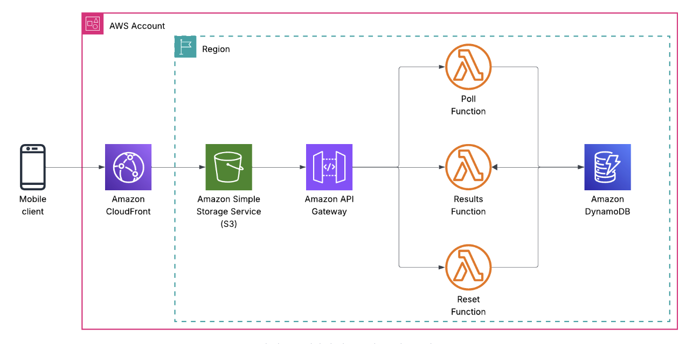
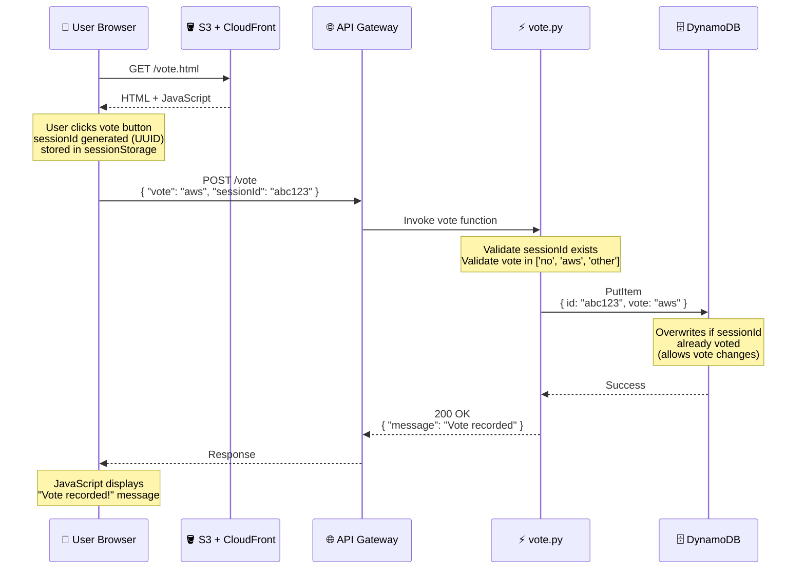
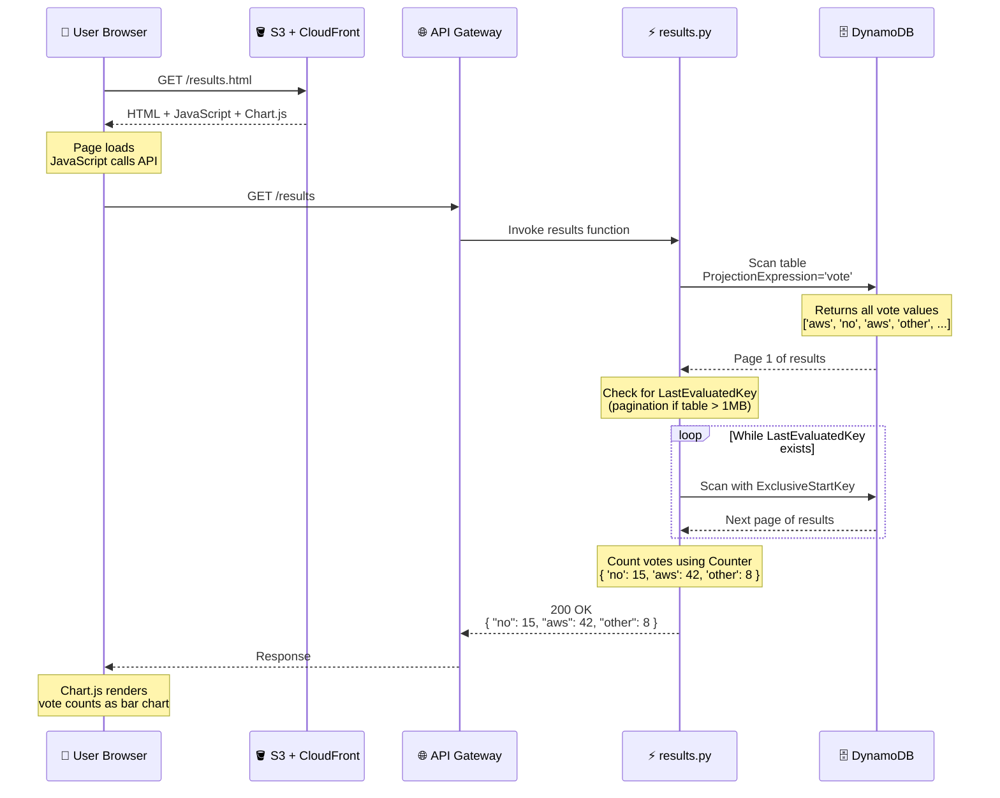
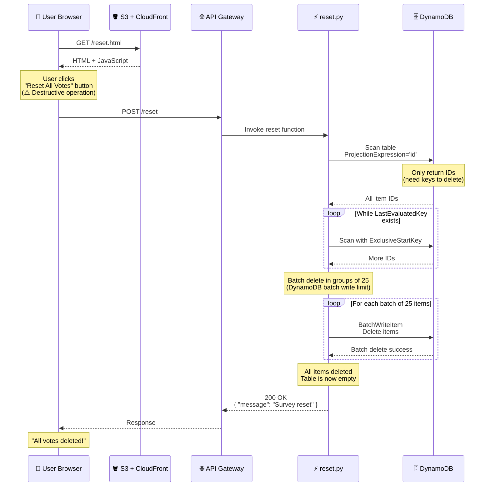

Back in November, I was preparing for the Cracking the Cloud presentation at UNC Charlotte. I needed a way to explain how the cloud fundamentally changed what's possible on the internet—not through abstract concepts, but through something students could immediately relate to.

That's when I remembered **Thomas Game Docs**.

If you've never heard of her: she's a YouTuber who makes incredibly well-produced video essays about video games. And she sometimes runs surveys asking her audience things like "Who's the LEAST popular Pokémon?" or "Who's the LEAST popular Animal Crossing villager?"

These aren't small surveys. They get millions of responses.

I helped with the backend for the Pokémon survey—a Flask app on Heroku. But the technology stack wasn't the interesting part. What mattered was that hosting something like this **doesn't require infrastructure expertise anymore**.

She didn't need to buy servers, configure databases, or hire a DevOps team.

Twenty years ago, hosting a survey that could handle 50,000 votes meant:

- Buy or rent physical servers
- Set up database infrastructure  
- Configure load balancers
- Plan for capacity (and hope you got it right)
- Deal with outages, scaling issues, and hardware failures

All of that would cost thousands of dollars—and that's before you wrote a single line of code.

Today? You build it with Lambda, API Gateway, and DynamoDB. You deploy it with Terraform. And unless traffic gets truly ridiculous, **it costs you basically nothing**.

The cloud didn't just make infrastructure cheaper. It made building things **accessible**.

That's what I wanted students to understand. Not that AWS has a lot of services. But that those services remove the barriers that used to keep people from building.

---

## The demo: a survey students could actually participate in

To drive the point home, I didn't just talk about Thomas Game Docs surveys.

I had the students take one.

At the start of the presentation, I pulled up a simple survey asking about their exposure to AWS:

- Have you used AWS before?
- Have you deployed something to the cloud?

They voted. They saw the results update in real-time. And then I showed them **exactly how it worked**—with no servers running, no databases to manage, and no ongoing costs to worry about.

That survey? It's the same repo I'm writing about now: [cracking-the-cloud](https://github.com/lukelittle/cracking-the-cloud).

## The architecture (small, but real)



Here's the final shape of the system:

- **S3** hosts the static frontend (HTML, CSS, JS)
- **CloudFront** sits in front for HTTPS, caching, and global delivery
- **API Gateway** exposes a REST API
- **Lambda** handles business logic (vote, results, reset)
- **DynamoDB** stores votes
- **IAM** wires permissions together
- **Terraform** defines everything

No servers. No containers. No databases to patch. No stateful nonsense.

Just managed services doing exactly what they're good at.

The request flow looks like this:

User clicks a button → JavaScript calls the API → API Gateway invokes Lambda → Lambda writes to DynamoDB → Response goes back to the browser.

Simple. Explicit. Observable.

## Why static frontend + API (on purpose)

I didn't use React.  
I didn't use Next.js.  
I didn't use server-side rendering.

Not because those tools are bad—they're not. But because I wanted you to see what's actually happening.

When you open the frontend code, you can immediately see:

- where the API URL lives
- how a POST request is formed
- what the response looks like
- how the browser handles the data

No build steps. No transpilation. No abstractions hiding what's really going on.

Once you understand how a browser talks to an API using vanilla JavaScript, **then** you can add React, TypeScript, and all the modern tooling. But you'll know what those tools are doing for you—not just that they work.

The frontend's job here is to show you the fundamentals, not teach you the latest framework.

## The Lambdas (three, on purpose)

There are three Lambda functions:

1. **Vote** (`backend/vote.py`) – Processes vote submissions
2. **Results** (`backend/results.py`) – Retrieves vote counts
3. **Reset** (`backend/reset.py`) – Clears all data

Could this be one Lambda with a switch statement?  
Absolutely.

Did I do that?  
Absolutely not.

Each function has:

- one responsibility
- one API route
- one IAM policy

This lets students see how permissions map to behavior.

- The **vote** function can write, but not delete
- The **results** function can read, but not write
- The **reset** function can delete, but nothing else

You don't need a lecture on least privilege when the code makes it obvious.

## How voting actually works

When a student clicks a vote button, here's the journey that request takes through the serverless stack:



The critical piece here is the **sessionId**. It's a random UUID generated in the browser and stored in `sessionStorage`—which means it persists for the current tab but disappears when you close the browser.

This gives us:

- **One vote per browser session** – you can't spam-click the vote button
- **Vote changes allowed** – if you vote "No experience" and change your mind, the second vote overwrites the first (DynamoDB's `PutItem` does this automatically)
- **Privacy by default** – no accounts, no tracking, no persistent identifiers
- **Simple anti-spam** – good enough for a teaching demo

Could someone bypass this by opening incognito windows? Yes. Is that fine for a teaching app? Also yes. The point is showing how to prevent duplicate votes, not building a production election system.

Here's what `vote.py` actually looks like:

```python
def handler(event, context):
    # Parse the incoming request
    body = json.loads(event.get('body', '{}'))
    vote_option = body.get('vote')
    session_id = body.get('sessionId')
    
    # Validate inputs
    if not session_id:
        return {
            'statusCode': 400,
            'body': json.dumps({'message': 'Session ID is required'})
        }
    
    if vote_option not in ['no', 'aws', 'other']:
        return {
            'statusCode': 400,
            'body': json.dumps({'message': 'Invalid vote option'})
        }
    
    # Store the vote
    table.put_item(Item={
        'id': session_id,
        'vote': vote_option
    })
    
    return {
        'statusCode': 200,
        'headers': {'Access-Control-Allow-Origin': '*'},
        'body': json.dumps({'message': 'Vote recorded successfully'})
    }
```

Twenty lines of code. No ORM. No database migrations. No connection pooling. Just write to DynamoDB and return a response.

## How results actually work

The results page is where students first encounter the concept of scanning a database:



The interesting part here is **pagination**. DynamoDB's `Scan` operation returns a maximum of 1MB of data per request. If your table is larger than that, you get a `LastEvaluatedKey` in the response, which you use to fetch the next page.

Here's what that looks like in code:

```python
def handler(event, context):
    # First scan
    response = table.scan(ProjectionExpression='vote')
    items = response.get('Items', [])
    
    # Keep scanning if there's more data
    while 'LastEvaluatedKey' in response:
        response = table.scan(
            ProjectionExpression='vote',
            ExclusiveStartKey=response['LastEvaluatedKey']
        )
        items.extend(response.get('Items', []))
    
    # Extract just the vote values
    votes = [item['vote'] for item in items]
    
    # Count them
    vote_counts = Counter(votes)
    
    # Return with defaults for zero-vote options
    return {
        'statusCode': 200,
        'headers': {'Access-Control-Allow-Origin': '*'},
        'body': json.dumps({
            'no': vote_counts.get('no', 0),
            'aws': vote_counts.get('aws', 0),
            'other': vote_counts.get('other', 0)
        })
    }
```

Students immediately see three concepts:

- **Scanning costs** – you're reading the entire table, which is fine for 100 votes but would be expensive for 10 million
- **Pagination handling** – real-world data doesn't fit in one response
- **Aggregation happens in code** – DynamoDB doesn't have `COUNT(*) GROUP BY vote`, so you pull the data and count it yourself

This naturally leads to questions like "how would you make this more efficient?" which is exactly where you want students' brains to go.

## How reset actually works

The reset function is the most dangerous one in the app—and also the most instructive:



This introduces batch operations:

```python
def handler(event, context):
    # Scan for all IDs (we only need keys to delete)
    scan_response = table.scan(ProjectionExpression='id')
    items = scan_response.get('Items', [])
    
    # Handle pagination
    while 'LastEvaluatedKey' in scan_response:
        scan_response = table.scan(
            ProjectionExpression='id',
            ExclusiveStartKey=scan_response['LastEvaluatedKey']
        )
        items.extend(scan_response.get('Items', []))
    
    # Delete all items using batch writer
    if items:
        with table.batch_writer() as batch:
            for item in items:
                batch.delete_item(Key={'id': item['id']})
    
    return {
        'statusCode': 200,
        'headers': {'Access-Control-Allow-Origin': '*'},
        'body': json.dumps({'message': 'Survey reset successfully'})
    }
```

The `batch_writer()` context manager is doing a lot of hidden work:

- Groups deletes into batches of 25 (DynamoDB's limit)
- Automatically retries failed operations
- Handles throttling gracefully
- Only commits when the context exits

Students don't need to know all of that on day one, but they can see that deleting 100 items doesn't require 100 API calls.

**Important note:** In a real app, you'd absolutely add authentication and authorization here. This function is intentionally unprotected for teaching purposes—it demonstrates the mechanics of batch operations without the complexity of auth flows.

## DynamoDB (intentionally unsexy)

The DynamoDB table is **boring by design**.

- Partition key (`id`)
- Simple attributes (`vote`)
- No GSIs
- No streams
- No TTL magic

Why?

Because the lesson isn't "DynamoDB is infinite and weird."  
The lesson is:

**You can persist state without running a database.**

Once students are comfortable, *then* you add:

- secondary indexes
- conditional writes
- access patterns
- cost modeling

But not on day one.

## Terraform as the real curriculum

Here's the quiet truth: **The Terraform is the most important part of this project.**

Students don't learn AWS by clicking around the console. They learn AWS by reading infrastructure definitions and realizing: *"Oh—that's what connects to that."*

This repo forces them to see how API Gateway connects to Lambda (`aws_api_gateway_integration`), how Lambda permissions work (`aws_lambda_permission`), how CloudFront talks to S3 (`origin_access_identity`), how outputs become frontend configuration (`cloudfront_domain`).

They can delete everything and recreate it in minutes. That alone teaches more than most cloud courses.

---

## How does this compare to the Heroku version?

Remember the Flask app I built for Thomas Game Docs' Pokémon survey?

I monitored that deployment closely. Every time she dropped an announcement on social media—Twitter, YouTube community posts, etc—I watched the app response time blow up. We were constantly aware that we were one viral tweet away from needing to manually scale the Heroku dyno or upgrade the database.

With this serverless version? **There wouldn't have been a hiccup.**

Lambda would have spun up as many concurrent executions as needed. API Gateway would have handled the traffic without breaking a sweat. DynamoDB would have throttled gracefully and auto-scaled. CloudFront would have cached the static assets globally.

No monitoring dashboards.  
No capacity planning.  
No "should we upgrade now or wait?" decisions.  
No watching metrics at 2 AM when a post goes viral.

The infrastructure would have scaled to meet demand and then scaled back down when traffic dropped. And the bill would have stayed under $5 for the entire campaign.

That's the difference between "serverless" and "server-you-manage-less."

## Costs (because someone always asks)

- **S3**: pennies
- **CloudFront**: free tier
- **Lambda**: free tier
- **API Gateway**: free tier
- **DynamoDB**: free tier

**Total monthly cost for light usage**: effectively $0.

Which matters, because students shouldn't need a credit card panic attack to learn cloud fundamentals.

## If you want to fork it

The entire project is open source and designed to be broken, modified, and rebuilt:

**[github.com/lukelittle/cracking-the-cloud](https://github.com/lukelittle/cracking-the-cloud)**

---

## How this project can be used to teach cloud

The beauty of this baseline is that every extension becomes a teaching moment. The answer to nearly every "Can I add...?" question is: **yes**.

**"Can I add another survey question?"** Yes. Modify the DynamoDB schema and update the frontend. Students learn about schema evolution and backwards compatibility.

**"Can I add authentication?"** Yes. Add Cognito, modify the Lambda to verify JWT tokens, update the frontend to handle login flows. Students learn about identity providers, token validation, and authorization.

**"Can I track who voted when?"** Yes. Add timestamps to DynamoDB items, maybe stream changes to S3 for analytics. Students learn about audit trails and data retention.

**"Can I swap DynamoDB for RDS?"** Yes. But now you need VPCs, security groups, connection pooling, and Lambda cold start considerations. Students learn why DynamoDB was the right choice for this use case.

**"Can I add email notifications?"** Yes. Give a Lambda permission to use SES, trigger it from DynamoDB Streams. Students learn about event-driven architecture and service integration.

**"Can I add a CI/CD pipeline?"** Yes. Add GitHub Actions, IAM roles with OIDC, and S3 sync logic. Students learn about deployment automation and security best practices.

Because the baseline is so small, every addition is visible. Every new service has a before-and-after moment. This is where the app stops being a demo and starts being a scaffold—students can extend it in any direction and immediately see what changes.

Change the question. Add auth. Add metrics. Rip it apart. That's how you build instincts. Not by memorizing services, but by wiring them together and watching what happens.
