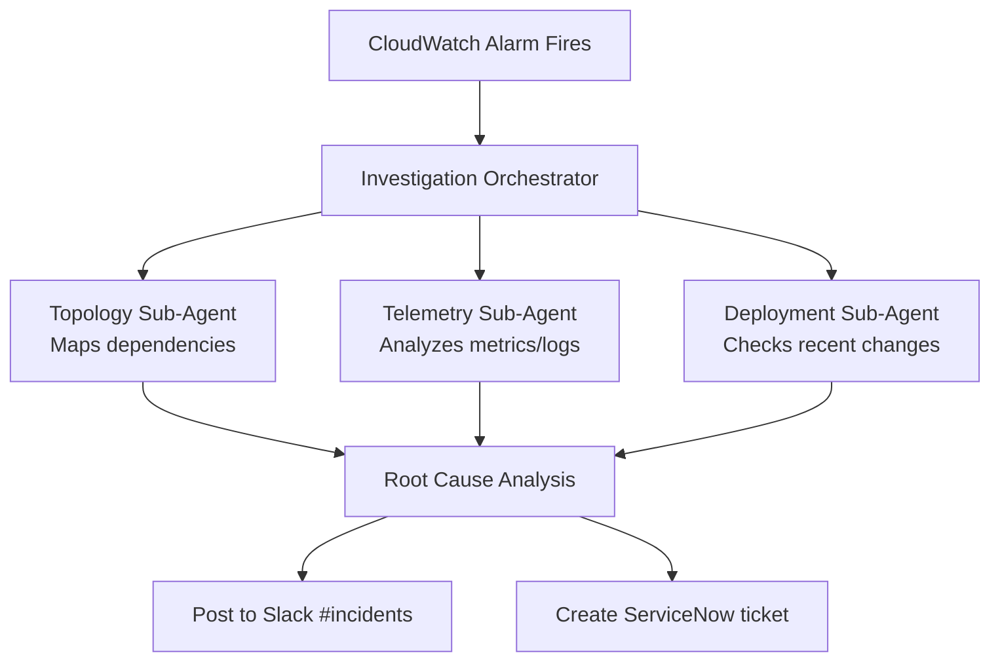
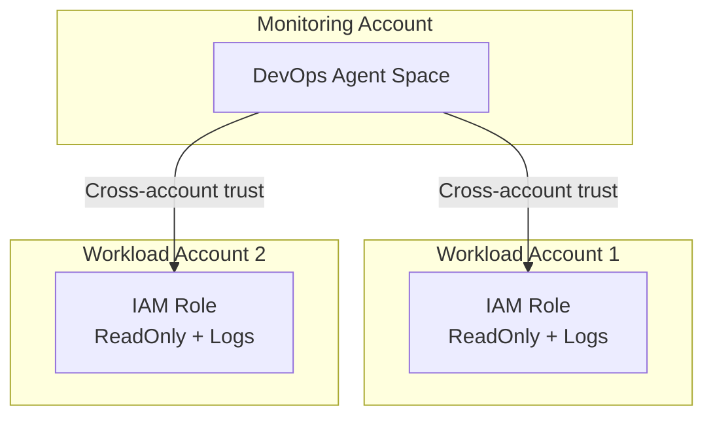

At re:Invent 2024, AWS CEO Matt Garman announced something that made me stop and actually pay attention during a keynote—which doesn't happen often.

He introduced **frontier agents**: AI systems that don't just help you write code or answer questions. They work autonomously for hours or days, maintaining context, investigating problems, and making decisions without you holding their hand.

Three agents got announced:
- **Kiro** - your AI developer
- **AWS Security Agent** - your AI security engineer  
- **AWS DevOps Agent** - your AI operations engineer

This isn't another coding assistant that autocompletes your Lambda functions. This is AWS betting that AI agents can handle the kind of multi-hour incident investigations that currently wake up humans at 2 AM.

Let's be real: AI-assisted incident response isn't new. PagerDuty, Datadog, Dynatrace, and a dozen startups have been doing "pull operational data into an LLM and suggest fixes" for years. What makes AWS DevOps Agent different is the depth of integration into the AWS control plane and the architectural pattern it represents.

You can watch the frontier agents announcement teaser here: https://www.youtube.com/watch?v=fMQfzwS0prQ

But I wanted to dig deeper and figure out what this actually means for teams running production systems on AWS.

## What makes an agent "frontier-class"

AWS uses the term "frontier agent" to mean something specific. It's not just GPT-4 with AWS API access.

**1. Autonomous goal-directed behavior**

Traditional AI: "Hey ChatGPT, what might cause high Lambda errors?"  
Frontier agent: "Investigate this Lambda error spike" → agent figures out how

You give it an objective, it decomposes the problem, forms hypotheses, collects evidence, and executes—without asking you for step-by-step guidance.

**2. Multi-agent coordination**

DevOps Agent doesn't work alone. When investigating an incident, it spawns specialized sub-agents—one analyzing logs, another reconstructing the deployment timeline, a third mapping topology. These agents run concurrently, investigating multiple hypotheses simultaneously and coordinating across AWS accounts. It's less "AI assistant" and more "AI team."

**3. Long-running independent operation**

Here's the paradigm shift: it works for hours without constant human intervention.

Traditional AI forgets everything when you close the chat. Frontier agents maintain persistent context, remember your infrastructure, learn from past incidents, and pick up where they left off after restarts.

When your Lambda error alarm goes off at 2 AM, DevOps Agent can investigate for 30 minutes, form a hypothesis, collect evidence, and have a diagnosis ready by the time you wake up and check Slack.

## How it actually works

DevOps Agent integrates with your existing monitoring tools—it doesn't replace them.

On the observability side, DevOps Agent integrates natively with CloudWatch and can pull data from Datadog, Dynatrace, New Relic, and Splunk. If you're using custom monitoring tools, you can build integrations via Model Context Protocol (MCP) servers—AWS's standard for extending agent capabilities.

For incident coordination, there's built-in support for ServiceNow and PagerDuty, plus Slack for real-time updates. Pretty much any tool with webhooks can be integrated into the workflow.

DevOps Agent can be triggered three ways: automatically when a CloudWatch alarm fires (fully autonomous response), manually through the web UI when you want to investigate something specific, or on a schedule for proactive analysis—think nightly scans looking for anomalies before they become incidents.

When an alert fires—say, Lambda errors spike at 2 AM—here's what happens:



The clever part is the **application topology map**. DevOps Agent builds and maintains an intelligent map of your entire system—which Lambda functions call which APIs, which services depend on which databases, when each component was last deployed and by whom. It tracks cross-account dependencies and even external dependencies like third-party APIs, SaaS integrations, and CDNs.

When an incident happens, this topology becomes invaluable. The agent can immediately identify blast radius (what's affected by this outage?), trace dependency chains (if the API is down, what upstream services caused it? what downstream services are impacted?), and correlate timing (there was a deploy 15 minutes ago—is that when this started?).

## The investigation loop

Once triggered, DevOps Agent enters an iterative loop:

1. **Generate hypotheses** based on alert type, topology, recent changes
2. **Collect evidence** by querying logs, metrics, traces, configs
3. **Correlate patterns** across time, services, accounts
4. **Assess confidence** in each hypothesis
5. **Recommend mitigation** or continue investigating
6. **Learn from outcome** to improve future investigations

This keeps going until it reaches high confidence in the root cause or exhausts reasonable paths.

What separates this from dumb rule-based systems: it doesn't just pattern-match. It reasons about your infrastructure.

## Agent Spaces and IAM permission boundaries

Everything starts with an **Agent Space**—the workspace where the agent operates and the IAM permission boundary defining what it can access.

You can structure Agent Spaces multiple ways:
- **Per-application:** One space per critical app
- **Per-team:** One space per on-call team
- **Centralized:** One space in monitoring account observing everything

Here's whatmakes this not just "magic AI with root access": DevOps Agent uses explicit, auditable IAM trust relationships.

The Agent Space role trust policy:
- **Principal:** `aidevops.amazonaws.com` (not some opaque service)
- **Conditions:** SourceAccount and SourceArn bound to your specific AgentSpace
- **Permissions:** Standard IAM policies you control

You can audit exactly what DevOps Agent accessed, when, and why. It's not a black box.

### Multi-account setup (the real production pattern)

Production incidents rarely happen in a single AWS account. You have workload accounts, shared services accounts, security accounts, monitoring accounts.

DevOps Agent supports this natively via External Account Associations:



Create your Agent Space in a central monitoring account, associate it with workload accounts via cross-account IAM roles, and let it investigate incidents spanning account boundaries.

This is how you do AWS at scale.

## Deploying it (Terraform example)

AWS provides Terraform resources (`aws_devopsagent_agentspace`, `aws_devopsagent_association`) and CDK constructs.

Basic Terraform setup:

```hcl
resource "aws_devopsagent_agentspace" "main" {
  name = "production-monitoring"
  
  agent_role {
    create_role = true
    role_name   = "DevOpsAgentSpaceRole"
  }
  
  enable_web_app = true  # Optional UI
}

resource "aws_devopsagent_association" "workload" {
  agent_space_id = aws_devopsagent_agentspace.main.id
  
  external_account {
    account_id = "987654321098"
    role_arn   = "arn:aws:iam::987654321098:role/DevOpsAgentWorkloadRole"
  }
}
```

In each workload account, create a role that trusts your Agent Space:

```hcl
resource "aws_iam_role" "devops_agent_workload" {
  name = "DevOpsAgentWorkloadRole"
  
  assume_role_policy = jsonencode({
    Principal = {
      AWS = "arn:aws:iam::123456789012:role/DevOpsAgentSpaceRole"
    }
  })
}

resource "aws_iam_role_policy_attachment" "read" {
  role       = aws_iam_role.devops_agent_workload.name
  policy_arn = "arn:aws:iam::aws:policy/ReadOnlyAccess"
}
```

Connect your monitoring tools (Data API keys, GitHub tokens) through the AWS Console.

**Important:** AWS explicitly says Terraform resources may change before GA. Pin your provider versions.

## Testing it

AWS provides test scenarios. I recommend running these before connecting production systems.

**Test 1: Lambda error investigation**

Deploy a Lambda that intentionally throws errors:

```python
import random

def lambda_handler(event, context):
    errors = [
        "Simulated database timeout",
        "Test API rate limit",
        "Validation error"
    ]
    raise Exception(f"Test: {random.choice(errors)}")
```

Create a CloudWatch alarm, trigger it, watch DevOps Agent:
- Detect the spike
- Analyze logs
- Check deployment timeline
- Identify root cause
- Recommend fixes

**Test 2: EC2 CPU spike**

Deploy an EC2 instance, run a CPU stress test, trigger an alarm, watch it correlate with recent changes and recommend auto-scaling.

## What's not ready yet (the honest limitations)

### 1. us-east-1 only

DevOps Agent is currently only available in us-east-1.

If you have data residency requirements (GDPR, finance, healthcare), this is a blocker. Cross-region investigations require routing everything through us-east-1.

Mitigration: Deploy Agent Space in us-east-1, use cross-account associations to observe other regions. AWS will probably expand regions post-GA.

### 2. Investigation vs action

It's unclear whether DevOps Agent can *execute* remediation or just *recommend* it.

The documentation emphasizes "investigations," "recommendations," "mitigation suggestions"—not "auto-rollback" or "auto-scale."

My read: GA will probably support both:
- **Investigation-only mode (default):** analyze → recommend → human executes
- **Action mode (opt-in):** execute pre-approved actions within guardrails

For regulated industries, you'll live in investigation-only mode. For fast-moving startups, action mode might be tempting.

### 3. Integration maturity

Integrations exist for CloudWatch, Datadog, Dynatrace, New Relic, Splunk, GitHub, GitLab, ServiceNow, PagerDuty—but they're first-generation.

Missing:
- OpenTelemetry native support
- ArgoCD, Flux, Spinnaker
- Opsgenie, Incident.io
- AppDynamics, Elastic APM

Good news: Model Context Protocol (MCP) support means you can build custom integrations.

### 4. Learning curve

DevOps Agent builds its topology map over time. Early investigations might be less accurate.

Mitigation:
- Run test investigations to let it learn
- Tag resources consistently
- Document dependencies explicitly

## Should you actually use this?

**Use it if:**
- You're heavily invested in AWS
- Your team is drowning in incident response toil
- You have operational maturity (monitoring, tagging, CI/CD)
- You're comfortable with preview-phase tech

**Wait if:**
- You need multi-region support now
- You require deterministic pricing
- Your incident response is already highly optimized
- You need production SLAs (preview = no SLAs)

**Key insight:** DevOps Agent amplifies good practices and exposes bad ones. If your infrastructure is poorly tagged, deployments aren't tracked, and metrics are scattered, it'll struggle. But if you have solid foundations, it can be transformative.

## My honest take

This is the future of operations. Not because AI replaces engineers, but because it handles undifferentiated heavy lifting.

The question isn't whether agentic operations are coming—they're here. The question is whether you'll be ready when GA drops.

If you're experimenting with this or have questions, reach out. The technology is moving fast, and we're all figuring it out together.

**Resources:**
- [AWS DevOps Agent User Guide](https://docs.aws.amazon.com/devops-agent/)
- [Terraform Sample Repo](https://github.com/aws-samples/sample-aws-devops-agent-terraform)
- [AWS Frontier Agents Overview](https://aws.amazon.com/ai/frontier-agents)
