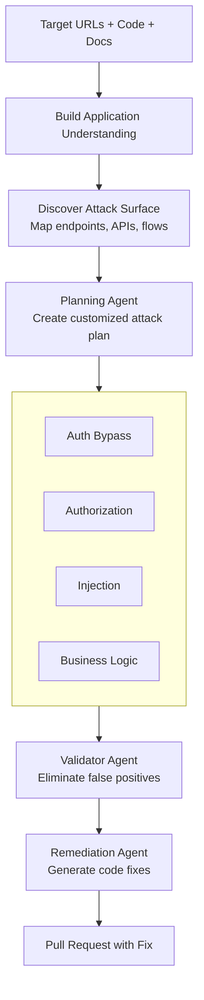

Here's what should make every security leader uncomfortable: organizations routinely deploy vulnerable code to production to meet delivery deadlines.

Not because they don't care about security. Because security can't keep up.

Over 60% of organizations update their web applications weekly or more frequently. Nearly 75% test those applications for security monthly or less. The math doesn't work. The gap between development velocity and security validation grows wider every sprint.

At re:Invent 2024, AWS CEO Matt Garman announced **AWS Security Agent**—not as another security scanning tool to add to the pile, but as a fundamentally different approach to the problem.

Security Agent is a frontier agent that operates autonomously throughout the development lifecycle, conducting design reviews, analyzing code, and executing penetration tests on-demand, matching the pace of modern development instead of being its bottleneck.

You can watch the AWS Security Agent announcement here: https://www.youtube.com/watch?v=oMY0tUDEhtY

This is AWS's bet that security doesn't scale through more manual reviews—it scales through intelligent automation that understands your applications, your standards, and your threats.

## What makes an agent "frontier-class"

AWS uses the term "frontier agent" to mean something specific. It's not just GPT-4 with security tools.

**1. Autonomous goal-directed behavior**

Traditional security: "Run this SAST scan and give me findings."  
Frontier agent: "Validate this application meets our security requirements" → agent figures out how

You give it an objective, it decomposes the problem, forms hypotheses, collects evidence, and executes—without asking you for step-by-step guidance.

**2. Multi-agent coordination**

Security Agent doesn't work alone. When conducting a penetration test, it spawns specialized sub-agents—one for authentication bypass, another for authorization flaws, a third for injection attacks. These agents work concurrently, investigating multiple attack vectors simultaneously and coordinating across findings.

**3. Long-running and context-aware**

Here's the paradigm shift: Security Agent maintains persistent understanding of your applications.

Traditional security tools forget everything between scans. Security Agent learns:
- Your organizational security requirements
- Your application architecture and data flows
- Your code patterns and common vulnerabilities
- Your historical findings and remediation approaches

When testing your API, it doesn't just throw generic payloads. It understands your authentication mechanism, maps your business logic, and targets application-specific vulnerabilities.

## How it actually works

Security Agent operates across three phases of the development lifecycle, each with different capabilities:

**Phase 1: Design Security Review**

Before code exists, upload design documents, architecture diagrams, and threat models. Security Agent analyzes against:
- AWS security best practices
- Your organization's security requirements
- Common architectural vulnerabilities
- Threat modeling patterns

Output: Security risk analysis with specific remediation guidance, in minutes instead of days.

**Phase 2: Code Security Review**

During development, GitHub integration provides automated security feedback on every pull request. Security Agent validates:
- Organizational security requirements (approved libraries, logging standards, data policies)
- OWASP Top 10 vulnerabilities
- Code-level security anti-patterns
- Compliance with your defined security standards

Developers get immediate feedback in their workflow—no context switching required.

**Phase 3: On-Demand Penetration Testing**

Whenever needed—pre-deployment, post-change, or on a schedule—Security Agent conducts comprehensive penetration testing.

Unlike traditional scanners, it:
- Builds understanding from your source code and architecture
- Creates customized attack plans based on your specific stack
- Executes multi-step attack chains (not just single-payload scans)
- Tests business logic vulnerabilities
- Validates findings to eliminate false positives
- Generates pull requests with remediation code

## The penetration testing loop

When you trigger a pentest, here's what happens:



The clever part is the **context-aware testing**. Security Agent analyzes your source code to understand:
- Which endpoints are public vs. internal
- What authentication patterns you use
- How data flows through your system
- What your actual threat model looks like

When it sees JWT tokens, it doesn't just test for SQL injection—it focuses on JWT-specific attacks like algorithm confusion, token tampering, and replay attacks.

## Agent Spaces and organizational requirements

Everything starts with an **Agent Space**—the workspace where Security Agent operates and the security boundary for what it can access.

You might structure Agent Spaces as:
- **Per-application:** One space for your customer portal, another for your admin dashboard
- **Per-team:** One space per development team managing their portfolio
- **Per-environment:** Separate spaces for staging vs. production testing

The powerful part: you define your organization's security standards once, centrally:

```
Authentication Requirements:
- OAuth 2.0 for all API endpoints
- JWT tokens with 15-minute expiration
- MFA required for admin functions

Data Protection Requirements:
- PII encrypted at rest (KMS)
- TLS 1.3 for data in transit
- No credit card data in logs

Logging Requirements:
- Correlation IDs on all requests
- Auth failures logged with IP
- No PII in application logs
```

These requirements automatically apply to all Agent Spaces, enforced during both design reviews and code reviews. Consistent enforcement across the organization—no more "this team follows standards, that team doesn't."

## Deploying it (practical walkthrough)

AWS provides console-based setup. Here's the flow:

**Step 1: Create Agent Space**

```
AWS Console → Security Agent → Create Agent Space
- Name: "production-security"
- Agent role: Auto-created
```

**Step 2: Define Security Requirements**

```
Security Requirements → Add requirements:
- Authentication standards
- Authorization patterns  
- Data protection policies
- Logging requirements
- Compliance frameworks
```

**Step 3: Configure Penetration Testing**

```
Agent Space → Enable penetration testing
- Add target domains (verify ownership)
- Configure CloudWatch logging
- Set up VPC access (for private apps)
- Add credentials to Secrets Manager
```

**Step 4: Integrate with GitHub**

```
Install AWS Security Agent GitHub App
- Authorize repository access
- Enable code review for Agent Space
- Auto-review triggered on PRs
```

**Step 5: Execute Penetration Test**

```
Security Agent Web App → Create pentest
- Target: https://staging.app.example.com
- Authentication: From Secrets Manager
- Attach: Source code + design docs
- Enable automatic remediation PRs
```

Watch as Security Agent:
- Discovers attack surface
- Executes targeted scenarios
- Validates findings
- Creates PRs with fixes

## Testing it

AWS provides real test scenarios. Run these before connecting production:

**Test 1: API authentication bypass**

Deploy an API with intentionally weak JWT validation:

```python
# Weak JWT verification
def verify_token(token):
    # Missing signature validation
    payload = jwt.decode(token, verify=False)
    return payload['user_id']
```

Trigger Security Agent pentest, watch it:
- Identify JWT usage
- Test algorithm confusion
- Attempt signature bypass
- Generate exploit proof
- Create PR with proper validation

**Test 2: SQL injection in query**

Deploy an endpoint with SQL injection:

```python
# Vulnerable query
def get_user(user_id):
    query = f"SELECT * FROM users WHERE id = {user_id}"
    return db.execute(query)
```

Security Agent should:
- Detect SQL construction
- Test injection vectors
- Confirm exploitability
- Recommend parameterized queries

## What's not ready yet (the honest limitations)

### 1. us-east-1 only

Security Agent is currently only available in us-east-1.

If you have data residency requirements (GDPR, finance, healthcare), this is a blocker. Applications in other regions must be accessible from us-east-1.

Mitigation: Test staging/dev environments. AWS will expand regions post-GA.

### 2. GitHub-only code review

Currently only GitHub is supported for automated code review.

What's missing:
- GitLab
- Bitbucket
- AWS CodeCommit
- Azure DevOps

Workaround: You can still use penetration testing by providing code via S3.

### 3. Not a replacement for professional pentesting

Security Agent is powerful but not guaranteed to discover all vulnerabilities. It's best used for continuous testing at development velocity.

AWS's position: "AWS Security Agent is not a professional penetration testing service, and we encourage users to integrate AWS Security Agent into their security review workflow."

The right mental model: Security Agent is your continuous validation layer. Professional pentesters are your comprehensive pre-launch audit.

### 4. False positive management

While Validator Agents significantly reduce false positives, AI-powered testing will never be 100% perfect.

What AWS does:
- Only reports high/medium confidence findings
- Hides unverified findings by default
- Provides reproducible exploit paths

What you should do:
- Review findings with security expertise
- Validate critical findings independently
- Use CloudWatch logs to understand agent reasoning

### 5. Learning curve

Security Agent builds topology understanding over time. Early investigations might be less accurate.

Mitigation:
- Run test assessments to let it learn
- Tag resources consistently
- Document dependencies explicitly

## Should you actually use this?

**Use it if:**
- Your development velocity is outpacing security capacity
- You deploy weekly but test security monthly
- You knowingly ship vulnerable code to meet deadlines
- You want to scale security across your entire portfolio
- You're AWS-native (tight integration benefits)
- You're comfortable with preview-phase tech

**Wait if:**
- You need multi-region support now
- You use source control other than GitHub (for code review)
- Your security process already keeps pace with development
- You need production SLAs (preview = no SLAs)
- You require deterministic pricing

**Key insight:** Security Agent amplifies good practices and exposes bad ones. If your infrastructure is poorly tagged, deployments aren't tracked, and requirements are scattered, it'll struggle. But if you have solid foundations, it can be transformative.

## My honest take

This is the future of application security. Not because AI replaces security engineers, but because it handles undifferentiated heavy lifting.

The traditional model: Security is a gate. Development builds features, security reviews them, findings go back to development, repeat until deadlines force compromise.

The agentic model: Security is embedded. AI agents continuously validate security throughout development, provide real-time guidance, and scale security expertise to match development velocity.

Security Agent doesn't eliminate the need for security expertise—it amplifies what your security team can accomplish. One senior security engineer using Security Agent can cover more applications than a team of five without it.

The question isn't whether agentic security is coming—it's here. The question is whether you're ready when GA drops.

If you're experimenting with this or have questions, reach out. The technology is moving fast, and we're all figuring it out together.

**Resources:**
- [AWS Security Agent User Guide](https://docs.aws.amazon.com/security-agent/)
- [AWS Security Agent Product Page](https://aws.amazon.com/security-agent)
- [AWS Frontier Agents Overview](https://aws.amazon.com/ai/frontier-agents)
