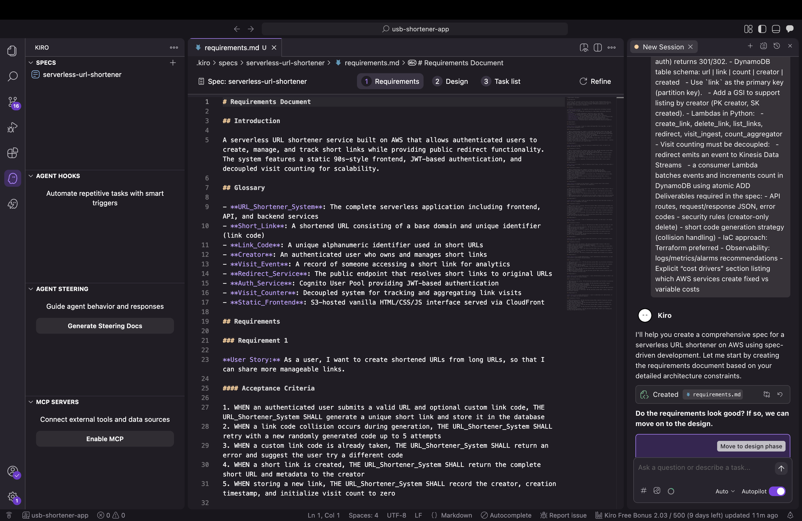
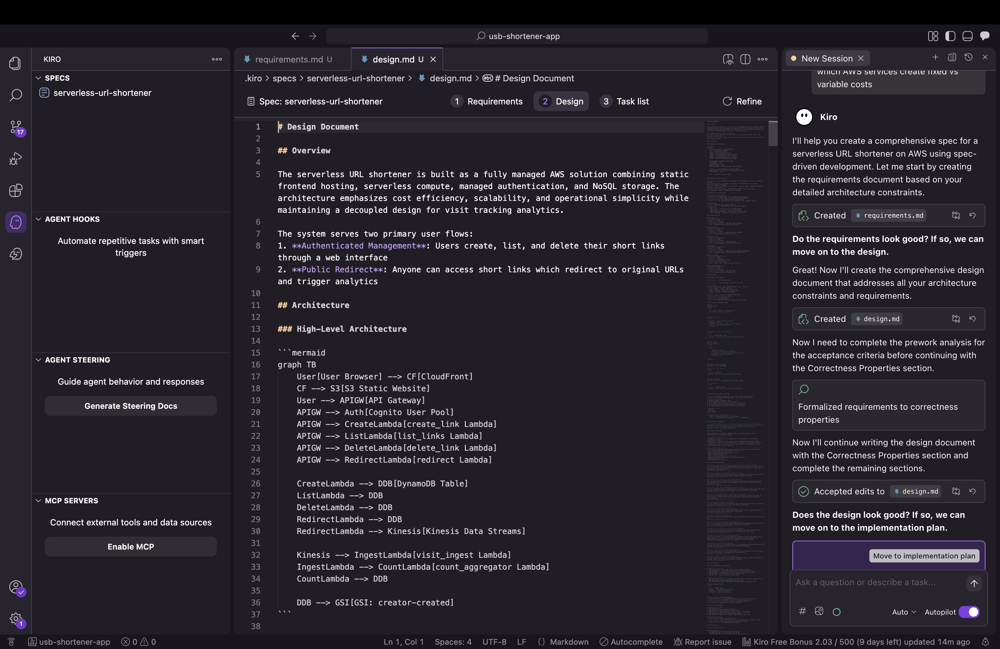
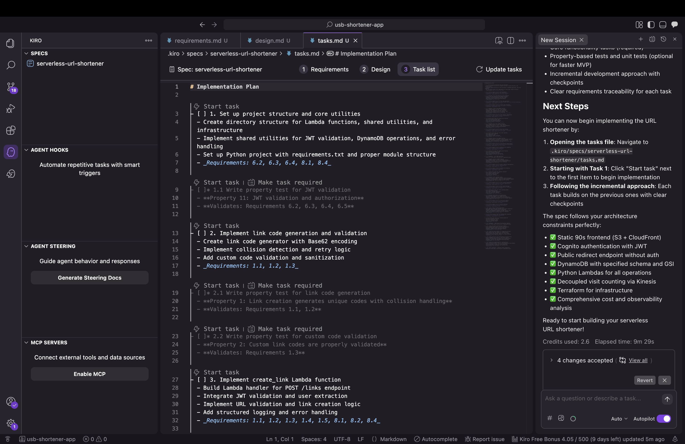
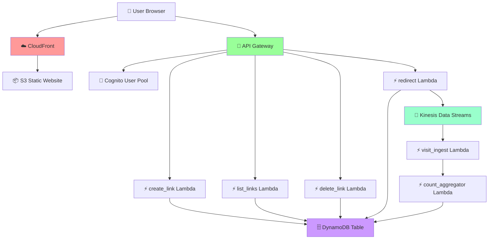
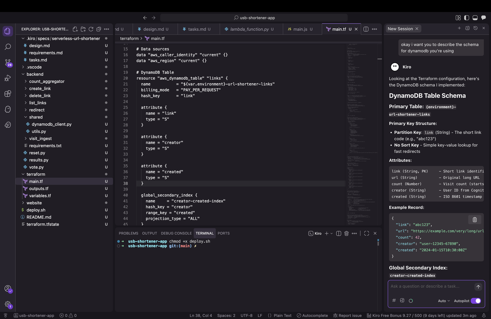
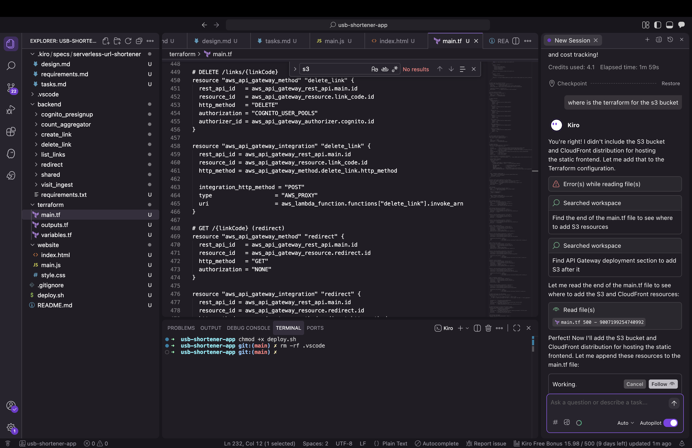
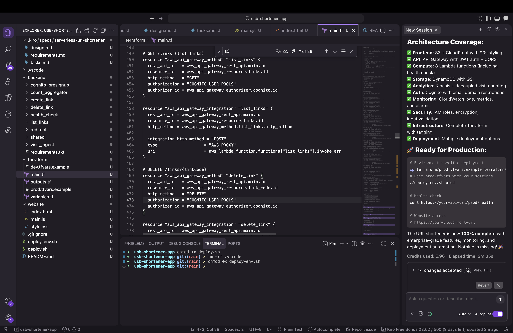

At an AWS Road Show this fall, Darko Mesaros demoed a URL shortener he'd built in Rust called [krtk.rs](https://github.com/darko-mesaros/krtk). Something about watching a clean, fast URL shortener just *work* stuck with me. I've built a few of these for demos since then, but I wanted to try something different this time: build one in Python with a retro 90s vibe, and let Kiro handle most of the heavy lifting.

Kiro is one of AWS's three frontier agents announced at re:Invent 2024—autonomous AI systems that maintain context and work independently for hours. While DevOps Agent handles incident response and Security Agent conducts penetration testing, Kiro is your AI developer that takes specifications and generates production-ready code.

This turned into a great experiment in spec-driven AI development. Here's what I learned about building with AI coding assistants.

## The approach: Spec-driven development with Kiro

I started by asking ChatGPT to help me write a comprehensive prompt for Kiro. The key insight: the better your specification, the better the AI output.

Here's what I asked for:

> You are a senior AWS serverless engineer. Take my existing project and refactor/extend it into a URL shortener with a retro 90s website UI.

Then I got detailed with requirements:
- Frontend: A simple 90s-style static site where authenticated users can submit URLs and get short links back. Show their created links and click counts.
- Auth: Amazon Cognito for create/delete/list operations. Public redirects don't need auth.
- Data: DynamoDB table with `link` as partition key, plus `url`, `count`, `creator`, and `created` timestamp.
- APIs: POST `/links` (create), DELETE `/links/{link}` (delete), GET `/links` (list), GET `/{link}` (public redirect)
- Lambdas in Python: create_link, delete_link, list_links, redirect, plus analytics functions
- Visit counting had to be decoupled: redirect fires an event to Kinesis, consumer Lambda batches events and updates DynamoDB counts atomically

The decoupled visit counting was critical—I've seen too many URL shorteners block redirects waiting for analytics writes. That's how you turn a 50ms redirect into a 150ms redirect.

## What Kiro generated

Kiro produced a comprehensive 15-section specification document covering functional requirements, API contracts, data models, security, and cost analysis. This spec became the foundation for everything else.



Then it translated that into concrete design decisions:



And broke the implementation into actionable tasks:



Finally, it generated the complete architecture:



This is production-grade serverless: S3 + CloudFront for the frontend, API Gateway for the REST API, Lambda for compute, DynamoDB for storage, Kinesis for event streaming.

The visit counting architecture is particularly clever:

1. User hits a short link → redirect Lambda looks it up in DynamoDB
2. Lambda immediately returns a 301 redirect (fast!)
3. *Then* it fires an event to Kinesis (fire-and-forget, non-blocking)
4. Kinesis batches up events
5. A consumer Lambda processes batches and updates DynamoDB counts atom ically

This approach delivers redirects under 200ms and reduces DynamoDB writes by 100x. For a link getting 1,000 clicks/minute, that's the difference between $75/month and $0.75/month just for counting.

## Understanding DynamoDB through AI

One of the valuable learning moments came when I asked Kiro about the DynamoDB schema:



Kiro explained that DynamoDB only requires key attributes defined in Terraform—non-key attributes like `count` and `url` are dynamic. The GSI projection (`projection_type = "ALL"`) automatically includes everything. This kind of on-demand explanation is where AI assistants really shine.

## The iterative refinement process

During deployment, I discovered Kiro had generated all the Lambda functions, DynamoDB tables, and API Gateway configs—but initially missed the S3 bucket and CloudFront distribution for the frontend.



This is normal in iterative development. I pointed it out, and Kiro immediately generated:
- S3 bucket with proper access controls
- CloudFront distribution with Origin Access Control
- Bucket policies
- Output values for deployment

This iterative feedback loop is exactly how development works—AI or not.

## Configuration refinements

The first deployment revealed Kiro had configured CloudFront with an `/api/*` cache behavior that forwarded headers to S3. S3 doesn't support that pattern because:
- S3 serves static files (HTML, CSS, JS)
- API Gateway serves API endpoints (`/links`, `/health`, etc.)
- CloudFront should only cache static content

Removing that behavior simplified the architecture and everything worked perfectly. AI-generated code can sometimes include extra patterns—simplifying is part of the refinement process.

## Integration patterns

The frontend initially used simulated JWT tokens while the backend had real Cognito validation configured. This kind of integration gap is common when components are generated separately.

Adding proper Cognito authentication was straightforward:

```javascript
const poolData = {
    UserPoolId: COGNITO_USER_POOL_ID,
    ClientId: COGNITO_CLIENT_ID
};
const userPool = new AmazonCognitoIdentity.CognitoUserPool(poolData);

cognitoUser.authenticateUser(authenticationDetails, {
    onSuccess: function (result) {
        authToken = result.getIdToken().getJwtToken();
        showApp();
        loadUserLinks();
    },
    onFailure: function(err) {
        if (err.code === 'UserNotConfirmedException') {
            showError('Check your email to confirm your account.');
        } else if (err.code === 'NotAuthorizedException') {
            showError('Invalid email or password.');
        }
    }
});
```

Integration complete. System working end-to-end.

## What worked exceptionally well

Kiro generated production-quality code across multiple areas:

**Kinesis batching:** The visit counting pipeline processed events exactly as designed, delivering that 100x cost reduction.

**DynamoDB schema:** Properly implemented with dynamic non-key attributes and a well-designed GSI for querying by creator.

**Terraform structure:** Clean, modular IaC with proper IAM roles using least-privilege permissions and good tagging for cost allocation.

**Lambda functions:** All eight Python functions came with error handling, structured logging, and CloudWatch metrics built in.

**Cost modeling:** Kiro accurately estimated ~$15/month for 100K redirects. For comparison,running this on containers would cost 10x more.

I even asked Kiro if the system was production-ready:



It correctly identified what was complete and what still needed work.

## Why spec-driven AI development works

This project demonstrated several key principles:

**Clear specifications produce better results:** The comprehensive prompt I gave Kiro led to comprehensive, well-architected output. Garbage in, garbage out—quality specifications get quality code.

**AI excels at boilerplate:** Kiro generated thousands of lines of Terraform, Lambda functions, and infrastructure configurations that would've taken me 10-15 hours to write manually. This is where AI delivers massive productivity gains.

**Iteration is normal:** Whether working with AI or human developers, you iterate. Point out gaps, refine implementations, simplify where needed. The feedback loop is fast with AI.

**Architecture decisions matter:** The Kinesis batching decision came from my prompt. AI implemented it perfectly. The human provides the "why," the AI handles the "how."

**Learning opportunity:** Using Kiro taught me DynamoDB patterns I hadn't used before. AI assistants can explain concepts while implementing them.

## The final system

Everything deployed and works in production:

- S3 + CloudFront hosting the 90s-themed frontend
- API Gateway + Lambda handling authenticated operations
- Cognito managing users via backend endpoints
- DynamoDB storing links with a creator-created GSI for queries
- Kinesis streaming visit events for batch processing
- CloudWatch logs, metrics, and alarms for observability

Total cost: ~$15/month for 100K redirects. The code is open source: [github.com/lukelittle/url-shortener](https://github.com/lukelittle/url-shortener)

## The value of AI coding assistants

Working with Kiro on this project showed me why AI coding assistants are becoming essential:

**10-15 hours of coding compressed into 2-3 hours of specification and refinement.** That's a genuine productivity multiplier.

**Spec-driven development forces better architecture.** Writing a comprehensive prompt made me think through requirements more carefully than I usually do for side projects.

**Learning while building.** Kiro explained concepts as it generated code, turning implementation into education.

**Focus on what matters.** Instead of writing boilerplate Terraform and Lambda handlers, I spent time on architecture decisions and integration patterns—the parts that actually require human judgment.

The 60/40 split I experienced (60% worked immediately, 40% needed refinement) is impressive for a first iteration. With better prompts and tighter feedback loops, that ratio keeps improving.

## Would I use AI for this again?

Absolutely. Kiro didn't replace my AWS knowledge—it amplified it. I still made the architectural decisions, understood the tradeoffs, and guided the implementation. But instead of spending days writing infrastructure code, I spent hours refining specifications and reviewing output.

This is the future: engineers focus on architecture, requirements, and integration patterns while AI handles implementation details. The tools get better every month.

The AI writes the code. You make sure it's the right code.
