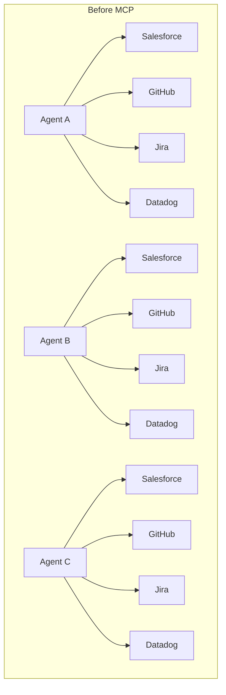
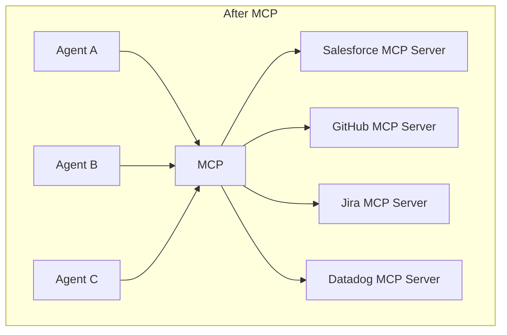
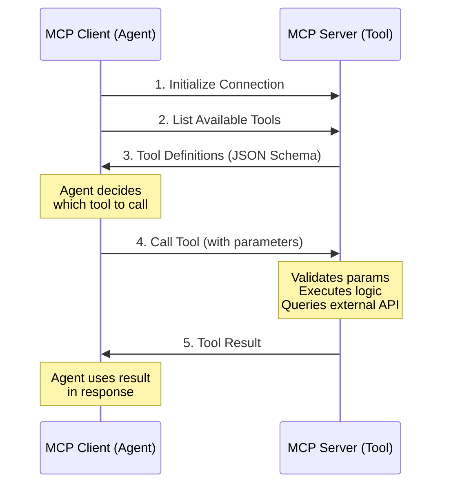
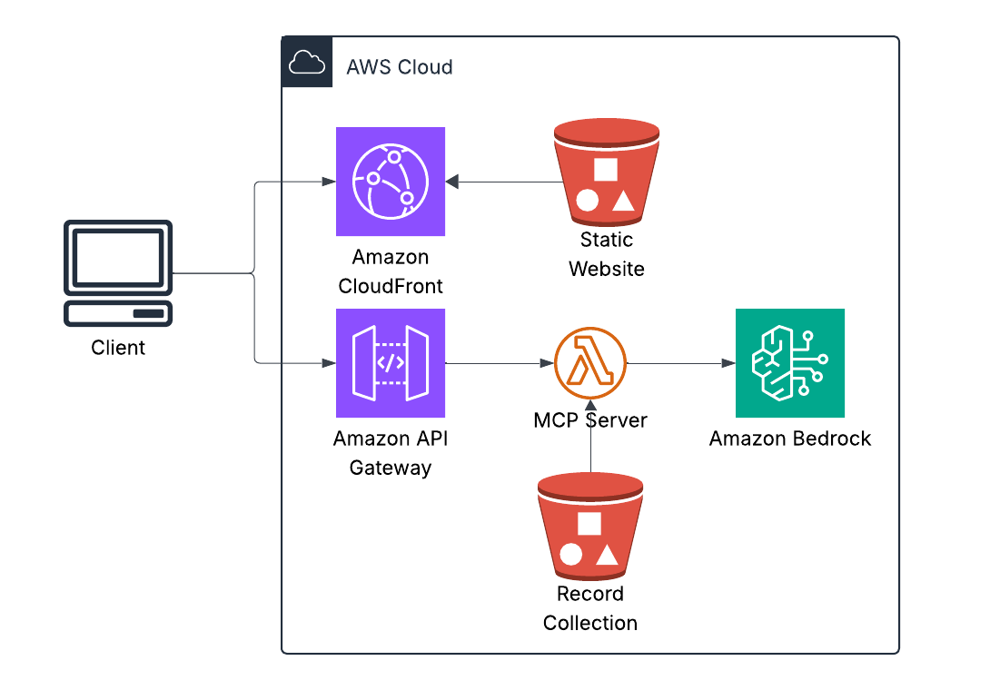
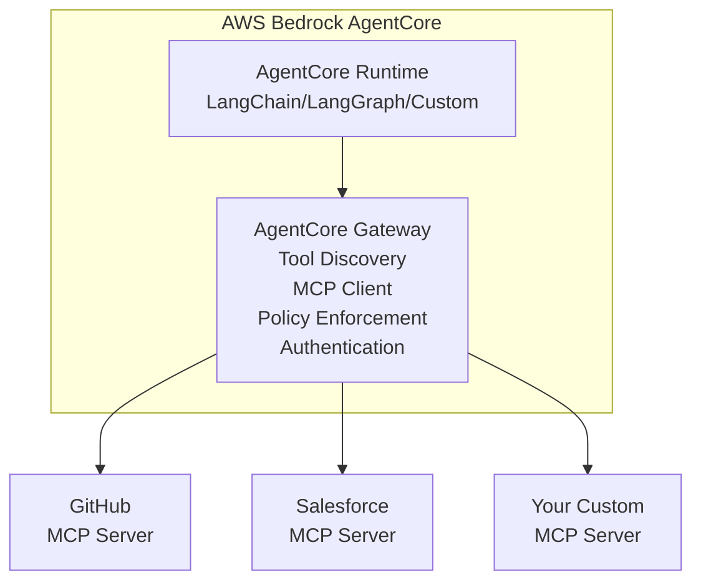

## What is the Model Context Protocol?

The Model Context Protocol (MCP) is an open standard for connecting AI agents to external systems. Think of it as a universal adapter that lets any AI agent talk to any tool or data source without custom integration code.

Anthropic announced MCP in November 2024 and donated it to the Linux Foundation's Agentic AI Foundation a month later. The adoption has been swift: OpenAI integrated it into ChatGPT, Google DeepMind uses it for Gemini agents, AWS built AgentCore around it, and development tools like Zed, Sourcegraph, Replit, and Codeium all support it. In just a few months, the community has built thousands of MCP servers. The protocol has become the de-facto standard for agent-to-tool communication.

If you've read my previous articles on AWS DevOps Agent, Security Agent, and Kiro, you've seen what these frontier agents do. This article explains how they actually work—the protocol layer that makes integration possible. More importantly, it shows how you can extend these agents to work with your proprietary systems.

## The N×M integration problem

Here's why MCP matters: You've built an amazing AI agent. It reasons brilliantly, writes elegant code, debugs complex issues. But it can't access your company's data. Your customer records are in Salesforce. Your code is in GitHub. Your metrics are in Datadog. Your tickets are in Jira.

The traditional approach is building custom integrations. One for each pairing. Want your agent to read Salesforce? Build a Salesforce connector. Want it to access GitHub? Build a GitHub connector. Want it to work with both? Build both connectors. Want to switch LLM providers? Rebuild everything.

This is the N×M integration problem: N agents times M data sources equals N×M custom integrations. As your ecosystem grows, the complexity becomes unmanageable. Three agents talking to four services means twelve custom connectors. Ten agents and fifty systems means five hundred integrations to build and maintain.

Each connector requires understanding the target system's API, building authentication flows, handling rate limits and retries, writing serialization and deserialization logic, maintaining the connector as APIs change, and rebuilding for each new agent or LLM provider. This doesn't scale.
The N×M Integration Problem (Why MCP Exists)
Let's visualize the traditional approach:


Every connector requires:

Understanding the target system's API
Building authentication flows
Handling rate limits and retries
Writing serialization/deserialization logic
Maintaining the connector as APIs change
Rebuilding for each new agent or LLM provider

This doesn't scale. At all.


Build the Salesforce MCP server once. Now DevOps Agent, Security Agent, Kiro, Claude Desktop—any MCP client—can access Salesforce. No custom integration needed. This is why every major AI company adopted MCP within months of its announcement. It solves an existential scaling problem.

## How MCP works: The architecture

MCP follows a client-server architecture using JSON-RPC 2.0 for communication. The protocol exposes three core primitives that servers can implement.

**Resources** are like RESTful GET endpoints. They load information into LLM context—files, database records, API responses. When you ask an agent to retrieve a customer's support ticket history, it's accessing a resource.

**Tools** are like RESTful POST endpoints. They execute code and produce side effects—creating Jira tickets, deploying code, sending Slack messages. When you tell an agent to create a high-priority ticket for a customer, it's using a tool.

**Prompts** are reusable templates that guide interactions with structured patterns. Think "Analyze this code for security vulnerabilities" or "Generate release notes from commits." They standardize how agents approach common tasks.

## The communication flow

Here's how an agent actually communicates with an MCP server:



The agent initializes a connection, requests the list of available tools, receives their JSON Schema definitions, decides which tool to call based on the user's request, sends the tool invocation with parameters, waits for the server to validate inputs and execute the logic, receives the result, and uses it to generate the final response. It's a clean request-response pattern.

## Transport mechanisms

MCP supports two primary transport methods. Standard Input/Output (stdio) is designed for local integration—the server runs as a subprocess and communicates via stdin/stdout. This is what Claude Desktop uses to run local MCP servers. It's simple, fast, and synchronous, but only works locally.

Server-Sent Events (SSE) is designed for remote integration. It uses HTTP-based streaming where the server pushes updates to the client. This is what you'd use for cloud-hosted MCP servers and enterprise integrations. It's network-capable and supports real-time updates, but requires HTTP server infrastructure.

## The protocol layer

MCP messages are structured as JSON-RPC 2.0 calls. Here's what a tool call looks like:
Request from client to server:

```json
{
  "jsonrpc": "2.0",
  "id": 1,
  "method": "tools/call",
  "params": {
    "name": "get_customer_info",
    "arguments": {
      "customer_id": "cust_12345"
    }
  }
}
```

Response from server to client:

```json
{
  "jsonrpc": "2.0",
  "id": 1,
  "result": {
    "content": [
      {
        "type": "text",
        "text": "{\"name\": \"Acme Corp\", \"tier\": \"Enterprise\", \"health\": \"green\"}"
      }
    ]
  }
}
```

The beauty of this: you rarely write this JSON by hand. MCP SDKs for Python, TypeScript, Java, C#, and Kotlin abstract it away completely. Which brings us to FastMCP.

## Building with FastMCP

Building MCP servers from scratch means handling JSON-RPC protocol details, managing connections, writing serialization boilerplate. It's tedious work that distracts from the actual business logic you want to implement.

FastMCP is the solution—a decorator-based Python framework that makes building MCP servers feel like writing FastAPI applications. Think of it as FastAPI for AI agents with the same elegant decorator patterns, Flask for tool integration with minimal boilerplate, or Express.js for MCP with simple and intuitive design.

Here's a complete, working MCP server:

```python
from fastmcp import FastMCP

# Initialize server
mcp = FastMCP("My First Server")

# Define a tool
@mcp.tool()
def add_numbers(a: int, b: int) -> int:
    """Add two numbers together"""
    return a + b

# Run it
if __name__ == "__main__":
    mcp.run()
```

That's it. You now have an MCP server that exposes a tool, automatically generates JSON Schema from type hints, handles serialization and deserialization, provides error handling, supports both stdio and SSE transports, and works with any MCP client. No boilerplate. No protocol details. Just your logic.
## A real example: GitHub integration

Let's build something practical—an MCP server that lets agents interact with GitHub. This demonstrates how FastMCP handles real-world integrations with external APIs, authentication, and error handling.

```python
from fastmcp import FastMCP
from github import Github
import os

# Initialize server
mcp = FastMCP(
    name="GitHub Integration",
    instructions="Use this server to interact with GitHub repositories"
)

# Initialize GitHub client
github_token = os.getenv("GITHUB_TOKEN")
gh = Github(github_token)

@mcp.tool()
def get_repository_info(owner: str, repo: str) -> dict:
    """
    Get information about a GitHub repository.
    
    Args:
        owner: Repository owner (username or organization)
        repo: Repository name
    
    Returns:
        Repository details including stars, forks, issues
    """
    repository = gh.get_repo(f"{owner}/{repo}")
    
    return {
        "name": repository.name,
        "description": repository.description,
        "stars": repository.stargazers_count,
        "forks": repository.forks_count,
        "open_issues": repository.open_issues_count,
        "language": repository.language,
        "created_at": repository.created_at.isoformat(),
        "updated_at": repository.updated_at.isoformat()
    }

@mcp.tool()
def create_issue(
    owner: str,
    repo: str,
    title: str,
    body: str,
    labels: list[str] = None
) -> dict:
    """
    Create a new issue in a GitHub repository.
    
    Args:
        owner: Repository owner
        repo: Repository name
        title: Issue title
        body: Issue description
        labels: Optional list of labels to apply
    
    Returns:
        Created issue details
    """
    repository = gh.get_repo(f"{owner}/{repo}")
    issue = repository.create_issue(
        title=title,
        body=body,
        labels=labels or []
    )
    
    return {
        "number": issue.number,
        "url": issue.html_url,
        "state": issue.state,
        "created_at": issue.created_at.isoformat()
    }

@mcp.tool()
def list_pull_requests(
    owner: str,
    repo: str,
    state: str = "open"
) -> list[dict]:
    """
    List pull requests in a repository.
    
    Args:
        owner: Repository owner
        repo: Repository name
        state: PR state ('open', 'closed', 'all')
    
    Returns:
        List of pull requests
    """
    repository = gh.get_repo(f"{owner}/{repo}")
    pulls = repository.get_pulls(state=state)
    
    return [
        {
            "number": pr.number,
            "title": pr.title,
            "author": pr.user.login,
            "state": pr.state,
            "created_at": pr.created_at.isoformat(),
            "url": pr.html_url
        }
        for pr in pulls[:10]  # Limit to 10 for brevity
    ]

@mcp.resource("repo://{owner}/{repo}/README")
def get_readme(owner: str, repo: str) -> str:
    """
    Get the README content for a repository.
    
    This is exposed as a resource (not a tool) because it's
    primarily for loading context into the LLM.
    """
    repository = gh.get_repo(f"{owner}/{repo}")
    readme = repository.get_readme()
    return readme.decoded_content.decode('utf-8')

if __name__ == "__main__":
    # Run with stdio (for local Claude Desktop)
    mcp.run(transport="stdio")
    
    # Or run with SSE (for remote access)
    # mcp.run(transport="sse", port=8000)
```

FastMCP handled type validation—ensuring owner and repo are strings—error handling so GitHub API failures return proper MCP errors, schema generation from docstrings and type hints, authentication flow using the GitHub token from environment variables, and transport abstraction so the same code works with stdio or SSE.

You focused on your business logic—what the tool actually does—and clear documentation where docstrings become tool descriptions. The framework handles everything else.

## Advanced FastMCP features

FastMCP isn't just decorators—it's a full-featured framework with capabilities that become important as your integrations grow more sophisticated.

**Context injection** lets you access MCP context and capabilities within your tools. This is useful for long-running operations where you want to send progress updates to the client:

```python
from fastmcp import FastMCP, Context
from mcp.server.session import ServerSession

mcp = FastMCP("Progress Example")

@mcp.tool()
async def long_running_task(
    task_name: str,
    ctx: Context[ServerSession, None],
    steps: int = 5
) -> str:
    """Execute a task with progress updates."""
    
    # Send progress notifications to client
    await ctx.info(f"Starting: {task_name}")
    
    for i in range(steps):
        progress = (i + 1) / steps * 100
        await ctx.progress(progress, f"Step {i+1}/{steps}")
        
        # Do actual work here
        await asyncio.sleep(1)
    
    await ctx.info(f"Completed: {task_name}")
    return f"Task {task_name} completed successfully"
```

**Sampling** lets your server request LLM completions. This is powerful for agentic workflows where the server orchestrates LLM calls without needing API keys:

```python
@mcp.tool()
async def generate_commit_message(
    diff: str,
    ctx: Context[ServerSession, None]
) -> str:
    """Generate a commit message from a git diff."""
    
    # Ask the client's LLM to generate the message
    result = await ctx.session.create_message(
        messages=[{
            "role": "user",
            "content": f"Generate a concise commit message for this diff:\n\n{diff}"
        }],
        max_tokens=100
    )
    
    return result.content[0].text
```

**Elicitation** lets servers request additional information mid-operation. This is useful when the tool needs clarification from the user:

```python
from mcp.types import ElicitRequestTextParams

@mcp.tool()
async def deploy_to_environment(
    service: str,
    ctx: Context[ServerSession, None]
) -> str:
    """Deploy a service to an environment."""
    
    # Ask user which environment
    result = await ctx.elicit(
        ElicitRequestTextParams(
            mode="text",
            message="Which environment? (staging/production)",
            placeholder="staging"
        )
    )
    
    environment = result.value
    
    # Validate input
    if environment not in ["staging", "production"]:
        raise ValueError("Environment must be 'staging' or 'production'")
    
    # Proceed with deployment
    return f"Deploying {service} to {environment}..."
```

**Filesystem roots** define security boundaries for which directories agents can access. FastMCP enforces that paths must be within configured roots that the client specifies when connecting:

```python
@mcp.tool()
def read_file(path: str, ctx: Context[ServerSession, None]) -> str:
    """Read a file from the allowed workspace."""
    
    # FastMCP enforces that path must be within configured roots
    # Client specifies roots when connecting:
    #   roots=["file:///safe/workspace"]
    
    with open(path, 'r') as f:
        return f.read()
```
## Case study: Vinyl collection chatbot

To see how easy FastMCP makes building real-world integrations, I built a serverless chatbot that answers questions about my vinyl collection. The data comes from a Discogs export—a CSV file containing my complete record collection that I store in S3.

Ask it "What Grimes records do I have?" and it queries the CSV, parses the Discogs data, and returns results. Ask it "What is vinyl?" and it just answers from general knowledge. The bot intelligently decides when to use tools and when to rely on its training data.

Here's the complete implementation of the MCP server that queries the Discogs collection data:

```python
from fastmcp import FastMCP
import boto3
import csv
from io import StringIO

# Initialize FastMCP server
mcp = FastMCP("vinyl-collection-server")

# S3 client for accessing Discogs export
s3_client = boto3.client('s3')
DATA_BUCKET = "my-vinyl-collection"

@mcp.tool()
def query_vinyl_collection(query_type: str, search_term: str, limit: int = 10) -> str:
    """
    Query Luke's vinyl record collection from Discogs export data.

    Args:
        query_type: One of: artist, label, year, title, all
        search_term: What to search for
        limit: Max results (default 10)
    """
    # Download Discogs CSV export from S3
    response = s3_client.get_object(Bucket=DATA_BUCKET, Key='discogs.csv')
    csv_content = response['Body'].read().decode('utf-8')
    
    # Parse CSV
    records = []
    csv_reader = csv.DictReader(StringIO(csv_content))
    for row in csv_reader:
        records.append(row)
    
    # Filter based on query type
    matches = []
    for record in records:
        if query_type == "artist" and search_term.lower() in record['Artist'].lower():
            matches.append(record)
        elif query_type == "label" and search_term.lower() in record['Label'].lower():
            matches.append(record)
        elif query_type == "year" and search_term in record['Released']:
            matches.append(record)
        elif query_type == "title" and search_term.lower() in record['Title'].lower():
            matches.append(record)
        elif query_type == "all":
            if (search_term.lower() in record['Artist'].lower() or 
                search_term.lower() in record['Title'].lower()):
                matches.append(record)
    
    # Format results
    results = []
    for record in matches[:limit]:
        results.append(
            f"{record['Artist']} - {record['Title']} "
            f"({record['Label']}, {record['Released']})"
        )
    
    return "\n".join(results) if results else "No matches found"

if __name__ == "__main__":
    mcp.run(transport="sse", port=8080)
```

That's it. No JSON schema writing. No protocol handling. No tool registration boilerplate. FastMCP generates the schema from type hints and docstrings, handles the Model Context Protocol communication, converts everything to Bedrock's format, and manages tool execution. You write the business logic for parsing Discogs data. FastMCP handles everything else.

The whole system—frontend, Lambda, Bedrock integration, S3 data access—deployed in under two minutes. This isn't a toy example. It's running in production, costs about fifteen dollars a month, and demonstrates why FastMCP is becoming the standard way to build tools for AI agents.



This is the full loop: user asks a question, Bedrock decides whether to use a tool, FastMCP executes it against the Discogs export data, and the result is returned—all serverless.

## How AWS frontier agents use MCP

Now let's connect this to the agents I've covered in previous articles. These patterns show how MCP enables coordination between specialized agents.

**DevOps Agent scenario:** A Lambda function starts timing out in production. DevOps Agent detects the anomaly through CloudWatch MCP Server where it reads metrics, logs, and traces. It queries the GitHub MCP Server to analyze recent code changes that might have introduced the issue. It creates an incident through the PagerDuty MCP Server and notifies the on-call engineer. Finally, it posts a summary to the incidents channel via the Slack MCP Server.

Without MCP, AWS would need custom connectors for every observability tool, ticketing system, and chat platform—an integration nightmare that doesn't scale. With MCP, DevOps Agent uses a standard MCP client and any MCP-compatible tool works instantly.

**Security Agent scenario:** During a penetration test, Security Agent finds a SQL injection vulnerability. It reads the vulnerable code through the GitHub MCP Server, creates a security ticket via the Jira MCP Server, requests a code fix from Kiro through MCP, and once Kiro generates the fix, it creates a pull request back through GitHub's MCP Server and notifies the security team via Slack's MCP Server.

The agents coordinate through MCP without custom integration code. Security Agent discovers, Kiro fixes, DevOps Agent validates deployment—all using the same protocol.

**Kiro scenario:** A developer asks Kiro to "Add authentication to the user API endpoint." Kiro reads the existing code through the Filesystem MCP Server, checks authentication patterns in other services via the GitHub MCP Server, queries your company's authentication library documentation through an Internal Auth MCP Server, writes the updated code back through the Filesystem MCP Server, and creates a pull request via GitHub's MCP Server.

Kiro doesn't just generate code—it actively researches your codebase and standards through MCP servers, understanding context before making changes.
## Building enterprise MCP servers: Real patterns

Here are three production-grade patterns that demonstrate how FastMCP handles enterprise integrations.

**Salesforce MCP Server** shows integration with a major CRM system:

```python
from fastmcp import FastMCP
from simple_salesforce import Salesforce
import os

mcp = FastMCP("Salesforce CRM")

sf = Salesforce(
    username=os.getenv("SF_USERNAME"),
    password=os.getenv("SF_PASSWORD"),
    security_token=os.getenv("SF_SECURITY_TOKEN")
)

@mcp.tool()
def get_account(account_id: str) -> dict:
    """Retrieve Salesforce account details."""
    return sf.Account.get(account_id)

@mcp.tool()
def create_case(
    account_id: str,
    subject: str,
    description: str,
    priority: str = "Medium"
) -> dict:
    """Create a support case in Salesforce."""
    return sf.Case.create({
        'AccountId': account_id,
        'Subject': subject,
        'Description': description,
        'Priority': priority
    })

@mcp.tool()
def search_accounts(query: str, limit: int = 10) -> list[dict]:
    """Search Salesforce accounts by name."""
    soql = f"SELECT Id, Name, Industry, AnnualRevenue FROM Account WHERE Name LIKE '%{query}%' LIMIT {limit}"
    return sf.query(soql)['records']
```

With this server deployed, any agent can now access Salesforce—DevOps Agent, Security Agent, Kiro, or any future agent you build. No custom integration needed per agent. Build once, use everywhere.

**Internal Wiki MCP Server** demonstrates knowledge base integration:

```python
from fastmcp import FastMCP
from elasticsearch import Elasticsearch
import os

mcp = FastMCP("Company Wiki")

es = Elasticsearch(
    os.getenv("ELASTICSEARCH_URL"),
    api_key=os.getenv("ELASTICSEARCH_API_KEY")
)

@mcp.resource("wiki://{article_id}")
def get_wiki_article(article_id: str) -> str:
    """Get wiki article by ID."""
    result = es.get(index="wiki", id=article_id)
    return result['_source']['content']

@mcp.tool()
def search_wiki(
    query: str,
    limit: int = 5
) -> list[dict]:
    """
    Search company wiki for relevant articles.
    
    Returns articles ranked by relevance.
    """
    response = es.search(
        index="wiki",
        body={
            "query": {
                "multi_match": {
                    "query": query,
                    "fields": ["title^2", "content", "tags"]
                }
            },
            "size": limit
        }
    )
    
    return [
        {
            "id": hit['_id'],
            "title": hit['_source']['title'],
            "excerpt": hit['_source']['content'][:200] + "...",
            "score": hit['_score'],
            "url": f"https://wiki.company.com/articles/{hit['_id']}"
        }
        for hit in response['hits']['hits']
    ]
```

This lets agents access institutional knowledge—Security Agent can read security policies, DevOps Agent can consult runbooks, and Kiro can reference coding standards, all from your internal wiki.

**Multi-Tool Orchestration MCP Server** aggregates data from multiple sources:

```python
from fastmcp import FastMCP
from datadog_api_client import ApiClient, Configuration
from datadog_api_client.v1.api.metrics_api import MetricsApi

mcp = FastMCP("Operations Dashboard")

# Initialize multiple clients
datadog_config = Configuration()
datadog_config.api_key['apiKeyAuth'] = os.getenv("DD_API_KEY")
datadog_config.api_key['appKeyAuth'] = os.getenv("DD_APP_KEY")

@mcp.tool()
async def get_service_health(service_name: str) -> dict:
    """
    Get comprehensive health status for a service.
    
    Aggregates data from multiple monitoring systems.
    """
    # Get Datadog metrics
    with ApiClient(datadog_config) as api_client:
        api_instance = MetricsApi(api_client)
        metrics = api_instance.query_metrics(
            _from=int(time.time()) - 3600,
            to=int(time.time()),
            query=f"avg:system.cpu.user{{service:{service_name}}}"
        )
    
    # Get PagerDuty incidents (if integrated)
    # Get deployment status from CI/CD
    # Aggregate everything
    
    return {
        "service": service_name,
        "status": "healthy",  # or "degraded", "down"
        "cpu_usage": metrics['series'][0]['pointlist'][-1][1],
        "open_incidents": 0,
        "last_deployment": "2025-01-25T10:30:00Z",
        "error_rate": 0.02  # 2%
    }
```

This gives agents a unified view across disparate monitoring tools—one call returns comprehensive health status aggregated from Datadog, PagerDuty, and your CI/CD system.
## Deploying MCP servers: Production patterns

Claude Desktop is the easiest way to test MCP servers during development. Create your MCP server using the patterns shown above, then configure Claude Desktop to use it. Edit the configuration file at `~/Library/Application Support/Claude/claude_desktop_config.json` on Mac or `%APPDATA%\Claude\claude_desktop_config.json` on Windows:

```json
{
  "mcpServers": {
    "github": {
      "command": "python",
      "args": ["/path/to/github_server.py"],
      "env": {
        "GITHUB_TOKEN": "your_token_here"
      }
    },
    "salesforce": {
      "command": "python",
      "args": ["/path/to/salesforce_server.py"],
      "env": {
        "SF_USERNAME": "your_username",
        "SF_PASSWORD": "your_password"
      }
    }
  }
}
```

Restart Claude Desktop and your agents will have access to these tools.

For production deployments, use remote MCP servers with SSE transport:

```python
# server.py
from fastmcp import FastMCP

mcp = FastMCP("Production GitHub Server")

# ... (your tools here)

if __name__ == "__main__":
    # Run with SSE on custom port
    mcp.run(transport="sse", port=8080)
```

You can deploy this on AWS Lambda with a Lambda function URL, ECS or Fargate for containerized auto-scaling workloads, traditional EC2 instances, or AWS App Runner for fully managed hosting.

For AWS Bedrock AgentCore integration, configure the client like this:

```python
from mcp import ClientSession, SseServerParameters
from mcp.client.sse import sse_client

server_params = SseServerParameters(
    url="https://mcp.company.com/github",
    headers={"Authorization": "Bearer YOUR_TOKEN"}
)

async with sse_client(server_params) as (read, write):
    async with ClientSession(read, write) as session:
        await session.initialize()
        tools = await session.list_tools()
        # Use tools...
```

## AWS Bedrock AgentCore and MCP integration

This is where everything comes together. AgentCore natively supports MCP through its Gateway service.



Integrating your FastMCP server with AgentCore follows three steps:

```python
# Step 1: Build your MCP server with FastMCP
from fastmcp import FastMCP

mcp = FastMCP("Custom Enterprise Tool")

@mcp.tool()
def query_internal_database(sql: str) -> list[dict]:
    """Query internal PostgreSQL database."""
    # Your implementation
    pass

# Deploy to AWS (Lambda, ECS, etc.)
mcp.run(transport="sse", port=8080)

# Step 2: Register with AgentCore Gateway
# In AgentCore Console or via SDK:
import boto3

agentcore = boto3.client('bedrock-agentcore')

agentcore.register_mcp_server(
    name="internal-database",
    url="https://internal-mcp.company.com",
    authentication={
        'type': 'bearer',
        'tokenSecret': 'arn:aws:secretsmanager:...'
    }
)

# Step 3: Use in your agent
from langchain.agents import create_react_agent
from bedrock_agentcore import BedrockAgentCoreApp

app = BedrockAgentCoreApp()

@app.entrypoint
def my_agent(request):
    # Your agent automatically has access to all
    # MCP servers registered in AgentCore Gateway
    agent = create_react_agent(model, tools)
    return agent.invoke(request)
```

AgentCore Gateway gives you automatic tool discovery where it lists all registered MCP servers, policy enforcement so you can define which agents can use which tools, authentication handling through AgentCore Identity for OAuth and API keys, observability with every MCP call logged to CloudWatch, and scaling managed entirely by AgentCore infrastructure.

## Security and best practices

Input validation is critical. Always validate and sanitize inputs before execution:

```python
@mcp.tool()
def query_database(sql: str) -> list[dict]:
    """Execute a SQL query (SELECT only)."""
    
    # ✅ GOOD: Validate before execution
    dangerous_keywords = ['DROP', 'DELETE', 'UPDATE', 'INSERT', 'ALTER']
    if any(keyword in sql.upper() for keyword in dangerous_keywords):
        raise ValueError("Only SELECT queries allowed")
    
    # Additional validation
    if ';' in sql:
        raise ValueError("Multiple statements not allowed")
    
    return execute_query(sql)
```

Apply the principle of least privilege by granting minimal permissions. Instead of using full admin access tokens, use read-only or scoped tokens:

```python
# BAD: Full admin access
github_token = os.getenv("GITHUB_ADMIN_TOKEN")

# GOOD: Read-only or scoped token
github_token = os.getenv("GITHUB_READONLY_TOKEN")
```

Rate limiting protects your backend systems from abuse:

```python
from functools import lru_cache
from time import time

@lru_cache(maxsize=128)
def rate_limit_key(user_id: str) -> int:
    return int(time() / 60)  # 1-minute windows

@mcp.tool()
def expensive_operation(user_id: str, query: str) -> dict:
    """Rate-limited operation."""
    
    # Simple rate limiting (use Redis in production)
    key = f"{user_id}:{rate_limit_key(user_id)}"
    
    if request_count(key) > 10:
        raise Exception("Rate limit exceeded: 10 requests per minute")
    
    increment_count(key)
    return perform_operation(query)
```

Error handling should provide helpful errors without leaking internal details:

```python
from mcp.types import ToolError

@mcp.tool()
def get_sensitive_data(resource_id: str) -> dict:
    """Access protected resource."""
    
    try:
        return fetch_resource(resource_id)
    except PermissionError:
        # GOOD: Generic error message
        raise ToolError("Access denied: insufficient permissions")
    except Exception as e:
        # BAD: Would leak internal details
        # raise ToolError(f"Database error: {str(e)}")
        
        # GOOD: Log internally, return generic error
        logger.error(f"Internal error: {e}", exc_info=True)
        raise ToolError("An internal error occurred")
```

## The future of MCP

Based on current trajectory and industry patterns, MCP is evolving rapidly. In the near term—the next six to twelve months—expect broader ecosystem adoption with every major AI platform supporting MCP (OpenAI, Google, Microsoft, AWS), IDE integration in VS Code, JetBrains, and Zed, and browser extensions for Arc and Chrome. Enhanced security will standardize OAuth 2.0 flows, introduce fine-grained permission models, and establish audit logging specifications. Performance optimizations will add caching strategies, batch operations, and streaming support for large results.

The medium term—one to two years out—will bring enterprise features like an MCP server marketplace similar to AWS Marketplace, a certified and verified server registry, and SLA guarantees with monitoring. Advanced capabilities will enable multi-step workflows that chain tools across servers, state management for sessions and transactions, and push notifications where servers can alert clients. Developer experience improvements will include visual server builders for low-code MCP development, testing frameworks like pytest for MCP, and observability SDKs with OpenTelemetry integration.

Long term—two to five years—MCP becomes the HTTP of agentic AI. Every enterprise system will provide an MCP interface, legacy systems will get wrapped in MCP adapters, and universal agent communication becomes standard. Economic models will emerge with pay-per-call MCP servers, SaaS subscriptions for premium MCP servers, and even agent-to-agent commerce. The platform shift means developers stop building custom integrations entirely, "MCP-first" becomes the default architecture, and agents compose tools like developers compose libraries today.

## Next steps

If you're building agents, start by learning FastMCP basics in about thirty minutes—install it with pip, build the hello world server, and test with Claude Desktop. Then build an MCP server for your most-used tool in a couple hours—GitHub, Jira, Salesforce, or your internal API—following the patterns in this article and deploying locally to test thoroughly. Finally, integrate with your agents in about an hour by adding it to your Claude Desktop config or integrating with AgentCore Gateway, then verify agents can discover and use the tools.

If you're at an enterprise, inventory your tool landscape over a day—list all systems agents need to access, identify which have existing MCP servers, and plan which you need to build custom. Build two to three pilot MCP servers in a week, starting with high-value, low-risk systems, using FastMCP for rapid development, and deploying to staging to test with real agents. Establish governance over two weeks by defining which agents can use which tools, implementing policy enforcement through AgentCore Policy, and setting up observability and monitoring. Then scale gradually over time, adding MCP servers incrementally, monitoring usage and costs, and iterating based on agent behavior.

## Why this matters

Here's the reality: The value of AI agents isn't in the agents themselves—it's in what they can access. An agent that can reason brilliantly but can't touch your systems is a toy. An agent that can access your systems through MCP is a tool. A fleet of specialized agents, coordinating through MCP, is a transformation.

DevOps Agent is powerful. Security Agent is powerful. Kiro is powerful. But they're only as powerful as the tools you give them through MCP.

That's why understanding MCP isn't optional—it's foundational. It's the difference between agents that demo well versus agents that actually work, prototypes in staging versus production deployments, vendor lock-in versus true interoperability.

FastMCP makes building these integrations trivial. The protocol is stable. The ecosystem is growing rapidly. The question isn't "Should we adopt MCP?" It's "Which systems do we connect first?"

## Resources

For further exploration, start with the MCP Official Specification at modelcontextprotocol.io, the FastMCP GitHub repository at github.com/jlowin/fastmcp, and FastMCP Documentation at gofastmcp.com. The MCP Python SDK is available at github.com/modelcontextprotocol/python-sdk. AWS AgentCore Gateway documentation can be found in the AWS Bedrock AgentCore Documentation, and the MCP Server Registry is at github.com/modelcontextprotocol/servers.

If you're building agents or integrating AI into enterprise systems, MCP is infrastructure you need to understand. Not as a nice-to-have, but as a prerequisite.
Start with FastMCP. Build a server for your most-used tool. See how quickly you can give agents superpowers.
The agents are here. The protocol is stable. The ecosystem is exploding.
Time to plug in.
