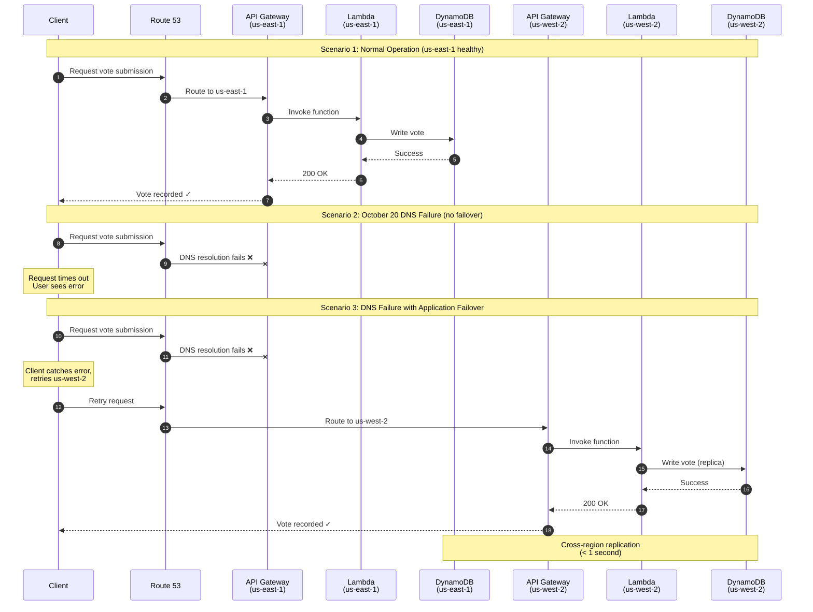

On October 20, 2025, DNS resolution failed in AWS us-east-1, and with it, a lot of DynamoDB applications went down.

Not because DynamoDB itself failed. The service was running. Data was there. Capacity was fine. But applications couldn't reach it because DNS queries for `dynamodb.us-east-1.amazonaws.com` stopped resolving correctly.

If you've ever wondered what happens when the infrastructure layer beneath your supposedly resilient database becomes unreachable—October 20 was the answer. And it wasn't pretty.

I've been thinking about that outage a lot lately, especially in the context of the survey application I built to teach students about serverless architecture. That app would have completely failed on October 20. The frontend would load from CloudFront, but every API call would hit a wall trying to reach DynamoDB in us-east-1.

So I decided to figure out what it would actually take to make that architecture survive a regional DNS failure. Not in theory—in practice, with real Terraform and honest tradeoffs.

Here's what I learned.

## Why "Highly Available" Wasn't Enough

After the outage, I went back and reviewed how I'd configured DynamoDB for the survey app. On paper, it looked solid:

- On-demand capacity (no throttling to worry about)
- SDK retries with exponential backoff
- Adaptive capacity for hot partitions
- CloudWatch alarms watching for errors

This is pretty much the standard DynamoDB resilience checklist. And on October 20, none of it helped.

Because retries don't work if the endpoint can't be resolved.

The SDK would try to send a request, fail at DNS resolution, retry with backoff, fail again, retry longer, fail again—all hitting the same DNS wall. Exponential backoff just meant it took longer to give up.

Adaptive capacity is irrelevant when requests never reach the service. The alarms fired, but by the time anyone saw them, users had already moved on.

Here's the uncomfortable realization: most DynamoDB resilience advice assumes the service is reachable. It's optimized for throttling, hot keys, capacity planning. It doesn't address what happens when the layer beneath DynamoDB becomes unavailable.

And that's exactly what happened on October 20.

## Global Tables: What They Solve (and What They Very Much Don't)

After the outage, the obvious question was: would DynamoDB Global Tables have saved us?

Global Tables give you automated multi-region replication. Write to a table in us-east-1, and the data shows up in us-west-2 within a second or two. It's designed for disaster recovery and geographic distribution.

But here's what Global Tables do not give you:

- Automatic application failover
- DNS independence  
- Transparent client redirection

If your application is configured to talk to `dynamodb.us-east-1.amazonaws.com` and that endpoint becomes unreachable, Global Tables don't help. Your data sits in us-west-2, perfectly healthy and accessible—but your application never tries to use it.

This is where a lot of architects' mental models break down. They think: "I have Global Tables, so my data is replicated. I'm resilient."

Not quite.

## The Hidden Assumption That Broke Everything

Even with Global Tables configured, most applications still have this somewhere in the code:

```python
dynamodb = boto3.resource('dynamodb', region_name='us-east-1')
```

Or this in their Terraform:

```hcl
provider "aws" {
  region = "us-east-1"
}
```

The application is hard-wired to us-east-1. It knows about one region. It sends all traffic there. If DNS in that region fails, the application fails—regardless of how many replica tables exist elsewhere.

This is the "oh shit" moment: **you replicated your data across the globe, but your application never learned to look anywhere else.**

Global Tables solve the data availability problem. They don't solve the application failover problem. And on October 20, it was the second one that broke.

## Availability vs Consistency (Suddenly This Matters)

DynamoDB has two consistency modes:

- **Strongly consistent reads**: Always return the most recent write
- **Eventually consistent reads**: Might return slightly stale data, but stay available during replication lag

In normal operations, this is mostly academic. But during a regional DNS failure, the tradeoff becomes very real.

If you fail over to a replica region and issue strongly consistent reads, those reads might succeed or fail depending on replication lag and table state. If you use eventually consistent reads, they'll work—but you might see data that's a few seconds behind.

For the survey app, the choice is obvious: show slightly stale vote counts. A result that's 10 seconds behind is infinitely better than no result at all. Users can still vote. The system degrades gracefully instead of falling over.

But you have to make that decision before the outage, not during it. You can't architect consistency tradeoffs while your dashboard is on fire.

## Failure Domains Nobody Models

Most teams model failures like this:

- Availability Zone goes down
- Service gets throttled
- Account gets compromised

DNS typically doesn't make the list. It's infrastructure—it just works.

Until it doesn't.

October 20 revealed that regional DNS resolution is a shared fate dependency. When it fails, everything that depends on it fails together. API Gateway, Lambda, DynamoDB, S3—if those services are addressed via DNS in the affected region, you can't reach them.

The survey app has this dependency everywhere: API Gateway in us-east-1 calls Lambda in us-east-1, which calls DynamoDB in us-east-1. Every single one of those calls requires DNS resolution. One DNS failure takes down the entire stack.

A "global service" like DynamoDB doesn't mean no regional failure modes. It means you need to understand which parts have regional dependencies—and DNS is absolutely one of them.

## Warm vs Cold Failover (Pick Your Pain)

There are two ways to handle multi-region failover:

**Cold failover** means your secondary region exists but isn't actively serving traffic. When the primary fails, you manually redirect traffic. This is cheaper—you're only paying for data replication—but recovery takes longer.

**Warm failover** means your secondary region is live, running infrastructure, and ready to take over immediately. Both regions serve traffic. When one fails, users barely notice. This costs more because you're running duplicate infrastructure.

For the survey app, cold failover looks like:
- DynamoDB Global Table replicating votes to us-west-2
- No Lambda, API Gateway, or CloudFront config for us-west-2
- Manual `terraform apply` when things go wrong

Warm failover looks like:
- Full stack deployed in both regions
- Route 53 health checks watching both
- Automatic traffic shifting when health checks fail

DNS-level failures complicate this decision. With a service outage, cold failover's longer recovery might be acceptable. But when DNS fails, even logging into the console to trigger failover might be impacted.

Warm failover starts looking a lot more attractive when "manually fail over" might not be possible.

## How Traffic Actually Flips (The Part Everyone Handwaves)

Failover is a decision, not a default. Something has to decide when to switch regions and actually execute that switch.

For the survey app, there are a few options:

**Application-level region awareness**  
The frontend JavaScript knows about both regions and tries the secondary if the primary fails:

```javascript
const regions = [
  { api: 'https://api-us-east-1.example.com', name: 'us-east-1' },
  { api: 'https://api-us-west-2.example.com', name: 'us-west-2' }
];

async function submitVote(vote) {
  for (const region of regions) {
    try {
      const response = await fetch(`${region.api}/vote`, {
        method: 'POST',
        body: JSON.stringify({ vote })
      });
      return response;
    } catch (error) {
      console.log(`${region.name} failed, trying next`);
    }
  }
  throw new Error('All regions failed');
}
```

This works, but now your frontend code is aware of regional infrastructure. That complexity leaks all the way to the browser.

Here's what this application-level failover looks like in practice:



The diagram illustrates three scenarios:
1. **Normal operation**: Everything works in us-east-1
2. **October 20 failure**: DNS fails and users see errors
3. **With application failover**: When us-east-1 fails, the client automatically retries with us-west-2 and succeeds

**Feature flags or configuration toggles**  
An external service (like LaunchDarkly) controls which region receives traffic. During an outage, ops flips the flag. This centralizes the logic but adds another dependency—and another potential failure point.

**Route 53 health checks**  
DNS-based failover that automatically routes to healthy endpoints. This works for many scenarios, but if regional DNS is failing, Route 53 lookups might also be impacted.

The uncomfortable truth: there's no perfect solution. Each approach has tradeoffs around complexity, blast radius, and new failure modes.

## Making the Survey App Actually Resilient

Let's revisit the serverless survey application. The original architecture:

- S3 + CloudFront serving the frontend
- API Gateway exposing REST endpoints  
- Lambda functions (vote, results, reset)
- DynamoDB storing votes
- Everything in us-east-1

On October 20, this would have completely failed. CloudFront would serve the static site from its global cache, but every API call would hit DNS failures trying to reach API Gateway in us-east-1.

Students would see the survey form but couldn't vote. The results page would spin forever. The reset function would be unreachable.

To make this resilient, I'd implement warm failover with application-level region awareness.

**What keeps working during a DNS failure**:
- Static frontend loads from CloudFront (it's global anyway)
- Vote submissions succeed by failing over to us-west-2 API
- Results page shows counts from the replica table
- Eventually consistent reads mean slight lag is acceptable

**What degrades gracefully**:
- Latency goes up for users far from the secondary region
- Global Table replication lag means new votes take longer to appear everywhere
- No strong consistency guarantees during failover

**What stops working**:
- Nothing critical (that's the entire point)

This is graceful degradation instead of complete failure.

## What Multi-Region DynamoDB Actually Looks Like

Here's the Terraform for making the survey app multi-region:

```hcl
# Primary region
provider "aws" {
  alias  = "primary"
  region = "us-east-1"
}

# Secondary region
provider "aws" {
  alias  = "secondary"
  region = "us-west-2"
}

# DynamoDB table with Global Tables enabled
resource "aws_dynamodb_table" "survey_votes" {
  provider         = aws.primary
  name             = "survey-votes"
  billing_mode     = "PAY_PER_REQUEST"
  hash_key         = "id"
  stream_enabled   = true
  stream_view_type = "NEW_AND_OLD_IMAGES"

  attribute {
    name = "id"
    type = "S"
  }

  # This one line enables Global Tables
  replica {
    region_name = "us-west-2"
  }

  tags = {
    Environment = "production"
  }
}

# Lambda in primary region
resource "aws_lambda_function" "vote_primary" {
  provider      = aws.primary
  function_name = "survey-vote"
  runtime       = "python3.11"
  handler       = "vote.handler"
  filename      = "lambda/vote.zip"

  environment {
    variables = {
      TABLE_NAME = aws_dynamodb_table.survey_votes.name
      REGION     = "us-east-1"
    }
  }
}

# Lambda in secondary region (same code, different region)
resource "aws_lambda_function" "vote_secondary" {
  provider      = aws.secondary
  function_name = "survey-vote"
  runtime       = "python3.11"
  handler       = "vote.handler"
  filename      = "lambda/vote.zip"

  environment {
    variables = {
      TABLE_NAME = aws_dynamodb_table.survey_votes.name
      REGION     = "us-west-2"
    }
  }
}
```

The critical piece is the `replica` block. That tells DynamoDB to automatically replicate to us-west-2. AWS handles the replication—you don't write code for it.

But notice: you still need to deploy Lambda, API Gateway, and all the supporting infrastructure in both regions. Global Tables replicate data, not infrastructure.

## Architecture Diagram Description

The architecture flows left to right:

**Far left: Client layer**
- User browsers, mobile apps, any HTTP client

**Edge layer (global)**
- CloudFront distribution serving static files (HTML, CSS, JS)
- Label: "Global Edge Network"

**Middle: Application layer (two parallel stacks)**

**Primary region stack (us-east-1)**:
- API Gateway endpoint
- Three Lambda functions (vote, results, reset)
- Connected to DynamoDB primary table
- Status indicator: normally green ("Healthy"), red during October 20 ("DNS Failed")

**Secondary region stack (us-west-2)**:
- Identical API Gateway endpoint
- Identical Lambda functions
- Connected to DynamoDB replica table
- Status indicator: green ("Healthy")

**Far right: Data layer**
- Two DynamoDB tables shown side-by-side
- Primary table (us-east-1)
- Replica table (us-west-2)
- Bi-directional arrows between them labeled "< 1s replication"
- Both showing identical data

**Failover control (dashed line across diagram)**:
- Route 53 health checks monitoring both regions
- Decision diamond: "Primary healthy?"
- Yes → route to us-east-1
- No → route to us-west-2
- Alternative path: client-side retry logic (try primary, fall back to secondary)

**DNS dependency markers (red warning icons)**:
- DNS resolution required for API Gateway in each region
- DNS resolution required for DynamoDB endpoints in each region
- These are the exact failure points October 20 exposed

**Bottom: Observability signals**
- CloudWatch alarms in both regions
- Metrics: API error rate, Lambda duration, DynamoDB throttles
- Threshold shown: "Error rate > 5% for 2 minutes → consider failover"

The diagram makes one thing brutally clear: when DNS fails in us-east-1, the entire primary stack becomes unreachable—but us-west-2 keeps running. Data replication keeps them in sync. Application failover keeps users working.

## Tradeoffs Nobody Wants to Talk About

This architecture is more complex than single-region. You're maintaining infrastructure in two regions, managing replication, handling eventual consistency, and building failover logic.

For the survey app—which costs $0/month in a single region—running warm failover in two regions might cost $15/month. That's not a lot in absolute terms, but it's infinitely more expensive than free.

And here's an uncomfortable truth: most teams won't actually test their failover. They'll build it, deploy it, document it, assume it works, and never validate it until a real outage happens.

When October 20 comes, they'll discover:
- Their failover mechanism has a bug
- Their health checks have false positives
- Their SDK client caching interferes with region switching
- Their observability doesn't show which region is actually serving traffic

Multi-region resilience requires ongoing operational investment. It's not "set and forget." You need runbooks, chaos engineering, regular failover drills, and teams who know how to operate it.

That's a lot of overhead for a student survey app.

## Who Actually Needs This

Not every DynamoDB workload needs multi-region failover.

**You should build this if**:
- Downtime directly costs revenue
- You have strict uptime SLAs (99.95%+)
- Users are globally distributed
- Regulatory requirements mandate geographic redundancy
- You've done the math: outage cost > infrastructure cost

**You're probably over-engineering if**:
- Your app is internal tooling
- Downtime measured in hours is tolerable
- You're optimizing for shipping speed over resilience
- Your team doesn't have the operational maturity to manage this complexity

The survey app I built for students? It absolutely doesn't need this. Downtime is annoying, not catastrophic. It's a teaching tool, not a production system.

But if you're running live event voting, mobile game leaderboards, or SaaS APIs that customers depend on—then yes, this makes sense.

The decision isn't technical. It's about risk tolerance, recovery time objectives, and operational burden.

On October 20, a lot of teams learned they'd miscalculated that risk. They assumed regional DNS wouldn't fail.

It did.

Learn from that. Design for the failures that actually happen, not the ones that feel unlikely.
