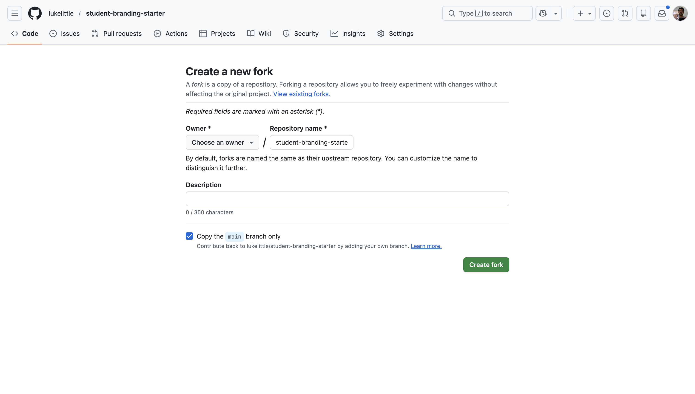
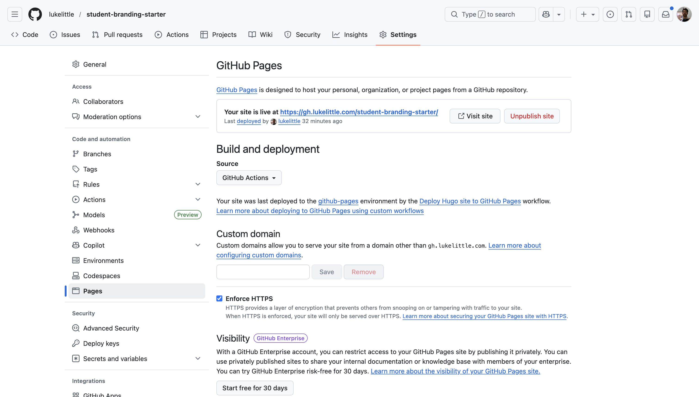
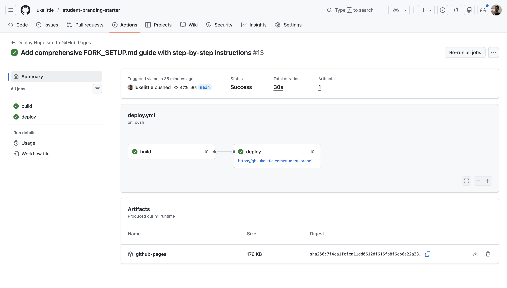

What does your online presence say about you?

For many students, searching their name online brings up little more than a LinkedIn profile and perhaps some social media accounts. This limited visibility can make it challenging to stand out professionally or showcase your actual skills and projects.

A personal website offers a solution - providing a dedicated space where you can control your professional narrative and present your work on your own terms.

Despite the benefits, many students don't create personal websites due to perceived barriers:

- Thinking web development skills are required
- Believing they need extensive projects to showcase first
- Assuming it's expensive or time-consuming

The [student-branding-starter](https://github.com/lukelittle/student-branding-starter) template addresses these concerns by providing a ready-to-use Hugo website template designed specifically for students. It can be deployed to GitHub Pages in minutes at no cost, comes pre-configured, and makes maintaining your online presence as simple as writing Markdown files.

This template isn't just a technical project - it's a foundation for your professional identity online. It creates a platform that can grow with you as you add projects, document your learning, and develop your portfolio.

In this article, I'll cover what the student-branding-starter template offers, how to set it up in under 10 minutes, and how you can use it to create an effective online presence.

## Why This Matters

Having a personal website can significantly boost your professional presence as a student. Here's why it's worth considering:

### Professional Presence

Your online presence matters in today's job market. When someone searches your name online, having a personal website gives you control over what they find. It supplements your LinkedIn profile and provides a more comprehensive view of your skills and interests.

A personal website demonstrates initiative - it shows you're willing to put in effort to present yourself professionally, which is itself a quality employers value.

### Practical Demonstration of Skills

Resumes are full of claims about technical skills, but a personal website lets you demonstrate those skills with actual examples. Instead of simply listing "Python" as a skill, you can show a Python project you built, explain your approach to solving problems, and showcase your coding style.

This transforms abstract claims into concrete evidence of your abilities. It's the difference between telling someone you can bake and showing them a cake you made.

### Building a Portfolio Over Time

One significant advantage of a personal website is that it grows with you. Each project, article, or tutorial you add becomes part of your professional story.

Content you create can serve multiple purposes:
- Showcase your technical skills
- Demonstrate your communication abilities
- Document your progress as a developer
- Help you remember solutions to problems you've solved
- Potentially help others facing similar challenges

As you add more content over time, the value of your site increases. By graduation, you'll have built a comprehensive portfolio that tells your story better than a resume ever could.

### Accessibility to Employers

A personal site makes your work accessible to anyone interested in your skills - including potential employers. When applying for positions, you can include your website URL on your resume, LinkedIn profile, and in your email signature.

This gives reviewers a way to learn more about you beyond your formal application materials and may help you stand out in a competitive field.

### Cost-Effective Solution

The student-branding-starter template deploys to GitHub Pages, which hosts static websites completely free. There's no monthly subscription or hidden fees.

Most other portfolio platforms either charge recurring fees or place your content behind their branding. With this approach, you invest only time, not money - and you maintain complete ownership of your content.

## What You're Building

Let's talk about what you're actually getting with the student-branding-starter template.

I built this after seeing students struggle with complex web development stacks just to put up a simple portfolio. We don't need React or a database for a personal site – simpler is often better.

The template creates a modern, professional website built on proven technology that just works.

### The Tech Behind It

The workflow is intentionally simple:

You write content in Markdown files, push your changes to GitHub, and GitHub Actions automatically runs Hugo to build your site. The built site is deployed to GitHub Pages, making your content live on the web with global distribution.

Hugo generates your site – it's blazing fast and converts simple text files to a beautiful website. GitHub handles the version control and hosting, while GitHub Actions automates the deployment process.

This means your workflow is dead simple. You write content in Markdown (basically plain text with some formatting). When you save and push your changes, everything rebuilds itself automatically. Your site stays live at yourusername.github.io/repository-name.

No databases to configure. No servers to maintain. No complicated deployment pipelines. Just write content, push, and your site updates.

### What Comes Pre-Built

I've included everything students need right out of the box:

A blog section for writing about your projects, what you're learning, or technical concepts you want to explain. A dedicated projects page that showcases your work in a portfolio format. An about page where you tell your story and highlight your skills – often the second most visited page after your homepage.

There's also a "Now" page showing what you're currently focused on (inspired by the /now movement), and a contact page for networking opportunities.

The design is responsive and works beautifully on phones, tablets, and desktops. It's SEO-optimized so Google can find and index your content. It includes both dark and light modes for better reading experience. And it even has multilingual support with English and Spanish included by default.

Social sharing integration helps your content spread, and the whole thing loads lightning fast, scoring 90+ on Google PageSpeed metrics.

I've made it opinionated enough to look professional immediately – no design skills needed – but flexible enough that you can make it your own without getting overwhelmed by options.

## The 10-Minute Setup

The student-branding-starter template is designed for quick setup. Here's how to get your site up and running in about 10 minutes.

### Step 1: Fork the Repository (2 minutes)

First, we need to make your own copy of the template.

Head over to github.com/lukelittle/student-branding-starter and look for the "Fork" button in the top-right corner. Click it and select your GitHub account as the destination.

If you want an especially clean URL, you can rename the repository to yourusername.github.io during this process, but that's optional.

Once you click "Create Fork," GitHub will take about 30 seconds to copy everything to your account.



Forking is better than starting from scratch because you get a direct copy of the repository that you can modify however you want. All the GitHub Actions workflows come pre-configured, and you maintain a connection to the original repo in case you want updates later.

### Step 2: Enable GitHub Pages (1 minute)

Now we need to turn on the free hosting.

Go to your newly forked repository and click the Settings tab. In the left sidebar, find and click "Pages." Under the "Build and deployment" section, select "GitHub Actions" as your source, then save.



This small step tells GitHub to use the workflow file that's already included in the template. This file handles building your site with Hugo and deploying it to GitHub Pages automatically whenever you make changes.

### Step 3: Make It Yours (5 minutes)

Time to personalize your site. We'll edit the main configuration file directly on GitHub for now.

Find and click on the hugo.toml file in your repository, then hit the pencil icon to edit it. This file controls how your site looks and functions.

You'll want to update a few key sections:

First, change the baseURL to match your GitHub username and repository name:
```toml
baseURL = "https://yourusername.github.io/repository-name/"
```

Next, replace the title and author information with your name:
```toml
title = "Your Name - Personal Site"

[params]
  author = "Your Name"
  description = "Student, developer, and lifelong learner."
```

Then update your social links so visitors can connect with you:
```toml
[[params.socialIcons]]
  name = "github"
  url = "https://github.com/yourusername"
  
[[params.socialIcons]]
  name = "linkedin"
  url = "https://linkedin.com/in/yourprofile"
  
[[params.socialIcons]]
  name = "email"
  url = "mailto:your.email@example.com"
```

Finally, personalize your home page information:
```toml
[params.homeInfoParams]
  Title = "Hi, I'm Your Name 👋"
  Content = """
I'm studying computer science at State University with a focus on machine learning.
I write about my projects and what I'm learning here.

**Currently:** Building a recommendation engine for my senior project.
"""
```

When you're finished, scroll down and click "Commit changes," add a message like "Customize site with my information," and commit again.

This commit triggers your first build and deployment automatically.

### Step 4: Watch the Magic Happen (1 minute)

Click over to the "Actions" tab in your repository. You'll see a workflow running – this is GitHub building your site.

Wait for the green checkmark to appear, indicating that deployment was successful. This usually takes just 1-2 minutes.



### Step 5: See Your Live Site (1 minute)

Head back to Settings → Pages. You'll see a message with your site URL: "Your site is live at https://yourusername.github.io/repository-name/"

Click that link, and boom – your professional personal site is live on the internet.

That's it. In less than 10 minutes, you've gone from nothing to having a fully functional personal website. No web development experience required.

## Writing Your First Content

Once your site is live, the next step is filling it with content that demonstrates your skills and interests.

### Creating a Blog Post

Blog posts are an excellent way to document your learning and showcase your problem-solving approach. Consider writing about:

- Projects you're working on
- Concepts you've recently learned
- Technical challenges you've overcome
- Tools or libraries you've explored

To create a new post, you'll use Hugo's command line interface:

```bash
# Clone your repository locally
git clone https://github.com/yourusername/repository-name.git
cd repository-name

# Install Hugo if you haven't already (macOS example)
brew install hugo

# Create a new post
hugo new posts/my-first-post.md
```

This creates a file at `content/posts/my-first-post.md` with default front matter:

```markdown
---
title: "My First Post"           # Post title
date: 2026-02-15                 # Publication date
draft: true                      # Draft status (true = hidden)
tags: []                         # Categories for organizing
summary: ""                      # Brief description
---

Your content goes here...
```

The front matter (section between `---` lines) contains metadata about your post:

- **title:** The main headline
- **date:** Publication date
- **draft:** Set to `false` when ready to publish
- **tags:** Categories for organization
- **summary:** Brief preview shown in listings

Below the front matter, you write your content using Markdown, which is a simple formatting syntax. A typical post might include headings, code blocks, lists, and images:

```markdown
## Project Overview

This post documents my process building a simple data visualization tool.

### The Problem

I needed to visualize temperature data collected from multiple sensors.

### The Solution

I built a visualization tool using Python with Matplotlib:

```python
import matplotlib.pyplot as plt
import pandas as pd

# Load the data
data = pd.read_csv('temperature_data.csv')

# Create the visualization
plt.figure(figsize=(10, 6))
plt.plot(data['timestamp'], data['temperature'])
plt.title('Temperature Readings Over Time')
plt.xlabel('Time')
plt.ylabel('Temperature (°C)')
plt.grid(True)
plt.show()
```

When your post is ready to publish:

1. Set `draft: false` in the front matter
2. Commit and push to your repository:

```bash
git add content/posts/my-first-post.md
git commit -m "Add my first blog post"
git push
```

GitHub Actions will automatically rebuild and deploy your site with the new content.

### Creating Project Pages

The Projects section of your site is designed specifically for showcasing your portfolio work. While blog posts can explain concepts or document your learning journey, project pages follow a more structured format to highlight specific work you've completed.

To create a new project page:

```bash
hugo new projects/my-project.md
```

This creates a file with project-specific front matter:

```markdown
---
title: "My Project"
date: 2026-02-15
draft: true
tags: ["python", "web-dev"]
summary: "A brief description of this project"
---

## Overview

A short introduction to what this project is and why you built it.

**Live Demo:** [Link to demo if available]
**GitHub:** [Link to repository]

## Problem Statement

What problem were you trying to solve?

## Tech Stack

- Technology 1
- Technology 2
- Technology 3

## Key Features

- Feature 1: Brief description
- Feature 2: Brief description
- Feature 3: Brief description

## What I Learned

What skills or knowledge did you gain from this project?

## Challenges

What obstacles did you encounter and how did you overcome them?

## Results

What was the outcome of the project? Include metrics if possible.

## Future Improvements

How would you extend or improve this project given more time?
```

The template prompts you to include important aspects of your project:

- What problem it solves
- Technologies used
- Key features implemented
- Learning outcomes
- Challenges encountered
- Results achieved
- Future development plans

This structure helps present your work in a comprehensive way that demonstrates both technical abilities and your problem-solving approach.

When documenting projects, remember that even smaller projects can be valuable portfolio pieces when you explain your process and what you learned. Class assignments, hackathon projects, and personal explorations all deserve documentation.

Once you've completed your project page, set `draft: false` in the front matter, commit and push to make it live.

### Updating Your About Page

The About page tells visitors who you are, what motivates you, and what skills you bring. Edit `content/about.md` with:

- Your educational background
- Technical skills and strengths
- Career interests and goals
- Personal motivations or philosophy
- Links to your resume or key projects

This page is often the second most-visited after your homepage, so invest time in making it authentic and engaging.

## Making It Yours

Now that you have the basics working, let's customize your site to truly make it your own.

### Adding Your Profile Photo

1. Add your photo to the `static/images/` directory
2. Edit `hugo.toml` to reference it:

```toml
[params]
  profileMode = true
  profilePicture = "/images/your-photo.jpg"
```

Keep your photo professional but authentic. A simple headshot with good lighting works best.

### Customizing Colors and Style

The template uses PaperMod theme, which offers built-in customization:

1. Create a file at `assets/css/extended/custom.css`
2. Add your custom CSS:

```css
:root {
  --primary-color: #4a89dc;
  --border-radius: 8px;
}

.post-title {
  font-size: 2.5rem;
}
```

This overrides the default styles without modifying theme files.

### Setting Up a Custom Domain (Optional)

While `yourusername.github.io/repository-name` works well, a custom domain like `yourname.com` looks more professional:

1. Purchase a domain from Namecheap, Google Domains, or similar
2. In your repository, go to **Settings → Pages**
3. Under "Custom domain", enter your domain name
4. Set up DNS records as instructed
5. Check "Enforce HTTPS"
6. Update `hugo.toml` with your new domain:

```toml
baseURL = "https://yourname.com/"
```

For detailed instructions, see the [Custom Domain section](https://github.com/lukelittle/student-branding-starter#custom-domain-setup) in the repository README.

### Adding Analytics (Optional)

To track visitors and popular content:

1. Create a Google Analytics account
2. Get your measurement ID (G-XXXXXXXX)
3. Add to `hugo.toml`:

```toml
[params.analytics]
  google = {
    SiteVerificationTag = "G-XXXXXXXX"
  }
```

This gives you insights into which content resonates with visitors.

## Content Strategy for Students

A common question is: "What should I write about?" Here are some content ideas that work well for student portfolio sites:

### Content Ideas

**1. Class Project Documentation**

When documenting class projects, focus on your unique perspective:
- Design decisions you made and why
- What you might do differently in future iterations 
- Any extensions or features you added beyond requirements
- Specific challenges you encountered and how you solved them

**2. Learning Reflections**

Consider writing about concepts you've recently mastered:
- Explanations of difficult topics in your own words
- Step-by-step guides through concepts that were challenging
- Visual aids or diagrams that helped your understanding
- Resources that were most helpful in your learning process

**3. Technology Comparisons**

If you've used different approaches to solve similar problems:
- Compare and contrast the technologies or methods
- Discuss trade-offs between different solutions
- Explain which scenarios might favor one approach over another
- Example: "Comparing React and Vue for Building a Student Dashboard"

**4. Problem-Solving Documentation**

When you solve technical challenges:
- Document the error or issue you encountered
- Explain your debugging process
- Share the solution you found
- Reflect on what you learned from the experience

**5. Event Summaries**

After attending technical events:
- Summarize key takeaways
- Describe interesting projects or talks
- Reflect on how the content relates to your interests

**6. Learning Resources Collections**

Organize helpful resources:
- Curate lists of useful learning materials
- Add your own commentary on why they were valuable
- Organize by topic or learning objective

### Posting Frequency

Focus on quality over quantity:
- Start with a goal of one thoughtful post per month
- Maintain consistency rather than posting in bursts
- Consider shorter, focused posts (500-800 words) that clearly explain one concept

### SEO Basics (In Plain English)

Search Engine Optimization isn't complex for personal sites. Focus on:

1. **Use descriptive titles** - "How I Built a Task Management System with React" is better than "My Project"
2. **Write clear summaries** - These appear in search results and social shares
3. **Use relevant tags** - These help organize your content
4. **Link to relevant sources** - Both internal and external
5. **Include code snippets** - These add value and help with technical searches

Most importantly: write naturally about topics you understand. Google rewards authentic expertise.

### Building an Audience

For students, focus on quality over distribution:
- **Share posts in relevant communities** (Reddit, Discord, Slack groups)
- **Cross-post to DEV.to or Hashnode** (linking back to your site)
- **Include your site URL in your GitHub profile**
- **Add it to your LinkedIn profile and resume**

Be patient—audience growth is typically slow at first and then compounds over time.

## Potential Scenarios

Here's how a personal website might benefit your job application process:

### Application Scenario Example

**Without a personal website:**
- Your application consists of a resume listing skills and projects
- Reviewer may quickly scan your GitHub repositories but might not explore deeply
- Limited time to evaluate your experience based on bullet points
- Your application may look similar to many others

**With a personal website:**
- Your application includes a link to your personal site
- Reviewer can see your projects with detailed explanations
- Your problem-solving approach is demonstrated through your posts
- Your communication skills are evident in your writing
- Your portfolio provides specific talking points for interviews

### What Can Improve Your Application

While every job application is different, having a personal site can potentially:

- Provide evidence of skills mentioned in your resume
- Showcase your communication ability
- Demonstrate initiative and follow-through
- Give interviewers specific projects to discuss
- Show how you think about and solve problems

### Content Suggestions

Consider creating these types of content for your site:

1. **Project documentation** with explanations of your approach
2. **Tutorials** for concepts you've recently learned
3. **Technical challenges** you've faced and how you solved them
4. **Learning resources** you've found helpful
5. **Code samples** that demonstrate your skills

The most valuable content tends to be authentic, clearly explained, and shows your problem-solving approach.

## Advanced Features

Once you're comfortable with the basics, you can take advantage of more advanced features:

### Local Development Workflow

Running Hugo locally gives you instant preview of your changes:

```bash
# Start the Hugo development server
hugo server -D

# View your site at http://localhost:1313
```

The `-D` flag shows draft posts, and changes appear immediately as you save files.

### Creating Custom Sections

Beyond blog posts and projects, you might want custom sections like "Notes" or "Resources":

1. Create a directory: `content/resources/`
2. Add an `_index.md` file with front matter:

```markdown
---
title: "Resources"
description: "Helpful resources I've collected"
---

Introduction text here...
```

3. Add to navigation in `hugo.toml`:

```toml
[[menu.main]]
  identifier = "resources"
  name = "Resources"
  url = "/resources/"
  weight = 60
```

### Understanding GitHub Actions Workflow

The automation that deploys your site is controlled by `.github/workflows/deploy.yml`:

```yaml
name: Deploy Hugo site to Pages

on:
  push:
    branches: ["main"]
  workflow_dispatch:

jobs:
  build:
    runs-on: ubuntu-latest
    steps:
      - name: Checkout
        uses: actions/checkout@v3
        with:
          submodules: true
      
      - name: Setup Hugo
        uses: peaceiris/actions-hugo@v2
        
      - name: Build
        run: hugo --minify
        
      - name: Upload artifact
        uses: actions/upload-pages-artifact@v1
        
  deploy:
    needs: build
    runs-on: ubuntu-latest
    permissions:
      pages: write
      id-token: write
    steps:
      - name: Deploy to GitHub Pages
        uses: actions/deploy-pages@v1
```

This workflow:
1. Checks out your repository with theme submodules
2. Sets up Hugo in the environment
3. Builds your site with optimization
4. Uploads the built site as an artifact
5. Deploys the artifact to GitHub Pages

You can customize this workflow for advanced needs like scheduled posts or multiple environments.

### Performance Optimization

The starter template is already optimized, but for even better performance:

1. Compress images before uploading with tools like [TinyPNG](https://tinypng.com/)
2. Use Hugo's built-in asset processing for CSS and JS
3. Lazy-load images for blog posts:

```markdown

```

4. Minimize external dependencies and third-party scripts

These optimizations help your site score well on Google's PageSpeed metrics.

## Common Pitfalls & Solutions

### "I don't have anything interesting to write about"

**Solution:** Start with what you're learning right now. Explanation is a form of learning, and writing about a concept helps solidify your understanding. Your unique perspective makes even basic topics valuable.

**Prompt:** Write about the last bug that took you more than 30 minutes to solve.

### "My writing isn't good enough"

**Solution:** Technical writing values clarity over style. Focus on being clear and specific. Use short sentences, include code examples, and explain your thinking. The more you write, the better you'll get.

**Pro tip:** Start by outlining with bullet points, then expand each point into a paragraph.

### "No one will read my content"

**Solution:** You're writing for three audiences:
1. Future you (documentation of your learning)
2. Recruiters and potential employers
3. Other students facing similar challenges

Even if the wider audience never materializes, the first two provide enough value to justify the effort.

### Technical Issues During Setup

**Problem:** "Theme not loading"

**Solution:** Make sure you initialized the theme submodule:
```bash
git submodule update --init --recursive
```

**Problem:** "Site shows 404 after deployment"

**Solution:** Check your `baseURL` in `hugo.toml`. It must match exactly where your site is deployed (including trailing slash).

**Problem:** "Changes not showing up"

**Solution:** Hard refresh your browser (Ctrl+Shift+R or Cmd+Shift+R) to clear cache.

## The Bigger Picture

Building a personal site isn't just about having a portfolio—it's about establishing infrastructure for your career.

### Building Digital Assets

Each post, project write-up, and tutorial you create is a digital asset that:
- Demonstrates your skills and thinking
- Helps others solve problems
- Improves your own understanding
- Builds your professional reputation
- Creates serendipitous opportunities through discovery

Unlike social media posts that disappear in feeds, your personal site content has longevity and compounds in value.

### Skills Beyond the Technical

Maintaining a personal site develops crucial meta-skills:
- **Technical writing:** Clearly communicating complex ideas
- **Knowledge management:** Organizing and structuring information
- **Public learning:** Being comfortable showing your growth
- **Digital presence management:** Controlling your online narrative
- **Personal brand development:** Defining how you want to be known

These soft skills often differentiate great engineers from good ones.

### The Long Game

Your personal site is a long-term investment with increasing returns:
- **Year 1:** Establish baseline presence and early portfolio
- **Year 2:** Build content library and refine voice
- **Year 3:** Leverage for internships and opportunities
- **Year 4+:** Position as industry contributor with viewpoints

Students who start early have a significant advantage by graduation.

## Next Steps

Ready to build your personal brand? Here's your action plan:

1. **Today:** Fork the repository and deploy your site
2. **This week:** Customize your About page and add a profile photo
3. **Before the weekend:** Write your first blog post or project page
4. **Within 30 days:** Have at least 3 pieces of content published
5. **Ongoing:** Aim for 1-2 new posts per month

### Resources to Help You Succeed

- **Technical Writing:** [Google's Technical Writing Course](https://developers.google.com/tech-writing)
- **Markdown Guide:** [The Markdown Guide](https://www.markdownguide.org/)
- **Content Ideas:** [dev.to/t/beginners](https://dev.to/t/beginners) for inspiration
- **Hugo Documentation:** [Hugo Docs](https://gohugo.io/documentation/)
- **Example Student Sites:** Browse the [student-branding-starter discussions](https://github.com/lukelittle/student-branding-starter/discussions) for real examples

### Commit to Consistency

The students who see the biggest impact from their personal sites are those who commit to consistency. It's better to publish one thoughtful post per month than to publish five posts and then abandon your site.

Schedule time for writing just like you schedule study time. Even 30 minutes twice a week is enough to maintain momentum.

---

Your personal brand isn't just what you say about yourself—it's what Google says about you when someone searches your name. With student-branding-starter, you're taking control of that narrative and building a professional presence that will serve you throughout your career.

The best part? You can start today, for free, in just 10 minutes. 

Your future self will thank you.