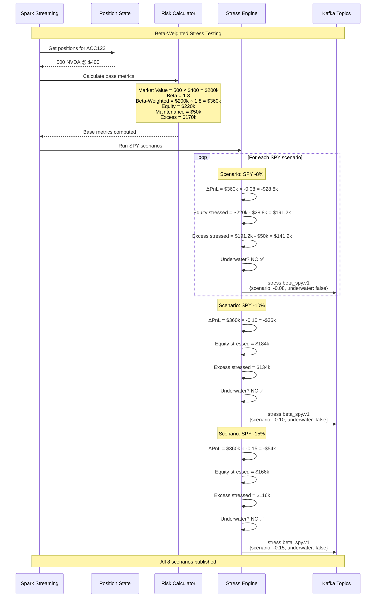
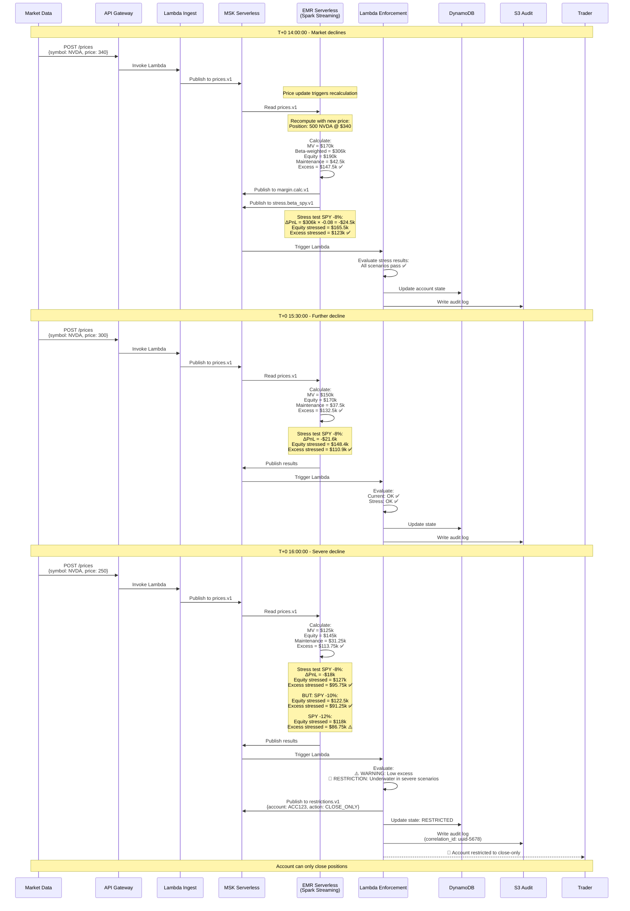
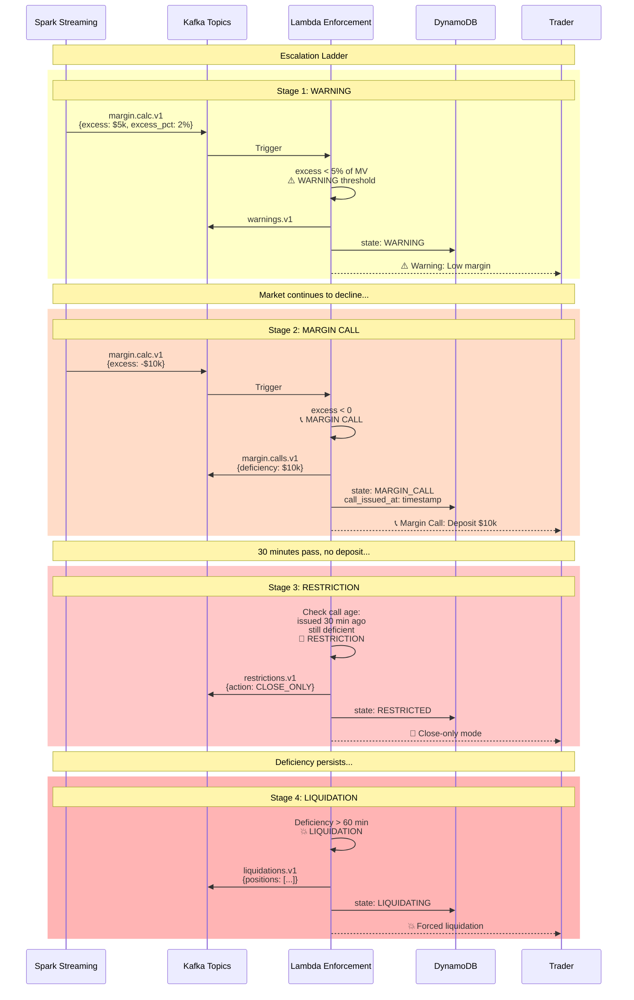

## Introduction

Margin risk management is critical to brokerages, where volatility events can pose existential risks when clients hold concentrated positions with leverage. Imagine a scenario where a stock held through margin, having a high beta coefficient (making it especially reactive to market movements), is held by enough clients to cause catastrophic losses during a flash crash. It only takes minutes for the damage to be done.

As fiduciaries, brokers must ensure the firm can weather all sorts of market events so that clients' funds remain safe. This necessitates constant vigilance and examination of risk positions. Traditionally, these calculations were done through batch processes running hourly, every 15 minutes, or if you were really advanced, every minute. But modern technology has made it possible—through tools like Kafka and Spark Streaming—to make these calculations in real-time, as the market moves.

This article explores how to build a real-time margin risk monitoring system using event-driven architecture, inspired by FINRA Rule 4210 (margin requirements), TIMS (Theoretical Intermarket Margining System), and industry-standard beta-weighted stress testing. You'll see not just the technical implementation, but also the reasoning behind these architectural decisions.

Before diving into the implementation details, let's understand the regulatory foundation that drives the design choices for a system like this.

## The Regulatory Context

### FINRA Rule 4210: Margin Requirements

Let's start with the rules of the game. FINRA sets the baseline requirements, but in practice, most firms implement stricter rules for their own protection.

FINRA Rule 4210 establishes minimum margin requirements for broker-dealers. The key provisions are straightforward:

**Regulation T (Initial Margin)**: This comes from the Federal Reserve—50% for equity purchases. It means when a customer buys securities on margin, they must deposit at least 50% of the purchase price themselves. The other half can be borrowed.

**Maintenance Margin**: Once the position is open, FINRA requires customers to maintain equity of at least 25% of the long market value. If equity falls below this threshold, the broker must issue a margin call.

```
Maintenance Requirement = 25% × Long Market Value
Equity = Cash + Market Value
Excess = Equity - Maintenance Requirement
```

When Excess drops below zero, you have what we call a "margin deficiency"—the customer must deposit additional funds or liquidate positions. And time matters here—the longer an account stays deficient, the greater the risk to the firm.

**House Requirements**: Here's where it gets interesting. Most broker-dealers impose stricter requirements than these regulatory minimums. Why? Because the 25% rule was designed in a different era of market volatility. Common house rules include:

- Higher maintenance rates (typically 30-40% instead of 25%)
- Concentration add-ons for customers with large single positions
- Volatility-based adjustments that increase requirements for more volatile stocks
- Special restrictions for low-priced securities that can move dramatically

These house rules form the first line of defense against market volatility. But they're still based on simple percentages, which brings us to portfolio margin—a more sophisticated approach.

### Portfolio Margin (Rule 4210(g))

Portfolio margin represents a significant evolution in risk management. For eligible accounts (typically those with $100k+ equity and sophisticated investors), portfolio margin replaces those fixed percentages with something much more intelligent: risk-based requirements.

Instead of the one-size-fits-all approach, portfolio margin evaluates the worst-case loss across various market scenarios:

```
For each scenario (e.g., underlying ±15%):
    Revalue all positions
    Compute portfolio value
Worst-Case Loss = min(portfolio values) - current value
Requirement = |Worst-Case Loss| × multiplier
```

This approach brings several advantages:
- It recognizes hedges and offsets (if you're long stock but have protective puts, your risk is capped)
- It reduces capital requirements for hedged portfolios
- It increases requirements for concentrated, directional positions
- It aligns margin requirements with actual portfolio risk

To implement this approach effectively, we need a solid theoretical framework—which brings us to TIMS.

## TIMS: Theoretical Intermarket Margining System

The backbone of modern margin risk systems is the Theoretical Intermarket Margining System, or TIMS. Developed by the Options Clearing Corporation (OCC), it's the industry standard for calculating portfolio margin requirements.

### How TIMS Works

TIMS takes a scenario-based approach that's both elegant and practical:

1. **Define Scenario Grid**: First, you create a matrix of underlying price moves and volatility changes. Imagine a grid like this:
   ```
   Price scenarios: -15%, -10%, -5%, 0%, +5%, +10%, +15%
   Volatility scenarios: -4%, -2%, 0%, +2%, +4%
   ```
   This creates 35 different market scenarios to test the portfolio against.

2. **Revalue Portfolio**: For each scenario, you revalue all positions using theoretical pricing models. This typically means Black-Scholes for options and simple mark-to-market for stocks. The key is repricing *everything* consistently in each scenario.

3. **Find Worst Case**: Next, you identify which scenario produces the largest loss. This reveals the portfolio's true risk profile.

4. **Set Requirement**: Finally, margin equals the absolute value of the worst-case loss, sometimes with a multiplier for additional safety.

### Why TIMS Matters

TIMS captures risk dimensions that fixed-percentage margin completely misses:

- **Non-linear risk**: Options have convexity, meaning their value doesn't move linearly with the underlying. Standard margin rules are blind to this, but TIMS isn't.
- **Hedges**: If a portfolio has long stock with a protective put, the downside is capped. TIMS recognizes this, while standard margin would over-margin the position.
- **Correlation**: Positions in correlated underlyings often offset each other's risk. TIMS allows for this natural hedging.

For our educational system, we implement a simplified TIMS model focusing just on equities (no options), to demonstrate the power of the scenario-based approach. But to apply these scenarios efficiently, we need a way to normalize market exposure—which brings us to beta weighting.

## Beta Weighting: Converting Portfolios to Market Exposure

One of the most powerful techniques in risk management is beta weighting—a way to normalize diverse portfolios to a common risk measure. It's like finding a universal adapter that lets you compare apples to oranges.

Beta (β) measures how much a stock moves relative to the market. The formula is straightforward:

```
β = Cov(Stock, Market) / Var(Market)
```

But what this really tells you is powerful:
- β = 1.0: The stock moves in lockstep with the market (think SPY itself)
- β = 1.5: High volatility—moves 1.5× the market (high beta stocks like many tech names)
- β = 0.5: More stable—moves only half as much as the market (low beta, defensive stocks like utilities)

### Beta-Weighted Market Value

The magic happens when you convert a diverse portfolio to SPY-equivalent exposure:

```
Beta-Weighted Value = Position Value × Beta
Total Beta-Weighted Exposure = Σ (Position Value_i × Beta_i)
```

Let's look at an educational example. Say we have this portfolio:

| Symbol | Value | Beta | Beta-Weighted |
|--------|-------|------|---------------|
| AAPL | $15,000 | 1.2 | $18,000 |
| NVDA | $20,000 | 1.8 | $36,000 |
| KO | $12,000 | 0.6 | $7,200 |
| **Total** | **$47,000** | | **$61,200** |

Here's the key insight: this $47,000 portfolio actually has the market risk of $61,200 of SPY. It's effectively leveraged 1.3×, even though no actual margin debt exists. That's a risk exposure that traditional margin calculations would completely miss.

This beta-weighting technique is powerful because it lets us compare different portfolios on an equal footing. And once we have this normalized view, we can run sophisticated stress tests.

### Stress Testing with Beta Weighting

Once we have beta-weighted our portfolios, we can apply common scenarios across all of them and identify hidden risks before they materialize.

Our system applies these steps:

```
Run SPY Scenarios: -8%, -6%, -4%, -2%, 0%, +2%, +4%, +6%

For each scenario:
    Calculate ΔPnL = Beta-Weighted Exposure × SPY Move %
    Determine Equity_stressed = Equity + ΔPnL
    Compute Excess_stressed = Equity_stressed - Maintenance Requirement
    
    If Excess_stressed < 0:
        Flag that the account is underwater in this scenario
```

A prudent house rule might be: If an account would be underwater in severe stress scenarios (e.g., SPY -6% or worse), apply trading restrictions even if their current margin is adequate.

The rationale is straightforward: high-beta, leveraged accounts can become problematic during market stress events. By being proactive with restrictions, firms can prevent losses during volatility events.

This scenario-based thinking is powerful, but to make it truly effective, we need to apply it in real-time rather than in overnight batch processes. That's where a streaming architecture comes in.

### Beta-Weighted Stress Testing in Action

This sequence diagram illustrates how beta-weighted stress testing is performed in the system:



## The Streaming Architecture

### Why Streaming?

The evolution of margin calculations has been remarkable. They started as end-of-day batch jobs, evolved to hourly runs, then to 15-minute intervals. But even that isn't good enough for today's volatile markets.

Real-time streaming is becoming necessary for several reasons:

- **Intraday volatility** can create margin deficiencies in minutes or even seconds—accounts can go from healthy to deeply underwater in a single 15-minute window during flash crashes
- **Positions change continuously** as clients execute trades throughout the day
- **Prices change continuously**, especially for volatile stocks in active markets
- **Regulatory expectations** have steadily moved toward more immediate monitoring as technology has improved

A modern streaming architecture can provide:

- **Low latency**: Risk updates within seconds of market movements or trade executions
- **Impressive scalability**: The ability to handle millions of price and trade events per day across thousands of accounts
- **Complete auditability**: Every event captured with causality trails, allowing reconstruction of exactly why a margin call was triggered
- **Solid resilience**: Fault-tolerance with exactly-once processing guarantees, so events won't be double-counted or missed

The right architecture isn't just a technical choice—it's a business and regulatory advantage that directly impacts risk management capabilities and capital efficiency.

### System Design

```
Market Data → Kafka → Spark Streaming → Risk Calculation → Enforcement → Audit
```

**Components**:

1. **Kafka Topics**: Event streams for fills, prices, betas, margin calculations, stress results, enforcement actions

2. **Spark Streaming**: Stateful processing
   - Maintains position state per account
   - Joins fills with prices and betas
   - Computes margin requirements
   - Performs stress testing
   - Emits results

3. **Lambda Enforcement**: Event-driven logic
   - Consumes margin and stress events
   - Applies escalation ladder
   - Emits margin calls, restrictions, liquidations
   - Writes audit trail

4. **Storage**: DynamoDB (state index), S3 (audit trail)

### Data Flow Example

**T+0 09:30**: Account buys 1000 NVDA at $400
- Event: `fills.v1` → `{account_id, symbol: NVDA, qty: 1000, price: 400}`

**T+0 09:30:05**: Spark processes
- Updates position state
- Joins with price ($400) and beta (1.8)
- Computes:
  - Market Value: $400,000
  - Beta-Weighted: $720,000
  - Equity: $440,000 (with $40k cash)
  - Maintenance Req: $100,000 (25%)
  - Excess: $340,000 ✅
- Emits: `margin.calc.v1`

**T+0 09:30:10**: Spark runs stress tests
- SPY -8% scenario:
  - ΔPnL: $720,000 × -0.08 = -$57,600
  - Equity_stressed: $382,400
  - Excess_stressed: $282,400 ✅
- Emits: `stress.beta_spy.v1`

**T+0 14:00**: SPY drops 5%, NVDA drops 9%
- Event: `prices.v1` → `{symbol: NVDA, price: 364}`

**T+0 14:00:05**: Spark recomputes
- Market Value: $364,000
- Equity: $404,000
- Excess: $313,000 ✅
- Emits: `margin.calc.v1`

**T+0 14:00:10**: Stress tests show account would be underwater if SPY drops another 8%
- Lambda evaluates: Account at risk
- Emits: `restrictions.v1` → Close-only mode

### Enforcement Ladder

The system escalates based on risk severity:

| Condition | Action | Description |
|-----------|--------|-------------|
| Excess < 5% of MV | WARNING | Alert sent |
| Excess < 0 | MARGIN_CALL | Deposit funds or reduce positions |
| Underwater in severe stress | RESTRICTION | Close-only mode |
| Deficiency persists > 30 min | LIQUIDATION | Firm liquidates positions |

Each action is logged to the audit trail with correlation IDs for traceability.

### Event Flow: Market Stress Scenario

This sequence diagram shows what happens when the market declines and triggers the enforcement ladder, visualizing how the system reacts to changing prices and risk levels in real-time:



### Enforcement Escalation in Detail

Here's a detailed visualization of how the system escalates from warning to liquidation according to the enforcement ladder:



## Implementation: Key Code Patterns

### Spark: Stateful Position Tracking

```python
# Maintain cumulative positions
positions = fills_df \
    .withWatermark("timestamp", "1 minute") \
    .groupBy("account_id", "symbol") \
    .agg(sum("qty").alias("qty"))

# Join with prices and betas
positions_enriched = positions \
    .join(latest_prices, on="symbol") \
    .join(latest_betas, on="symbol") \
    .withColumn("market_value", col("qty") * col("price")) \
    .withColumn("beta_weighted_value", col("market_value") * col("beta"))

# Aggregate per account
account_summary = positions_enriched.groupBy("account_id").agg(
    sum("market_value").alias("total_mv"),
    sum("beta_weighted_value").alias("beta_weighted_exposure")
)
```

### Spark: Stress Testing

```python
spy_scenarios = [-0.08, -0.06, -0.04, -0.02, 0.0, 0.02, 0.04, 0.06]

for scenario in spy_scenarios:
    stress_df = account_summary \
        .withColumn("scenario", lit(scenario)) \
        .withColumn("delta_pnl", col("beta_weighted_exposure") * lit(scenario)) \
        .withColumn("equity_stressed", col("equity") + col("delta_pnl")) \
        .withColumn("excess_stressed", col("equity_stressed") - col("maintenance_req")) \
        .withColumn("underwater", col("excess_stressed") < 0)
    
    # Emit to Kafka
    stress_df.writeStream.format("kafka").option("topic", "stress.beta_spy.v1").start()
```

### Lambda: Enforcement Logic

```python
def enforce_margin(margin_event):
    account_id = margin_event['account_id']
    excess = margin_event['excess']
    
    if excess < 0:
        deficiency = abs(excess)
        emit_margin_call(account_id, deficiency)
        
        # Check if call is stale
        if is_call_stale(account_id, minutes=30):
            emit_restriction(account_id, 'CLOSE_ONLY')
            
            if still_deficient(account_id):
                emit_liquidation(account_id)

def enforce_stress(stress_event):
    if stress_event['underwater'] and abs(stress_event['scenario']) >= 0.06:
        emit_restriction(
            stress_event['account_id'],
            'CLOSE_ONLY',
            reason=f"Underwater in SPY {stress_event['scenario']:.1%} scenario"
        )
```

## AWS Serverless Deployment

The system uses serverless AWS services:

- **MSK Serverless**: Managed Kafka without cluster sizing
- **EMR Serverless**: Spark jobs without always-on clusters
- **Lambda**: Event-driven enforcement
- **DynamoDB**: Fast state lookups
- **S3**: Durable audit storage

**Benefits**:
- Pay only for what you use
- Auto-scaling
- Minimal operational overhead
- Focus on business logic

**Cost**: Demo runs cost ~$5-10 total.

## Production Architecture Considerations

### The Cold Start Problem

When implementing a system like this in the real world, architects face a critical trade-off with serverless compute: **cost vs. latency**.

This trade-off presents decision-makers with challenging choices:

**Cold Start** (first job after idle):
- Time: 2-4 minutes to start processing
- Cost: $0 while idle (budget-friendly)
- Use case: Batch jobs, non-time-sensitive workloads

**Warm Workers** (pre-initialized capacity):
- Time: 30-60 seconds to respond
- Cost: ~$0.39/hour for idle workers (ongoing expense)
- Use case: Production systems requiring low latency

The question becomes: is saving money on idle capacity worth potentially missing critical market events? For most production risk systems, the answer is clearly no, but it's a decision each organization must make based on their risk tolerance and budget.

### Our Choice: Pre-Initialized Workers

For a real-time margin risk system, we configure EMR Serverless with pre-initialized capacity:

```hcl
resource "aws_emrserverless_application" "spark" {
  # Pre-initialized capacity keeps workers warm
  initial_capacity {
    initial_capacity_type = "Driver"
    initial_capacity_config {
      worker_count = 1
      worker_configuration {
        cpu    = "2 vCPU"
        memory = "4 GB"
      }
    }
  }
  
  initial_capacity {
    initial_capacity_type = "Executor"
    initial_capacity_config {
      worker_count = 2
      worker_configuration {
        cpu    = "2 vCPU"
        memory = "4 GB"
      }
    }
  }
}
```

**Why?**

1. **Regulatory Expectations**: Margin monitoring should be near real-time
2. **Risk Management**: 2-4 minute delays could expose the firm to losses
3. **Operational Reality**: Production systems prioritize availability over cost
4. **User Experience**: Traders expect instant feedback

**Cost Impact**:

| Configuration | Startup Time | Idle Cost | 8-Hour Cost | Use Case |
|---------------|--------------|-----------|-------------|----------|
| No pre-init | 2-4 minutes | $0/hour | $1.01 | Batch, demos |
| Pre-initialized | 30-60 seconds | $0.39/hour | $4.13 | Production |

**Trade-off Analysis**:

For a real-world margin monitoring system, the analysis might look like this:

- **Downside**: $0.39/hour idle cost = $280/month if running 24/7
- **Upside**: Sub-minute latency, meets regulatory expectations, could prevent significant losses during market events
- **Alternative**: Flink on KDA ($158/month) for true streaming could be considered, though it might require different expertise

This represents one of those pragmatic architectural decisions that production systems face: sometimes it makes sense to **pay for idle capacity to ensure low latency**. When put in perspective—operational costs like this are typically minuscule compared to what a single missed margin event could cost—the decision becomes more straightforward.

### Comparison to Traditional Architecture

**Traditional (Always-On EMR Cluster)**:
- Cost: ~$280/month (2 × m5.xlarge)
- Startup: Instant (always running)
- Scaling: Manual
- Idle cost: Full cost even with no load

**Serverless with Pre-Init**:
- Cost: ~$280/month if running 24/7, $0 if stopped
- Startup: 30-60 seconds
- Scaling: Automatic
- Idle cost: Only for pre-initialized workers

**Serverless without Pre-Init**:
- Cost: ~$91/month if running 24/7, $0 if stopped
- Startup: 2-4 minutes
- Scaling: Automatic
- Idle cost: $0

**Key Insight**: Serverless with pre-initialized workers gives you the best of both worlds:
- Fast startup (like always-on)
- Auto-scaling (like serverless)
- Pay-per-use (like serverless)
- Can stop completely when not needed (unlike always-on)

### When to Use Each Pattern

**No Pre-Initialization** ($0 idle):
- Batch processing (end-of-day reports)
- Development/testing
- Cost-sensitive workloads
- Acceptable 2-4 minute latency

**Pre-Initialized Workers** ($0.39/hour idle):
- Real-time monitoring
- Production trading systems
- Regulatory compliance requirements
- User-facing applications

**Always-On Cluster** ($280/month):
- Legacy systems
- Extremely latency-sensitive (<1 second)
- Complex cluster configurations
- When serverless limitations are blockers

### Workshop Setup

For the educational workshop, we use pre-initialized workers to simulate production:

```bash
# Run before workshop starts
./scripts/workshop_setup.sh
```

This script:
1. Starts the EMR Serverless application
2. Submits a warmup job to initialize workers
3. Keeps workers warm for fast subsequent jobs
4. Teaches students about production trade-offs

**Teaching Moment**: Students learn that architectural decisions involve trade-offs between cost, latency, and operational complexity.

## Key Takeaways

1. **FINRA 4210 sets baseline margin requirements** (25% maintenance), but firms impose stricter house rules

2. **Portfolio margin is scenario-based** (TIMS methodology), recognizing hedges and actual risk

3. **Beta weighting converts portfolios to market exposure**, enabling unified stress testing

4. **Streaming architecture enables real-time risk monitoring**, catching deficiencies as they occur

5. **Enforcement ladders automate risk management**, from warnings to liquidations

6. **Audit trails are essential** for regulatory compliance and operational transparency

7. **Serverless cloud architecture** provides scalability and cost efficiency

## Educational Value

This system example provides valuable learning opportunities for finance-minded computer science students. It covers multiple domains:

- **Event-driven architecture**: Students get exposure to Kafka, stream processing, and exactly-once semantics concepts
- **Stateful streaming**: The position tracking, joins, and aggregations in Spark demonstrate practical stream processing
- **Financial risk modeling**: Even non-finance majors can understand margin math, beta weighting, and scenario analysis through these examples
- **Regulatory thinking**: The system shows how compliance requirements drive technical decisions, and how audit trails and escalation procedures work
- **Cloud patterns**: The AWS serverless implementation illustrates modern cloud architecture, managed services, and infrastructure as code

Financial examples like this help bridge the gap between theoretical computer science concepts and practical applications in the financial industry.

## Disclaimer

This article presents an educational example with simplified risk mathematics. I want to emphasize that this implementation is not:

- A production-ready trading system you should deploy as-is
- Legal or financial advice for any specific situation
- Suitable for actual risk management without significant enhancement
- A complete implementation of FINRA rules or TIMS methodology, which require much more nuance

The brokerage industry faces unique regulatory and risk management challenges that require specialized expertise. If you're implementing margin systems in production, always consult qualified professionals who understand both the technical and regulatory landscape.

The architectural patterns described here are educational models that demonstrate the concepts, but they should not be deployed in real production environments without proper review and enhancement by qualified professionals.

## Further Reading

- [FINRA Rule 4210](https://www.finra.org/rules-guidance/rulebooks/finra-rules/4210)
- [OCC TIMS Overview](https://www.theocc.com/risk-management/margin-methodology)
- [Federal Reserve Regulation T](https://www.federalreserve.gov/supervisionreg/regt.htm)
- [Spark Structured Streaming](https://spark.apache.org/docs/latest/structured-streaming-programming-guide.html)
- [AWS MSK Serverless](https://aws.amazon.com/msk/features/msk-serverless/)

## Repository

For those who want to explore further, the educational example code is available at:
[github.com/lukelittle/finra-4210-margin-risk-monitor-example](https://github.com/lukelittle/finra-4210-margin-risk-monitor-example)

Feel free to fork it, deploy it, and use it as a learning tool to understand these concepts better.

---

*This article is designed to help finance-minded college students learn AWS with real-world examples that bridge technology and financial services. It's an educational resource, not a blueprint for production systems.*
