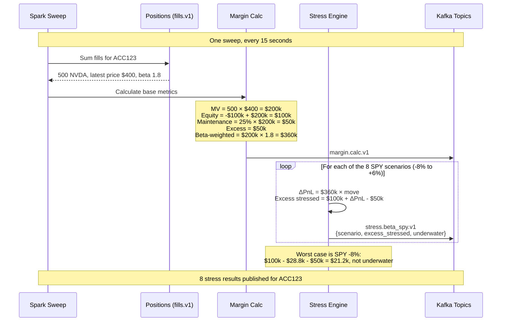
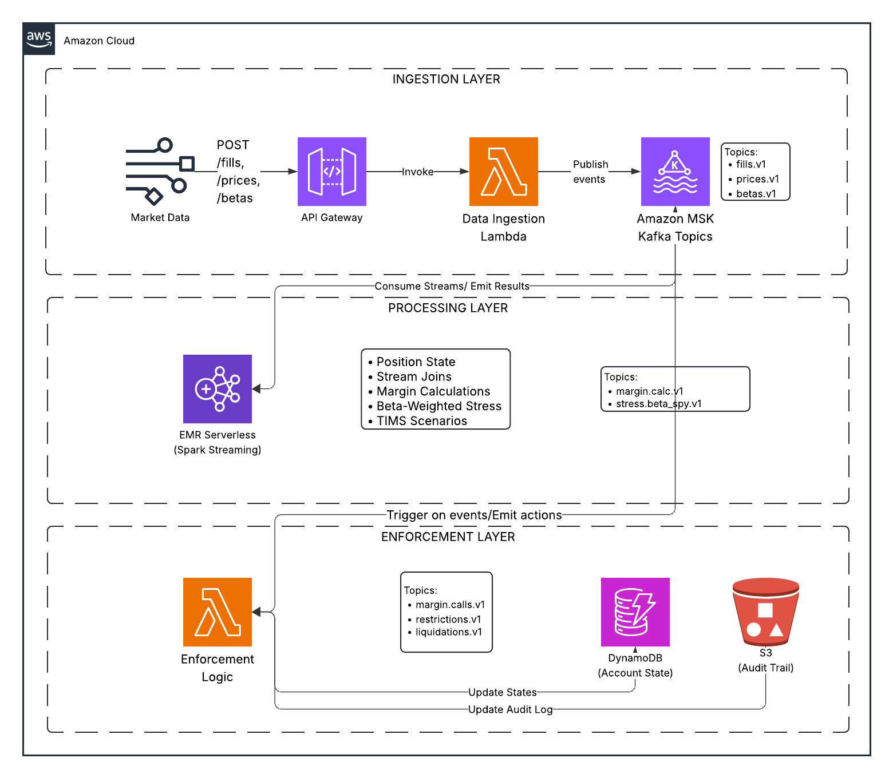
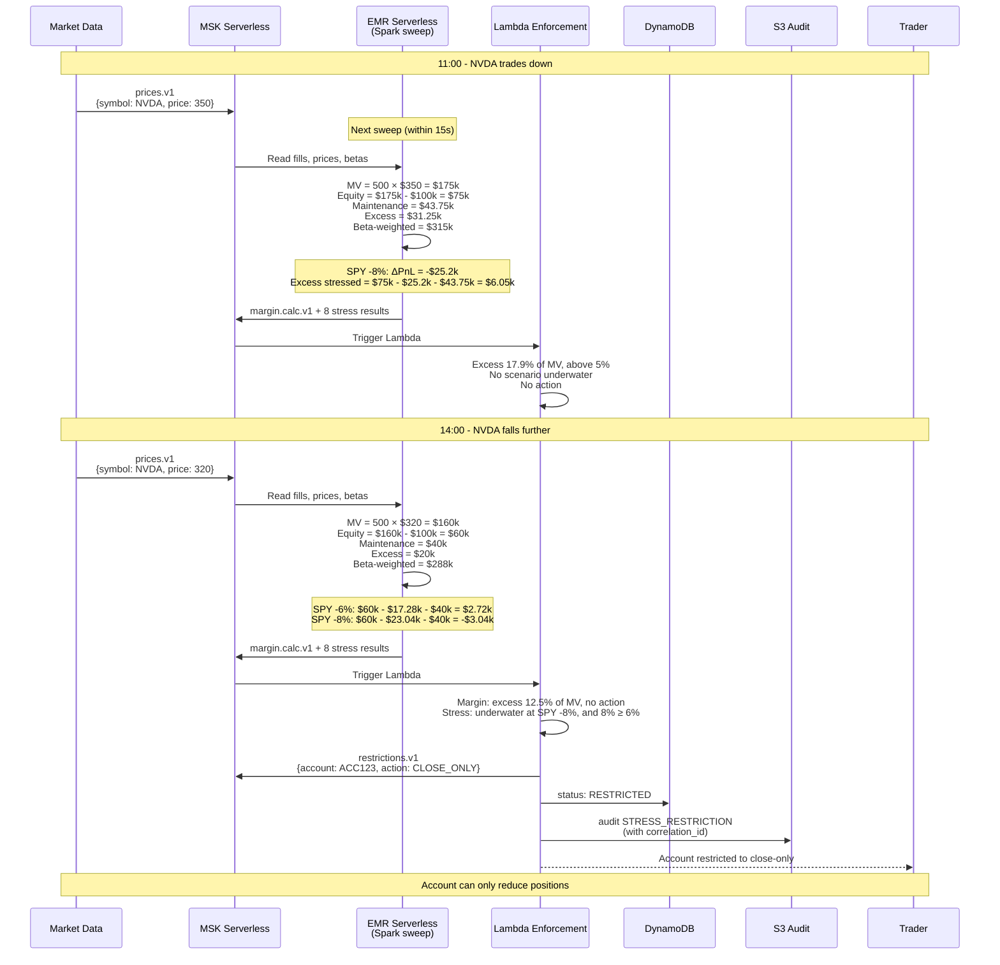
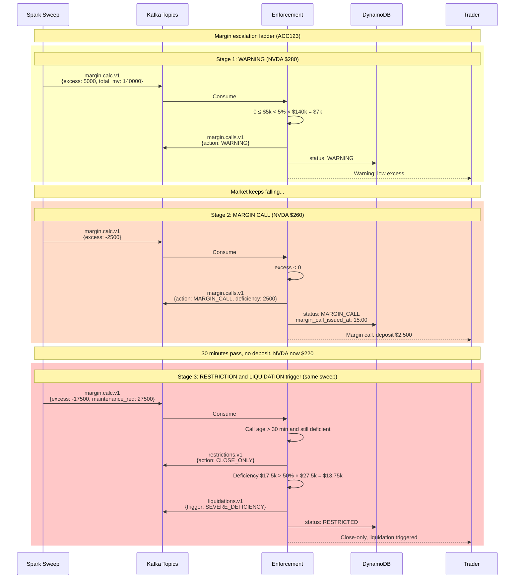

## Introduction

Margin risk management is critical to brokerages, where volatility events can pose existential risks when clients hold concentrated positions with leverage. Imagine a stock with a high beta coefficient (making it especially reactive to market movements), bought on margin by enough clients that a flash crash turns their borrowed money into the firm's loss. It only takes minutes for the damage to be done.

As firms extending credit, brokers must make sure they can weather all sorts of market events so that clients' funds remain safe. That means constantly re-examining risk positions. Traditionally, these calculations were done through batch processes running hourly, every 15 minutes, or if you were really advanced, every minute. Modern tools like Kafka and Spark make it practical to rerun those calculations every few seconds, as the market moves.

This article walks through a margin risk monitor built on an event-driven architecture, inspired by FINRA Rule 4210 (margin requirements), TIMS (the OCC's Theoretical Intermarket Margining System), and beta-weighted stress testing. I'll cover the reasoning behind the design, not just the code, and work through the margin math step by step with a leveraged account so you can see exactly when each alarm goes off.

Before diving into the implementation details, let's understand the regulatory foundation that drives the design choices.

## The Regulatory Context

### Regulation T and FINRA Rule 4210

Let's start with the rules of the game. There are two layers of regulatory minimums, and in practice most firms add a third layer of their own.

**Regulation T (initial margin)**: Reg T is the Federal Reserve's rule for credit extended by broker-dealers (12 CFR Part 220). For equity purchases in a margin account, the initial requirement is 50%: the customer puts up at least half the purchase price, and the firm can lend the rest. Buy $200,000 of stock, deposit $100,000, and you have a $100,000 **debit balance** (a loan from the firm).

**FINRA Rule 4210 (maintenance margin)**: Once the position is open, Rule 4210 requires the customer's equity to stay at or above 25% of the current market value of long securities. If equity falls below that, the firm has to collect more margin (a maintenance call) or liquidate.
<!-- TODO(Luke): verify the 4210(f)(6) timing language ("as promptly as possible and in any event within 15 business days") before adding it here; it's a useful contrast with the demo's 30-minute house timer. -->

For a long-only account, the math looks like this. Cash is negative when the account is borrowing, so "Cash + Market Value" is just market value minus the debit balance:

```
Equity                  = Cash + Long Market Value     (cash < 0 means a debit balance)
Maintenance Requirement = 25% × Long Market Value
Excess                  = Equity - Maintenance Requirement
```

When Excess drops below zero, you have a **margin deficiency**: the customer must deposit funds or reduce positions. And time matters. The longer an account stays deficient in a falling market, the more of the loan is at risk.

One thing that's easy to miss: without a debit balance, none of this bites. An account that owns $200,000 of stock outright has $200,000 of equity against a $50,000 requirement, and the stock would have to go to zero before the math changed sign. Margin risk is a leverage problem, which is why every worked example below uses a leveraged account.

**House requirements**: Rule 4210 sets minimums, and firms are allowed to require more. Most do. Common house rules include:

- Higher maintenance rates than the 25% minimum (30% or more is common)
- Concentration add-ons for customers with large single positions
- Volatility-based adjustments that raise requirements for more volatile stocks
- Special treatment for low-priced securities that can move dramatically

These house rules are the first line of defense. But they're still flat percentages, which brings us to portfolio margin.

### Portfolio Margin (Rule 4210(g))

Rule 4210(g) lets firms offer portfolio margin to eligible customers as an alternative to the strategy-based percentages above. Instead of a fixed percentage per position, the requirement is based on the largest loss the whole portfolio would suffer across a set of hypothetical price moves. Customers need at least $100,000 of equity to use it, and many firms set a higher bar.

The rule spells out the size of those moves by product. As I read it, broad-based index products are shocked from −8% to +6% for high-capitalization indexes (±10% for other broad-based indexes), and individual equities are shocked ±15%, evaluated at a set of equally spaced valuation points.
<!-- TODO(Luke): verify the 4210(g) valuation ranges (+6%/−8% high-cap broad-based index, ±10% non-high-cap, ±15% other equity) and the "10 equidistant valuation points" wording against the current rule text before publishing. -->

In pseudocode:

```
For each valuation point (e.g., underlying -15% ... +15%):
    Revalue every position in the portfolio
    Compute portfolio P&L
Requirement = largest portfolio loss across all points
              (subject to per-position minimums in the rule)
```

This approach has some real advantages:
- It recognizes hedges and offsets (if you're long stock with protective puts, your downside is capped)
- It reduces requirements for genuinely hedged portfolios
- It increases requirements for concentrated, directional positions
- It ties the requirement to modeled portfolio risk rather than a fixed percentage

To implement it, you need a consistent way to revalue every position at every valuation point. That's where TIMS comes in.

## TIMS: Theoretical Intermarket Margining System

TIMS is a scenario-based margin methodology developed by the Options Clearing Corporation (OCC). Rule 4210(g) requires portfolio margin to be computed with a theoretical pricing model, and the OCC's theoretical values are what broker-dealers have traditionally plugged into those calculations.
<!-- TODO(Luke): verify how to describe TIMS today. OCC moved its own clearing-member margin to STANS in 2006; confirm the current relationship between TIMS, OCC's published theoretical values, and 4210(g) customer portfolio margin before publishing. -->

### How TIMS-Style Margin Works

The approach is elegant and practical:

1. **Define a scenario grid**: a set of underlying price moves at which to revalue the portfolio. For an individual stock under 4210(g), that's a range of ±15%.

2. **Revalue the portfolio**: at each point, reprice every position with a theoretical model. That typically means an options pricing model for options and simple mark-to-market for stock. The key is repricing *everything* consistently in each scenario.

3. **Find the worst case**: identify the scenario with the largest loss. That's the portfolio's risk profile in one number.

4. **Set the requirement**: the margin requirement is that worst-case loss, subject to the rule's minimums.

### Why TIMS Matters

Scenario-based margin captures risks that fixed-percentage margin misses:

- **Non-linear risk**: Options have convexity, so their value doesn't move linearly with the underlying. A flat percentage can't see that; a revaluation grid can.
- **Hedges**: Long stock plus a protective put has capped downside. Scenario revaluation recognizes this, while strategy-based margin can over-margin the position.
- **Offsets**: Positions in related underlyings can partly offset each other, and the methodology allows some of that offset within defined groups.

The demo implements a heavily simplified version for equities only (no options). Its Spark job evaluates ten price moves:

```python
TIMS_SCENARIOS = [-0.15, -0.10, -0.05, -0.03, -0.01, 0.01, 0.03, 0.05, 0.10, 0.15]
```

For each account it publishes `portfolio_pnl = Σ qty × price × scenario` for every point. That's enough to show the shape of the idea, but it's not the rule's grid: the points aren't evenly spaced, and the demo doesn't turn the worst case into a requirement.

To apply scenarios across very different portfolios, we need a way to normalize market exposure. That's beta weighting.

## Beta Weighting: Converting Portfolios to Market Exposure

Beta weighting normalizes diverse portfolios to a common risk measure. It's a universal adapter that lets you compare apples to oranges.

Beta (β) measures how much a stock moves relative to the market:

```
β = Cov(Stock, Market) / Var(Market)
```

What this tells you:
- β = 1.0: The stock moves in lockstep with the market (think SPY itself)
- β = 1.5: Moves 1.5× the market (many tech names)
- β = 0.5: Moves half as much as the market (defensive stocks like utilities)

### Beta-Weighted Market Value

Converting a portfolio to SPY-equivalent exposure is one multiplication per position:

```
Beta-Weighted Value = Position Value × Beta
Total Beta-Weighted Exposure = Σ (Position Value_i × Beta_i)
```

Here's an example portfolio:

| Symbol | Value | Beta | Beta-Weighted |
|--------|-------|------|---------------|
| AAPL | $15,000 | 1.2 | $18,000 |
| NVDA | $20,000 | 1.8 | $36,000 |
| KO | $12,000 | 0.6 | $7,200 |
| **Total** | **$47,000** | | **$61,200** |

The key insight: this $47,000 portfolio has the market risk of $61,200 of SPY ($61,200 ÷ $47,000 ≈ 1.3×). It behaves as if it's leveraged 1.3× before a single dollar is borrowed. Add real margin debt on top of that and the risk compounds, and that's what a flat 25% maintenance calculation doesn't see.

### Stress Testing with Beta Weighting

Once every account is expressed in SPY terms, we can apply the same market scenarios to all of them and find hidden risk before it materializes. The demo runs eight SPY moves:

```
SPY scenarios: -8%, -6%, -4%, -2%, 0%, +2%, +4%, +6%

For each account, for each scenario:
    ΔPnL             = Beta-Weighted Exposure × SPY Move
    Equity_stressed  = Equity + ΔPnL
    Excess_stressed  = Equity_stressed - Maintenance Requirement (current, unshocked)
    Underwater       = Excess_stressed < 0
```

Notice that the maintenance requirement is held at its current level rather than recomputed on the shocked market value. That's conservative: after a drop, 25% of a smaller market value is a smaller requirement, so recomputing it would show slightly more excess. I'll show the size of that difference in the worked example.

The house rule in the demo: if an account is underwater in any scenario where the SPY move is 6% or larger in magnitude, restrict it to closing trades only, even if its current margin is fine. (The check uses the absolute value of the move, so a +6% scenario counts too. For a long-only book that never matters, but it would for short positions.)

The rationale is straightforward: high-beta, leveraged accounts are the ones that blow through their equity in a fast market. Restricting them while they still have positive excess is cheaper than chasing a deficiency after the fact.

### Beta-Weighted Stress Testing in Action

Let's make that concrete with the account I'll use for the rest of the post. ACC123 buys 500 NVDA at $400 on Reg T margin:

```
Purchase:     500 × $400                    = $200,000
Deposit:      50% × $200,000                = $100,000
Debit (cash): $200,000 - $100,000           = -$100,000

Market Value                                = $200,000
Equity:       -$100,000 + $200,000          = $100,000
Maintenance:  25% × $200,000                = $50,000
Excess:       $100,000 - $50,000            = $50,000
Beta-Weighted Exposure: $200,000 × 1.8      = $360,000
```

Now run the eight SPY scenarios against it:

| SPY move | ΔPnL ($360k × move) | Equity stressed | Excess stressed | Underwater? |
|---------:|--------------------:|----------------:|----------------:|:-----------:|
| −8% | −$28,800 | $71,200 | $21,200 | No |
| −6% | −$21,600 | $78,400 | $28,400 | No |
| −4% | −$14,400 | $85,600 | $35,600 | No |
| −2% | −$7,200 | $92,800 | $42,800 | No |
| 0% | $0 | $100,000 | $50,000 | No |
| +2% | +$7,200 | $107,200 | $57,200 | No |
| +4% | +$14,400 | $114,400 | $64,400 | No |
| +6% | +$21,600 | $121,600 | $71,600 | No |

Freshly opened at the Reg T minimum, the account passes everything. Here's how one sweep flows through the system:


```mermaid
sequenceDiagram
    participant Spark as Spark Sweep
    participant State as Positions (fills.v1)
    participant Calc as Margin Calc
    participant Stress as Stress Engine
    participant Kafka as Kafka Topics

    Note over Spark,Kafka: One sweep, every 15 seconds

    Spark->>State: Sum fills for ACC123
    State-->>Spark: 500 NVDA, latest price $400, beta 1.8

    Spark->>Calc: Calculate base metrics

    Note over Calc: MV = 500 × $400 = $200k<br/>Equity = -$100k + $200k = $100k<br/>Maintenance = 25% × $200k = $50k<br/>Excess = $50k<br/>Beta-weighted = $200k × 1.8 = $360k

    Calc->>Kafka: margin.calc.v1

    loop For each of the 8 SPY scenarios (-8% to +6%)
        Stress->>Stress: ΔPnL = $360k × move<br/>Excess stressed = $100k + ΔPnL - $50k
        Stress->>Kafka: stress.beta_spy.v1<br/>{scenario, excess_stressed, underwater}
    end

    Note over Stress: Worst case is SPY -8%:<br/>$100k - $28.8k - $50k = $21.2k, not underwater

    Note over Spark,Kafka: 8 stress results published for ACC123
```

## The Architecture

### Why Event-Driven?

Margin calculations started as end-of-day batch jobs, moved to hourly runs, then 15-minute intervals. In a fast market even that can be too slow:

- **Intraday volatility** can create margin deficiencies in minutes. An account can go from healthy to deficient inside a single 15-minute window during a flash crash
- **Positions change continuously** as clients trade throughout the day
- **Prices change continuously**, especially for volatile stocks
- **Expectations keep moving toward more immediate monitoring** as the technology makes it cheaper

The interesting design choice in the demo is that it's *not* per-tick stream processing. Kafka is the streaming backbone, but the Spark job is a periodic **sweep**: every 15 seconds it reads all fills, prices and betas, recomputes every account and publishes the results. That's how many real risk engines work. A sweep bounds latency to the sweep interval, gives you a consistent snapshot across all accounts, and is much easier to reason about than stateful streaming joins. The enforcement side is the part that's truly event-driven: it reacts to each result as it lands on Kafka.

What this architecture gives you:

- **Low latency**: risk updates within one sweep interval (15 seconds by default) of a price move or fill
- **Scalability**: Spark parallelizes the per-account math, so adding accounts adds executors, not code
- **Auditability**: every enforcement action goes to an audit topic with a correlation ID, so you can reconstruct why a margin call fired
- **Replayability**: inputs live in Kafka, so a sweep can be rerun against the same data to explain or test a decision

### System Design



```
Fills, Prices, Betas → Kafka → Spark sweep (every 15s) → margin.calc / stress → Enforcement → Kafka + audit
```

**Components**:

1. **Kafka topics**: `fills.v1`, `prices.v1`, `betas.v1` in; `margin.calc.v1` and `stress.beta_spy.v1` out of Spark; `margin.calls.v1`, `restrictions.v1`, `liquidations.v1` and `audit.v1` out of enforcement

2. **Spark sweep** (`spark/margin_calculator.py`)
   - Rebuilds positions by summing fills per account and symbol
   - Joins the latest price and beta per symbol
   - Computes margin per account
   - Runs the eight beta-weighted SPY scenarios and the ten simplified TIMS scenarios
   - Writes results back to Kafka

3. **Enforcement** (`lambda/enforcement/handler.py` on AWS, `scripts/enforcement_local.py` locally)
   - Consumes margin and stress events
   - Applies the escalation ladder
   - Emits warnings, margin calls, restrictions and liquidation triggers
   - Writes the audit trail

4. **Storage**: DynamoDB for current account state, S3 for the durable audit trail (on AWS)

### Data Flow Example

Here's ACC123 over a bad afternoon for chip stocks. All the numbers come from the formulas above with a $100,000 debit balance.

**09:30**: Account buys 500 NVDA at $400 with a $100,000 deposit
- Event: `fills.v1` → `{account_id: ACC123, symbol: NVDA, qty: 500, price: 400}`

**Next sweep (within 15 s)**: Spark computes
- Market Value: $200,000
- Equity: $200,000 − $100,000 = $100,000
- Maintenance Req: 25% × $200,000 = $50,000
- Excess: $50,000 (25% of MV)
- Beta-Weighted: $360,000
- Worst stress (SPY −8%): $100,000 − $28,800 − $50,000 = $21,200 → not underwater
- Emits: `margin.calc.v1`, 8 × `stress.beta_spy.v1`

**11:00**: NVDA trades down to $350
- Market Value: 500 × $350 = $175,000
- Equity: $175,000 − $100,000 = $75,000
- Maintenance Req: 25% × $175,000 = $43,750
- Excess: $75,000 − $43,750 = $31,250 (17.9% of MV)
- Beta-Weighted: $175,000 × 1.8 = $315,000
- SPY −8%: ΔPnL = $315,000 × −0.08 = −$25,200 → Excess stressed = $75,000 − $25,200 − $43,750 = $6,050 → not underwater
- Nothing to enforce, but the cushion in the worst scenario went from $21,200 to $6,050

**14:00**: NVDA trades down to $320
- Market Value: 500 × $320 = $160,000
- Equity: $160,000 − $100,000 = $60,000
- Maintenance Req: 25% × $160,000 = $40,000
- Excess: $60,000 − $40,000 = $20,000 (12.5% of MV, well above the 5% warning line)
- Beta-Weighted: $160,000 × 1.8 = $288,000

Now the stress grid at $320:

| SPY move | ΔPnL ($288k × move) | Equity stressed | Excess stressed | Underwater? |
|---------:|--------------------:|----------------:|----------------:|:-----------:|
| −8% | −$23,040 | $36,960 | −$3,040 | **Yes** |
| −6% | −$17,280 | $42,720 | $2,720 | No |
| −4% | −$11,520 | $48,480 | $8,480 | No |
| −2% | −$5,760 | $54,240 | $14,240 | No |
| 0% | $0 | $60,000 | $20,000 | No |
| +2% | +$5,760 | $65,760 | $25,760 | No |
| +4% | +$11,520 | $71,520 | $31,520 | No |
| +6% | +$17,280 | $77,280 | $37,280 | No |

The account is underwater in the SPY −8% scenario, and |−8%| ≥ 6%, so enforcement publishes `restrictions.v1` → `{action: CLOSE_ONLY}`. No margin call, no warning: the account still has $20,000 of real excess. The stress test is flagging that one more bad market day could wipe that out.

How conservative is that? If you recompute the requirement on the shocked price instead of holding it constant, SPY −8% means NVDA falls 1.8 × 8% = 14.4%, to $320 × 0.856 = $273.92. Market value is $136,960, equity is $136,960 − $100,000 = $36,960 (same as the table), the requirement becomes 25% × $136,960 = $34,240, and excess is +$2,720. So the recomputed view says "barely above water" and the demo's conservative view says "$3,040 short". Either way, this account is one bad day from a margin call.

Solving the same formulas for price tells you where each line sits for this account (500 shares, $100,000 debit, β 1.8):

| Trigger | Condition | NVDA price |
|---------|-----------|-----------:|
| Stress restriction (SPY −8%) | 375P − 100,000 − 72P < 0 | below $330.03 |
| Stress restriction (SPY −6%) | 375P − 100,000 − 54P < 0 | below $311.53 |
| Warning | 0 ≤ 375P − 100,000 < 5% × 500P | below $285.71 |
| Margin call | 375P − 100,000 < 0 | below $266.67 |
| Liquidation trigger at escalation | 100,000 − 375P > 50% × 125P | below $228.57 |

(Here 375P is 500P of market value minus the 125P maintenance requirement, and 72P = 500P × 1.8 × 8%.) The stress restriction fires about $63 per share ($330.03 − $266.67) before the account is actually deficient. That early warning is the whole point of stress testing.

### Enforcement Ladder

The repo runs two enforcement paths. Margin events drive the escalation ladder; stress events can jump straight to a restriction.

| Path | Condition | Action | Topic | New status |
|------|-----------|--------|-------|-----------|
| Margin | 0 ≤ Excess < 5% of MV (from ACTIVE) | WARNING | `margin.calls.v1` | WARNING |
| Margin | Excess < 0 (from ACTIVE or WARNING) | MARGIN_CALL | `margin.calls.v1` | MARGIN_CALL |
| Margin | Call outstanding > 30 min and still deficient | RESTRICTION (close-only) | `restrictions.v1` | RESTRICTED |
| Margin | At that same check, deficiency > 50% of maintenance req | LIQUIDATION trigger | `liquidations.v1` | RESTRICTED |
| Stress | Underwater in a scenario with \|SPY move\| ≥ 6% | RESTRICTION (close-only) | `restrictions.v1` | RESTRICTED |

A few details worth calling out, because they're easy to get wrong:

- The 30-minute timer isn't a scheduled job. It's checked every time a new `margin.calc.v1` event arrives for an account in MARGIN_CALL, so with a 15-second sweep the restriction lands within one sweep after the 30 minutes are up.
- Liquidation isn't a separate later stage. It's decided at the moment of escalation: if the deficiency is severe at that point, the restriction and the liquidation trigger go out together. The demo only *emits* a trigger; it never sells anything.
- Every action also writes an audit event with a correlation ID.
- 30 minutes is a demo house rule, far stricter than any regulatory deadline. In practice firms decide how fast to act based on their own risk appetite and customer agreements.

<!-- TODO(Luke): repo README's ladder table says "Deficiency persists > 30 min → Liquidation trigger", but the code restricts at >30 min and only triggers liquidation at that same moment if deficiency > 50% of maintenance; fix the README to match the code. -->
<!-- TODO(Luke): repo shares one status field between the two paths, which is wrong because once a stress restriction sets RESTRICTED, enforce_margin never issues a margin call or liquidation trigger (it only escalates from ACTIVE/WARNING/MARGIN_CALL); and a RESTRICTED account whose deficiency later becomes severe is never re-evaluated for liquidation. Fix in repo. -->

### Walking the Margin Ladder

Here's the margin path on its own for ACC123, continuing to fall after 14:00. (See the TODO above: in the current repo code, the earlier stress restriction would stop this path. I'm showing the margin ladder in isolation so each rung is visible.)

**14:30, NVDA $280** → WARNING
```
MV          = 500 × $280         = $140,000
Equity      = $140,000 - $100,000 = $40,000
Maintenance = 25% × $140,000      = $35,000
Excess      = $40,000 - $35,000   = $5,000
5% of MV    = 5% × $140,000       = $7,000
0 ≤ $5,000 < $7,000  → WARNING
```

**15:00, NVDA $260** → MARGIN_CALL
```
MV          = 500 × $260         = $130,000
Equity      = $130,000 - $100,000 = $30,000
Maintenance = 25% × $130,000      = $32,500
Excess      = $30,000 - $32,500   = -$2,500
Deficiency $2,500 → MARGIN_CALL, call_issued_at = 15:00
```

A $2,500 deposit would cure it: the debit drops to $97,500, equity becomes $130,000 − $97,500 = $32,500, which exactly meets the requirement.

**15:30 and later, no deposit** → first sweep after the 30 minutes are up. What happens depends on the price at that sweep:

```
If NVDA is still $260:
    Deficiency  = $2,500
    50% of maintenance = 50% × $32,500 = $16,250
    $2,500 ≤ $16,250  → RESTRICTED (close-only), no liquidation trigger

If NVDA has fallen to $220:
    MV          = 500 × $220         = $110,000
    Equity      = $110,000 - $100,000 = $10,000
    Maintenance = 25% × $110,000      = $27,500
    Deficiency  = $27,500 - $10,000   = $17,500
    50% of maintenance = 50% × $27,500 = $13,750
    $17,500 > $13,750 → RESTRICTED + LIQUIDATION trigger in the same step
```

### Event Flow: Market Stress Scenario

This sequence diagram shows the stress path from the data flow example as it moves through the AWS deployment:


```mermaid
sequenceDiagram
    participant Market as Market Data
    participant Kafka as MSK Serverless
    participant Spark as EMR Serverless<br/>(Spark sweep)
    participant Enforcement as Lambda Enforcement
    participant DDB as DynamoDB
    participant S3 as S3 Audit
    participant Trader

    Note over Market,Trader: 11:00 - NVDA trades down

    Market->>Kafka: prices.v1<br/>{symbol: NVDA, price: 350}

    Note over Spark: Next sweep (within 15s)

    Kafka->>Spark: Read fills, prices, betas

    Spark->>Spark: MV = 500 × $350 = $175k<br/>Equity = $175k - $100k = $75k<br/>Maintenance = $43.75k<br/>Excess = $31.25k<br/>Beta-weighted = $315k

    Note over Spark: SPY -8%: ΔPnL = -$25.2k<br/>Excess stressed = $75k - $25.2k - $43.75k = $6.05k

    Spark->>Kafka: margin.calc.v1 + 8 stress results

    Kafka->>Enforcement: Trigger Lambda

    Enforcement->>Enforcement: Excess 17.9% of MV, above 5%<br/>No scenario underwater<br/>No action

    Note over Market,Trader: 14:00 - NVDA falls further

    Market->>Kafka: prices.v1<br/>{symbol: NVDA, price: 320}

    Kafka->>Spark: Read fills, prices, betas

    Spark->>Spark: MV = 500 × $320 = $160k<br/>Equity = $160k - $100k = $60k<br/>Maintenance = $40k<br/>Excess = $20k<br/>Beta-weighted = $288k

    Note over Spark: SPY -6%: $60k - $17.28k - $40k = $2.72k<br/>SPY -8%: $60k - $23.04k - $40k = -$3.04k

    Spark->>Kafka: margin.calc.v1 + 8 stress results

    Kafka->>Enforcement: Trigger Lambda

    Enforcement->>Enforcement: Margin: excess 12.5% of MV, no action<br/>Stress: underwater at SPY -8%, and 8% ≥ 6%

    Enforcement->>Kafka: restrictions.v1<br/>{account: ACC123, action: CLOSE_ONLY}
    Enforcement->>DDB: status: RESTRICTED
    Enforcement->>S3: audit STRESS_RESTRICTION<br/>(with correlation_id)

    Enforcement-->>Trader: Account restricted to close-only

    Note over Market,Trader: Account can only reduce positions
```

### Enforcement Escalation in Detail

And here's the margin ladder from the walkthrough above, matching the repo's code:


```mermaid
sequenceDiagram
    participant Spark as Spark Sweep
    participant Kafka as Kafka Topics
    participant Enforcement as Enforcement
    participant DDB as DynamoDB
    participant Trader

    Note over Spark,Trader: Margin escalation ladder (ACC123)

    rect rgb(255, 255, 200)
        Note over Spark,Trader: Stage 1: WARNING (NVDA $280)
        Spark->>Kafka: margin.calc.v1<br/>{excess: 5000, total_mv: 140000}
        Kafka->>Enforcement: Consume
        Enforcement->>Enforcement: 0 ≤ $5k < 5% × $140k = $7k
        Enforcement->>Kafka: margin.calls.v1<br/>{action: WARNING}
        Enforcement->>DDB: status: WARNING
        Enforcement-->>Trader: Warning: low excess
    end

    Note over Spark,Trader: Market keeps falling...

    rect rgb(255, 220, 200)
        Note over Spark,Trader: Stage 2: MARGIN CALL (NVDA $260)
        Spark->>Kafka: margin.calc.v1<br/>{excess: -2500}
        Kafka->>Enforcement: Consume
        Enforcement->>Enforcement: excess < 0
        Enforcement->>Kafka: margin.calls.v1<br/>{action: MARGIN_CALL, deficiency: 2500}
        Enforcement->>DDB: status: MARGIN_CALL<br/>margin_call_issued_at: 15:00
        Enforcement-->>Trader: Margin call: deposit $2,500
    end

    Note over Spark,Trader: 30 minutes pass, no deposit. NVDA now $220

    rect rgb(255, 200, 200)
        Note over Spark,Trader: Stage 3: RESTRICTION and LIQUIDATION trigger (same sweep)
        Spark->>Kafka: margin.calc.v1<br/>{excess: -17500, maintenance_req: 27500}
        Kafka->>Enforcement: Consume
        Enforcement->>Enforcement: Call age > 30 min and still deficient
        Enforcement->>Kafka: restrictions.v1<br/>{action: CLOSE_ONLY}
        Enforcement->>Enforcement: Deficiency $17.5k > 50% × $27.5k = $13.75k
        Enforcement->>Kafka: liquidations.v1<br/>{trigger: SEVERE_DEFICIENCY}
        Enforcement->>DDB: status: RESTRICTED
        Enforcement-->>Trader: Close-only, liquidation triggered
    end
```

## Implementation: Key Code Patterns

These are condensed from the repo; the full versions are linked at the end.

### Spark: The Margin Sweep

```python
SWEEP_INTERVAL = int(os.getenv('SWEEP_INTERVAL', '15'))  # seconds
MAINTENANCE_RATE = 0.25

# Rebuild positions from every fill on the topic
positions = fills.groupBy("account_id", "symbol") \
    .agg(sum("qty").alias("qty")) \
    .filter(col("qty") != 0)

# Join latest prices and betas, compute values
enriched = positions.join(prices, "symbol", "left") \
    .join(betas, "symbol", "left") \
    .fillna({"price": 0.0, "beta": 1.0}) \
    .withColumn("market_value", col("qty") * col("price")) \
    .withColumn("beta_weighted_value", col("market_value") * col("beta"))

# Margin per account
margin = enriched.groupBy("account_id").agg(
    sum("market_value").alias("total_mv"),
    sum("beta_weighted_value").alias("beta_weighted_exposure")
).withColumn("cash", col("total_mv") * 0.1) \
 .withColumn("equity", col("cash") + col("total_mv")) \
 .withColumn("maintenance_req", col("total_mv") * MAINTENANCE_RATE) \
 .withColumn("excess", col("equity") - col("maintenance_req")) \
 .withColumn("excess_pct", col("excess") / col("total_mv"))
```

One honest caveat about that `cash` line: the demo doesn't track cash balances yet. It stubs cash as a positive 10% of market value, which means the demo's own accounts never carry a debit balance, excess is always 85% of market value, and the ladder never actually fires in a local run. The worked examples in this post use a real $100,000 debit so you can see what the logic does once cash is modeled properly. Tracking cash from fills and deposits is a good first exercise if you fork the repo.

<!-- TODO(Luke): repo stubs cash as total_mv * 0.1 in spark/margin_calculator.py, which is wrong because accounts can never have a debit balance, so excess is always 0.85 × MV and neither WARNING, MARGIN_CALL nor any stress restriction can trigger (it would take beta > 10 to go underwater at −8%). demo_scenario.py's INITIAL_CASH = 50000 is also positive and isn't used by Spark. Fix in repo by tracking cash per account (e.g., a cash/debit topic), then drop the caveat paragraph above. -->
<!-- TODO(Luke): repo takes the "latest" price and beta with groupBy(...).agg(last(...)), which is wrong because last() without an ordering is nondeterministic; order by timestamp (or use max_by). Fix in repo. -->

### Spark: Beta-Weighted Stress Tests

After the margin results are written, the sweep collects them to the driver and loops over all eight scenarios for every account:

```python
SPY_SCENARIOS = [-0.08, -0.06, -0.04, -0.02, 0.0, 0.02, 0.04, 0.06]

stress_rows = []
for row in margin.collect():
    for scenario in SPY_SCENARIOS:
        delta_pnl = row["beta_weighted_exposure"] * scenario
        equity_stressed = row["equity"] + delta_pnl
        excess_stressed = equity_stressed - row["maintenance_req"]
        stress_rows.append({
            "account_id": row["account_id"],
            "scenario": scenario,
            "scenario_type": "SPY_BETA_WEIGHTED",
            "delta_pnl": delta_pnl,
            "equity_stressed": equity_stressed,
            "excess_stressed": excess_stressed,
            "underwater": excess_stressed < 0,
        })

spark.createDataFrame(stress_rows) \
    .selectExpr("to_json(struct(*)) AS value") \
    .write.format("kafka") \
    .option("topic", "stress.beta_spy.v1") \
    .save()
```

Collecting to the driver is fine for a demo with a handful of accounts. For thousands of accounts you'd cross-join the margin DataFrame with a small scenarios DataFrame and let the executors do the work.

<!-- TODO(Luke): repo writes the TIMS rows to stress.beta_spy.v1 too, without an "underwater" field, which is wrong because lambda/enforcement/handler.py reads stress_event['underwater'] and raises KeyError on every TIMS row (caught and logged); the local consumer uses .get() so it's silent. Fix in repo by using a separate topic such as stress.tims.v1. -->

### Enforcement: The Ladder

```python
WARNING_THRESHOLD_PCT = 0.05    # Warn if excess < 5% of MV
ESCALATION_MINUTES = 30         # Escalate to restriction after 30 minutes
SEVERE_STRESS_THRESHOLD = 0.06  # SPY moves >= 6% are severe

def enforce_margin(margin_event):
    excess, total_mv = margin_event['excess'], margin_event['total_mv']
    maintenance_req = margin_event['maintenance_req']
    state = get_account_state(margin_event['account_id'])
    status = state['status'] if state else 'ACTIVE'

    if 0 <= excess < total_mv * WARNING_THRESHOLD_PCT and status == 'ACTIVE':
        emit('margin.calls.v1', action='WARNING')            # -> WARNING

    if excess < 0:
        deficiency = abs(excess)
        if status in ('ACTIVE', 'WARNING'):
            emit('margin.calls.v1', action='MARGIN_CALL',
                 deficiency=deficiency)                       # -> MARGIN_CALL, stamp time
        elif status == 'MARGIN_CALL':
            elapsed = minutes_since(state['margin_call_issued_at'])
            if elapsed > ESCALATION_MINUTES:
                emit('restrictions.v1', action='CLOSE_ONLY')  # -> RESTRICTED
                if deficiency > maintenance_req * 0.5:
                    emit('liquidations.v1', trigger='SEVERE_DEFICIENCY')

def enforce_stress(stress_event):
    if stress_event['underwater'] and abs(stress_event['scenario']) >= SEVERE_STRESS_THRESHOLD:
        if current_status(stress_event['account_id']) not in ('RESTRICTED', 'LIQUIDATION'):
            emit('restrictions.v1', action='CLOSE_ONLY',
                 reason=f"Underwater in SPY {stress_event['scenario']:.1%} stress scenario")
```

(`emit`, `minutes_since` and `current_status` stand in for the repo's Kafka, audit and DynamoDB helpers. Each real emit also writes an audit event with the same correlation ID, and each status change is written to DynamoDB.)

## AWS Serverless Deployment

The repo runs entirely on a laptop with Docker Compose, and also ships Terraform for an AWS version:

- **MSK Serverless**: Managed Kafka without cluster sizing
- **EMR Serverless**: Spark without an always-on cluster
- **Lambda**: Event-driven enforcement
- **DynamoDB**: Fast account-state lookups
- **S3**: Durable audit storage

**Benefits**:
- Pay only for what you use
- Auto-scaling
- Minimal operational overhead
- Focus on business logic

**Cost**: the repo estimates about $0.87 for a one-hour demo and about $10 for an eight-hour workshop on AWS. The local Docker Compose version costs nothing.

## Production Architecture Considerations

### The Cold Start Problem

Serverless compute forces a real trade-off: **cost vs. latency**.

**Cold start** (first job after idle):
- Time: 2-4 minutes to start processing
- Cost: $0 while idle
- Use case: Batch jobs, non-time-sensitive workloads

**Pre-initialized workers** (warm capacity):
- Time: 30-60 seconds to respond
- Cost: ~$0.39/hour for the idle workers, whether or not they're doing anything
- Use case: Systems that need low latency

Is saving money on idle capacity worth possibly missing a market event? For a risk system, usually not, but it's a decision each organization has to make based on its risk tolerance and budget.

### Our Choice: Pre-Initialized Workers

The demo's Terraform configures EMR Serverless with pre-initialized capacity:

```hcl
resource "aws_emrserverless_application" "spark" {
  # Pre-initialized capacity keeps workers warm
  initial_capacity {
    initial_capacity_type = "Driver"
    initial_capacity_config {
      worker_count = 1
      worker_configuration {
        cpu    = "2 vCPU"
        memory = "4 GB"
      }
    }
  }

  initial_capacity {
    initial_capacity_type = "Executor"
    initial_capacity_config {
      worker_count = 2
      worker_configuration {
        cpu    = "2 vCPU"
        memory = "4 GB"
      }
    }
  }
}
```

**Why?**

1. **Monitoring expectations**: Margin monitoring should be close to real time
2. **Risk management**: A 2-4 minute startup delay is time the firm is exposed
3. **Operational reality**: Production risk systems prioritize availability over cost
4. **User experience**: Traders expect immediate feedback

**Cost Impact**:

The numbers below use the repo's estimates, which are based on EMR Serverless on-demand pricing in us-east-1 (about $0.0526 per vCPU-hour and $0.0058 per GB-hour at the time of writing). Three warm workers at 2 vCPU and 4 GB each come to 6 vCPU and 12 GB:

```
Warm workers: 6 × $0.0526 + 12 × $0.0058 ≈ $0.32 + $0.07 ≈ $0.39/hour
Sweep job:    ~2 vCPU running continuously  ≈ $0.127/hour
```

| Configuration | Startup Time | Idle Cost | 8-Hour Cost (EMR only) | 24/7 Monthly (EMR only, 720 h) | Use Case |
|---------------|--------------|-----------|-------------|--------------|----------|
| No pre-init | 2-4 minutes | $0/hour | $1.01 (job only) | ~$91 (job only) | Batch, demos |
| Pre-initialized | 30-60 seconds | $0.39/hour | $3.12 warm + $1.01 job = $4.13 | $280.80 warm + $91.20 job = $372 | Production |

**Trade-off Analysis**:

For a real-world margin monitoring system, the analysis might look like this:

- **Downside**: keeping workers warm adds $0.39/hour × 720 hours ≈ $281/month on top of the job itself, for about $372/month of EMR compute running 24/7
- **Upside**: sub-minute startup, and you're never waiting on a cold start during a market event
- **Alternative**: Amazon Managed Service for Apache Flink (around $158/month for the smallest always-on application) for true per-event streaming, though it needs different expertise
<!-- TODO(Luke): verify the ~$158/month Managed Flink figure against current pricing (1 KPU plus the 1 KPU orchestration overhead ≈ 2 × $0.11 × 720). -->

This is one of those pragmatic decisions production systems face: sometimes it makes sense to **pay for idle capacity to get low latency**. Operational costs like this are usually small next to what a single missed margin event could cost.

### Comparison to Traditional Architecture

**Traditional (always-on cluster)**:
- Cost: ~$280/month in EC2 alone for 2 × m5.xlarge on demand (2 × $0.192 × 720 ≈ $276), before any EMR charges
- Startup: Instant (always running)
- Scaling: Manual
- Idle cost: Full cost even with no load

**Serverless with pre-init**:
- Cost: ~$372/month if running 24/7 ($281 warm workers + $91 job), $0 if stopped
- Startup: 30-60 seconds
- Scaling: Automatic
- Idle cost: Only the pre-initialized workers

**Serverless without pre-init**:
- Cost: ~$91/month if running 24/7, $0 if stopped
- Startup: 2-4 minutes
- Scaling: Automatic
- Idle cost: $0

**Key insight**: At 24/7 the warm serverless setup isn't cheaper than a small always-on cluster. What it buys you is flexibility:
- Fast startup (close to always-on)
- Auto-scaling (like serverless)
- The ability to stop completely when you don't need it (unlike always-on); the demo's Terraform also enables auto-stop after 15 idle minutes

### When to Use Each Pattern

**No pre-initialization** ($0 idle):
- Batch processing (end-of-day reports)
- Development and testing
- Cost-sensitive workloads
- Where 2-4 minutes of startup latency is acceptable

**Pre-initialized workers** ($0.39/hour idle):
- Real-time monitoring
- Production trading systems
- Compliance-driven latency requirements
- User-facing applications

**Always-on cluster** (~$280/month in EC2 for two m5.xlarge):
- Legacy systems
- Extremely latency-sensitive work (sub-second)
- Complex cluster configurations
- When serverless limitations are blockers

### Workshop Setup

For a workshop on AWS, the repo includes a script that warms things up ahead of time:

```bash
# Run 10-15 minutes before the workshop starts
./scripts/workshop_setup.sh
```

This script:
1. Starts the EMR Serverless application
2. Warms up the pre-initialized workers
3. Verifies the services are ready

**Teaching moment**: architectural decisions are trade-offs between cost, latency, and operational complexity, and it's worth making students pay (a few dollars) to feel that.

## Try It Yourself

The fastest way to see the pipeline is locally. You need Docker Desktop with about 4 GB of RAM allocated:

```bash
git clone https://github.com/lukelittle/finra-4210-margin-risk-monitor-example.git
cd finra-4210-margin-risk-monitor-example

# Kafka, Spark, DynamoDB Local and the enforcement consumer
docker compose up -d

# After ~30 seconds, submit the sweep job
docker compose exec -d spark-master spark-submit \
  --master spark://spark-master:7077 \
  --packages org.apache.spark:spark-sql-kafka-0-10_2.12:3.5.3 \
  /opt/spark-apps/margin_calculator.py

# Run the demo scenario, and watch the topics in a second terminal
docker compose exec python-services python scripts/demo_scenario.py
docker compose exec python-services python scripts/observe_streams.py
```

Tear it down with `docker compose down -v`. The AWS version is `cd terraform && terraform init && terraform apply`; see `docs/05-deploy-aws.md` in the repo.

## Key Takeaways

1. **Reg T sets 50% initial margin and FINRA 4210 sets a 25% maintenance minimum**, and most firms layer stricter house requirements on top

2. **Margin risk is a leverage problem**: without a debit balance, the maintenance math never goes negative

3. **Portfolio margin is scenario-based** (TIMS-style revaluation), recognizing hedges and concentration instead of flat percentages

4. **Beta weighting converts portfolios to market exposure**, so one set of SPY scenarios can stress every account

5. **Stress testing buys time**: in the worked example, the stress restriction fires at $330 while the margin call doesn't come until $266.67

6. **Enforcement ladders automate the response**, from warnings to margin calls to restrictions and liquidation triggers, and every step needs an audit trail

7. **Serverless trades cost for flexibility**: warm workers cost money, but you can turn them off

## Educational Value

This example gives finance-minded computer science students a lot to chew on:

- **Event-driven architecture**: Kafka topics as the contract between independent components
- **Batch vs. streaming**: a periodic Spark sweep over Kafka is a great discussion point about when per-event streaming is worth its complexity
- **Financial risk modeling**: margin math, beta weighting and scenario analysis are approachable even for non-finance majors once you work an example by hand
- **Regulatory thinking**: compliance requirements drive technical decisions like audit trails, escalation timers and state machines
- **Cloud patterns**: the AWS version shows managed services and infrastructure as code

Working through the numbers by hand, like the tables above, is the best way to catch bugs in this kind of system.

## Sources and Further Reading

### Primary Regulatory Sources

1. **FINRA Rule 4210: Margin Requirements**  
   Full rule text, including maintenance requirements (4210(c)) and portfolio margin (4210(g)).  
   [https://www.finra.org/rules-guidance/rulebooks/finra-rules/4210](https://www.finra.org/rules-guidance/rulebooks/finra-rules/4210)

2. **Regulation T: Credit by Brokers and Dealers (12 CFR Part 220)**  
   Federal Reserve rule governing broker-dealer credit, including the 50% initial margin requirement in § 220.12.  
   [https://www.ecfr.gov/current/title-12/chapter-II/subchapter-A/part-220](https://www.ecfr.gov/current/title-12/chapter-II/subchapter-A/part-220)

### Portfolio Margin and TIMS

3. **The Options Clearing Corporation: Margin Methodology**  
   OCC's overview of its risk-based margin methodologies.  
   [https://www.theocc.com/risk-management/margin-methodology](https://www.theocc.com/risk-management/margin-methodology)
<!-- TODO(Luke): verify the OCC link still resolves, and add a primary OCC source that specifically documents TIMS / the theoretical values used for customer portfolio margin. -->

### Technical Resources

4. **Apache Spark Structured Streaming + Kafka Integration Guide**  
   Covers the Kafka source and sink the sweep uses for batch reads and writes.  
   [https://spark.apache.org/docs/latest/structured-streaming-kafka-integration.html](https://spark.apache.org/docs/latest/structured-streaming-kafka-integration.html)

5. **Amazon EMR Serverless: Pre-Initialized Capacity**  
   [https://docs.aws.amazon.com/emr/latest/EMR-Serverless-UserGuide/pre-init-capacity.html](https://docs.aws.amazon.com/emr/latest/EMR-Serverless-UserGuide/pre-init-capacity.html)

6. **Amazon EMR Pricing**  
   [https://aws.amazon.com/emr/pricing/](https://aws.amazon.com/emr/pricing/)

7. **Amazon MSK Serverless**  
   [https://aws.amazon.com/msk/features/msk-serverless/](https://aws.amazon.com/msk/features/msk-serverless/)

### Demo Repository

8. **finra-4210-margin-risk-monitor-example**  
   The demo code for this post: Docker Compose stack, Spark sweep, enforcement consumer and Terraform.  
   [https://github.com/lukelittle/finra-4210-margin-risk-monitor-example](https://github.com/lukelittle/finra-4210-margin-risk-monitor-example)

---

**Disclaimer**: This blog post and associated demo are for educational purposes only. They do not constitute trading advice, investment advice, legal advice, or compliance guidance. The architecture described does not represent any former employer's actual systems or implementations. The demo uses synthetic data and simplified risk math (equity-only, beta-weighted scenarios and a simplified TIMS-style grid) to illustrate concepts; it is not a complete implementation of FINRA Rule 4210, Regulation T, or OCC methodology. Actual production margin systems require extensive additional controls, testing, and regulatory review. Always consult with legal and compliance professionals when implementing margin and risk systems.
