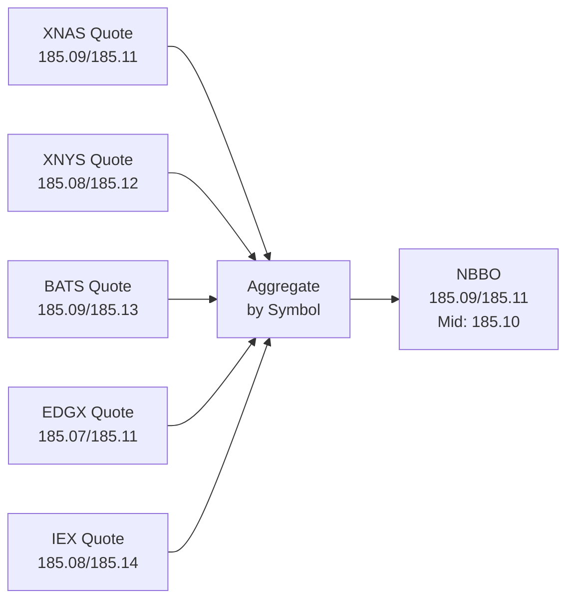
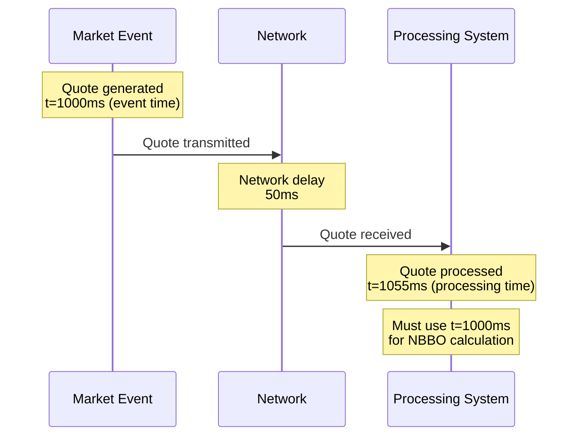
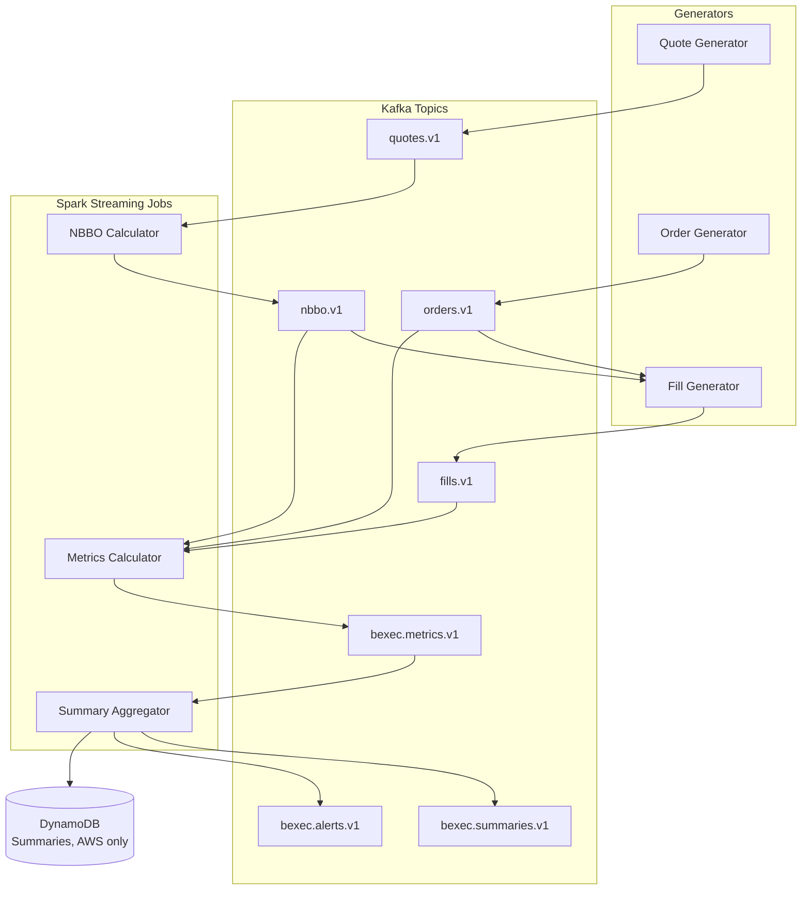

## Introduction

When you tap "buy" in a brokerage app, you probably assume you got a fair price. But "fair" relative to what? Your order might have gone to an exchange, a wholesaler, or an alternative trading system, and the price could have been better or worse than the best quotes displayed at that moment.

Broker-dealers have a legal duty to care about that difference. In the U.S., that duty is spelled out in FINRA Rule 5310, the best execution rule. In the [previous post in this series]() I looked at controls that sit *in front of* the market. This one looks at the other side: after an order executes, how do you measure whether the customer got a good result?

We'll cover what the rule requires (and what it doesn't), the math behind the standard execution quality metrics, and a streaming demo built on Kafka and Spark that computes those metrics continuously. Fair warning: continuous monitoring goes well beyond what the rule requires. That's part of what makes it an interesting engineering problem.

## What FINRA Rule 5310 Requires

[FINRA Rule 5310](https://www.finra.org/rules-guidance/rulebooks/finra-rules/5310) requires a member firm, in any transaction for or with a customer, to use "reasonable diligence" to ascertain the best market for the security and to buy or sell in that market so that the resulting price to the customer is as favorable as possible under prevailing market conditions.

The rule lists factors that go into whether a firm used reasonable diligence, including:

- The character of the market for the security (price, volatility, relative liquidity, and pressure on available communications)
- The size and type of transaction
- The number of markets checked
- The accessibility of the quotation
- The terms and conditions of the order as communicated to the firm

Notice what's missing: the rule doesn't say "always execute at the NBBO" or "measure every fill within 100 milliseconds." It's a diligence standard, not a formula.

### Regular and Rigorous Review

The part that matters most for engineers is Supplementary Material .09. Firms that route customer orders to other venues for execution don't have to evaluate every order individually. They can instead do a **"regular and rigorous" review** of execution quality. Under .09, that review has to happen at least quarterly, and FINRA expects firms to think about whether more frequent reviews are warranted given their business.

A regular and rigorous review compares the quality of executions a firm is getting through its current routing arrangements with what it could get from competing markets. It looks at factors such as price improvement opportunities, the likelihood of execution for limit orders, speed of execution, size of execution, transaction costs, customer needs and expectations, and whether internalization or payment for order flow is in play.

FINRA's [Regulatory Notice 15-46](https://www.finra.org/rules-guidance/notices/15-46) is the best plain-language guide to all of this. It reminds firms that the review has to actually compare routing destinations using execution quality data, not just rubber-stamp the status quo, and that order routing inducements like payment for order flow can't interfere with the duty of best execution.

<!-- TODO(Luke): verify the exact wording of 5310 Supplementary Material .09 on finra.org (quarterly minimum, factor list) before publishing; the finra.org page was rate-limiting automated fetches during this edit. -->

### Where Real-Time Monitoring Fits

So the regulatory floor is **reasonable diligence plus a documented review of execution quality, at least quarterly**. Real-time monitoring is an enhancement on top of that floor. It doesn't replace the periodic review, the written procedures, or the committee that looks at the numbers and decides whether routing should change.

Why build it anyway? A quarterly review tells you a venue degraded sometime in the last three months. A streaming monitor can tell you it degraded *this morning*, and it produces the same per-fill metrics the periodic review needs.

## Rule 605 and Rule 606: The Public Side

Two SEC rules sit alongside 5310 and often get confused with it:

- **[Rule 605](https://www.law.cornell.edu/cfr/text/17/242.605)** (disclosure of order execution information) requires market centers to publish monthly, standardized statistics about execution quality: things like effective spread, price improvement, and speed, broken out by order type and size. The SEC [adopted amendments in 2024](https://www.sec.gov/files/rules/final/2024/34-99679.pdf) that expand which firms have to report and modernize the metrics.
- **[Rule 606](https://www.law.cornell.edu/cfr/text/17/242.606)** (disclosure of order routing information) requires broker-dealers to publish quarterly reports showing where they route customer orders and the payment for order flow and other financial arrangements they have with those venues. [Amendments adopted in 2018](https://www.sec.gov/rules/final/2018/34-84528.pdf) added more detail, including customer-specific reports for not-held orders on request.

<!-- TODO(Luke): confirm current compliance dates for the 2024 Rule 605 amendments before publishing. -->

A useful way to keep them straight: **605 is about how well orders were executed, 606 is about where orders were sent, and 5310 is the obligation that both kinds of data help a firm meet.** A 5310 review commonly uses 605 statistics from competing market centers as one input when comparing venues.

## Understanding NBBO: The Benchmark

**NBBO** stands for **National Best Bid and Offer**. Under SEC [Regulation NMS](https://www.sec.gov/rules/final/34-51808.pdf), it's the best displayed prices across all the protected quotations in the national market system:

- **NBB (National Best Bid)**: the highest bid across venues
- **NBO (National Best Offer)**: the lowest offer (ask) across venues

The securities information processors (SIPs) disseminate the NBBO, and many firms also build their own from direct feeds. Either way, it's the standard yardstick: the best price publicly available when the order arrived.

### NBBO Example

Here are quotes for AAPL across the five venues the demo simulates (using the same venue codes as the repo):

| Venue | Bid | Ask |
|-------|-----|-----|
| XNAS (Nasdaq) | $185.09 | $185.11 |
| XNYS (NYSE) | $185.08 | $185.12 |
| BATS | $185.09 | $185.13 |
| EDGX | $185.07 | $185.11 |
| IEX | $185.08 | $185.14 |

The NBBO is:
- **NBB**: $185.09 (XNAS and BATS)
- **NBO**: $185.11 (XNAS and EDGX)
- **Midpoint**: $185.10



If the NBB is ever greater than or equal to the NBO, the market is **locked** (equal) or **crossed** (bid above offer). That's rare in real markets and usually a sign of stale data, so it's worth flagging.

## Execution Quality Metrics: The Math

The metrics below are the standard ones in market microstructure research and in Rule 605 reporting. They all start from the same direction indicator.

### Direction Indicator

```
D = +1  for BUY orders
D = -1  for SELL orders
```

This lets one formula work for both sides. For a buy, paying above the midpoint is a cost; for a sell, receiving below the midpoint is a cost. Multiplying by D makes "cost" positive in both cases.

### Metric 1: Effective Spread

The **effective spread** measures what the customer paid for immediacy relative to the midpoint when the order arrived.

```
ES = 2 × D × (P − M)
ES_bps = 10,000 × ES / M
```

Where `P` is the execution price and `M` is the NBBO midpoint at order arrival. The factor of 2 puts it on the same scale as the quoted spread (NBO − NBB), which is a round trip.

**Interpretation:**
- **ES > 0**: executed on the unfavorable side of the midpoint. The customer paid part (or all) of the spread.
- **ES = 0**: executed exactly at the midpoint.
- **ES < 0**: executed beyond the midpoint in the customer's favor, which is substantial price improvement. A buy filled below the mid, or a sell filled above it.

**Example:** A customer buys 100 AAPL when NBB = $185.09, NBO = $185.11, midpoint = $185.10. The order fills at $185.11, the offer.

```
D = +1
ES = 2 × 1 × (185.11 − 185.10) = $0.02 per share
ES_bps = 10,000 × 0.02 / 185.10 ≈ 1.08 bps
```

The effective spread equals the $0.02 quoted spread: the customer paid the full spread and got no improvement.

### Metric 2: Price Improvement

**Price improvement** measures execution inside the NBBO at order arrival.

```
BUY:  PI = NBO − P
SELL: PI = P − NBB
```

- **PI > 0**: better than the NBBO (price improvement)
- **PI = 0**: at the NBBO
- **PI < 0**: worse than the NBBO (price disimprovement)

**Example:** Same quote, but the buy fills at $185.105:

```
PI = 185.11 − 185.105 = $0.005 per share
100 shares × $0.005 = $0.50 saved
ES = 2 × 1 × (185.105 − 185.10) = $0.01
```

Price improvement and effective spread are related but not the same. This fill was improved by half a cent, so it has positive PI, but ES is still positive because it's above the midpoint. ES only goes negative once the fill crosses the midpoint.

### Metric 3: Realized Spread and Price Impact

The **realized spread** uses the midpoint a short time *after* the trade instead of the midpoint at arrival:

```
RS = 2 × D × (P − M_{t+Δ})
Price Impact = ES − RS = 2 × D × (M_{t+Δ} − M)
```

`Δ` is a fixed horizon. Research has used a range of horizons; the demo defaults to 5 seconds and makes it configurable.

<!-- TODO(Luke): confirm which horizon the amended Rule 605 uses for realized spread if you want to cite it here. -->

The cleanest way to read these is from the **liquidity provider's** point of view, meaning whoever took the other side of the customer's trade:

- **Effective spread** is what the liquidity provider earned at the moment of the trade.
- **Price impact** is how far the midpoint moved *in the direction of the customer's trade* afterward. A buy followed by a rising midpoint has positive price impact.
- **Realized spread** is what the liquidity provider kept after that move: ES minus price impact.

**Interpretation:**
- **RS = ES**: the midpoint didn't move. No price impact.
- **RS < ES**: the midpoint moved in the direction of the customer's trade. That's adverse selection for the liquidity provider; the customer's order carried information, or at least got lucky.
- **RS > ES**: the midpoint moved against the customer's trade direction (it reverted), so the liquidity provider kept more than the effective spread.

**Example:** The customer buys at $185.11 when the midpoint is $185.10. Five seconds later, the midpoint is $185.12.

```
ES           = 2 × 1 × (185.11 − 185.10) = +$0.02
RS           = 2 × 1 × (185.11 − 185.12) = −$0.02
Price Impact = ES − RS                    = +$0.04
```

The customer paid a $0.02 effective spread. But the midpoint then rose $0.02 in the direction of their buy, a price impact of $0.04 on the same 2× scale. RS is less than ES and in fact negative: the liquidity provider who sold at $185.11 is now short a stock worth $185.12, so on a marked-to-market basis it lost money on the trade.

Why care about the *liquidity provider's* outcome? Persistently high realized spreads at a venue mean it's capturing a lot of value from your customers' order flow without taking much risk. That's useful context when comparing routing destinations.

## Why Event-Time Correctness Matters

Streaming systems have two clocks:

- **Event time**: when something actually happened (the quote was published, the order arrived)
- **Processing time**: when your system got around to handling it

Execution quality has to be measured in event time. "Prevailing market conditions" means conditions when the order arrived, not when your Spark job processed it. Event time also makes results reproducible: replay the same data next quarter and you get the same numbers.



### Watermarks for Late Data

Spark Structured Streaming uses **watermarks** to decide how long to wait for late events. A 5-second watermark means Spark keeps a window's state open until it has seen events 5 seconds past the end of that window, then finalizes it. Events that arrive later than that can be dropped.

The demo uses 5 seconds for quotes and NBBO, 10 for orders and fills, and 15 for the per-venue summaries.

## The Demo Architecture

The [demo repository](https://github.com/lukelittle/finra-5310-best-execution-monitor-example) runs locally with Docker Compose or on AWS with MSK Serverless and EMR Serverless. Three Python generators produce synthetic data, and three Spark Structured Streaming jobs turn it into metrics:



The generators publish quotes for 10 symbols on 5 venues every 100 ms, about 100 customer orders a minute, and a fill for each order. The fill generator has a `best` mode and a `bad` mode, which is how you simulate a routing problem. On the Spark side, the NBBO calculator produces `nbbo.v1`, the metrics calculator joins fills to orders and to the NBBO at order time and about 5 seconds after the fill, and the summary aggregator rolls everything into 1-minute windows per venue and symbol, emits alerts, and (on AWS) writes summaries to DynamoDB.

Here's the NBBO step, straight from `spark_jobs/nbbo_calculator.py`:

```python
quotes_with_watermark = quotes_df.withWatermark("event_time", "5 seconds")

nbbo = (quotes_with_watermark
    .groupBy(
        col("symbol"),
        window(col("event_time"), "100 milliseconds")
    )
    .agg(
        spark_max("bid").alias("nbb"),  # National Best Bid
        spark_min("ask").alias("nbo")   # National Best Offer
    )
    .select(
        col("symbol"),
        col("nbb"),
        col("nbo"),
        ((col("nbb") + col("nbo")) / 2).alias("mid"),
        col("window.end").alias("event_time"),
        (col("window.end").cast("long") * 1000).alias("ts")
    ))

nbbo = nbbo.withColumn("is_locked_or_crossed", col("nbb") >= col("nbo"))
```

One simplification to be aware of: this takes the best bid and ask among quotes that *arrived in* each 100 ms window. A real NBBO is the best of each venue's *current* quote, which persists until that venue updates it. The simplification works here because the generator refreshes every venue every 100 ms.

And the metric formulas from `spark_jobs/metrics_calculator.py` map directly to the math above:

```python
metrics = fills_with_nbbo.withColumn(
    "direction",
    when(col("side") == "BUY", lit(1)).otherwise(lit(-1))
)

# ES = 2 * d * (p_exec - m(t_order))
metrics = metrics.withColumn(
    "effective_spread",
    2 * col("direction") * (col("exec_price") - col("mid_at_order"))
)

# BUY: PI = NBO - p_exec   SELL: PI = p_exec - NBB
metrics = metrics.withColumn(
    "price_improvement",
    when(col("side") == "BUY", col("nbo_at_order") - col("exec_price"))
    .otherwise(col("exec_price") - col("nbb_at_order"))
)
```

Realized spread is the same pattern with `mid_at_future`, the midpoint from a stream-stream join against `nbbo.v1` in the window 5 to 6 seconds after the fill's timestamp.

The summary aggregator's alert rule is deliberately simple: flag any venue/symbol window where average effective spread is above 5 bps or fewer than 30% of fills got price improvement. Both thresholds are command-line flags.

### Mapping the Rule to the Demo

| Rule 5310 concept | What the demo does |
|---|---|
| Benchmark against the best available market | NBBO computed from all simulated venues |
| Evaluate execution quality | Per-fill effective spread, price improvement, realized spread |
| Compare routing destinations | 1-minute summaries keyed by venue and symbol |
| Regular and rigorous review | Summaries in Kafka (and DynamoDB on AWS) that a periodic review could aggregate; the review itself is a human process |
| Detect deterioration between reviews | Threshold alerts on `bexec.alerts.v1` |

## Try It Yourself

Everything is in the [repository](https://github.com/lukelittle/finra-5310-best-execution-monitor-example). The local path is the fastest way to see it work.

### Run It Locally

You'll need Docker, Python 3.11+, and Apache Spark 3.5 with `spark-submit` on your path.

```bash
git clone https://github.com/lukelittle/finra-5310-best-execution-monitor-example.git
cd finra-5310-best-execution-monitor-example
pip install -r requirements.txt

make local-setup   # starts Kafka, ZooKeeper, Kafka UI, then creates the topics
```

Then open six terminals:

```bash
# Terminals 1-3: generators
python generators/quote_generator.py --local --duration 600
python generators/order_generator.py --local --duration 600
python generators/fill_generator.py --local --duration 600 --routing-mode best

# Terminals 4-6: Spark jobs
make spark-nbbo
make spark-metrics
make spark-summaries
```

<!-- TODO(Luke): do a clean end-to-end local run before publishing. The metrics_calculator.py join conditions reference `fills_with_orders.` and `metrics.` qualifiers in expr() strings, but those DataFrames are never given .alias() names, so Spark may fail to resolve them. -->

### What You'll See

Open Kafka UI at http://localhost:8080 and browse the topics, or tail them from the command line:

```bash
kafka-console-consumer --bootstrap-server localhost:9092 --topic bexec.metrics.v1
```

In local mode, each Spark job also prints its output to the console, so you can watch NBBO rows, per-fill metrics, and 1-minute summaries scroll by in terminals 4 through 6. Each summary row has `num_fills`, `avg_effective_spread_bps`, `pct_price_improved`, `pct_at_nbbo_or_better`, and `avg_realized_spread_bps` for one venue and symbol.

In `best` mode, a fill either executes at the NBBO or gets price improvement (for a buy, the generator uses `min(nbo - improvement, mid)`, so improved fills usually land at the midpoint). Venue choice is weighted toward XNAS and XNYS.

Now simulate a routing problem. Stop the fill generator and restart it in `bad` mode:

```bash
python generators/fill_generator.py --local --duration 600 --routing-mode bad
```

In `bad` mode, routing tilts toward EDGX and BATS, and every fill executes at or *through* the NBBO with up to about 3 to 4 cents of slippage. There's no price improvement at all, so `pct_price_improved` drops toward zero, effective spreads widen, and `bexec.alerts.v1` should start filling with `LOW_PRICE_IMPROVEMENT` and `HIGH_EFFECTIVE_SPREAD` alerts.

<!-- TODO(Luke): the repo docs quote specific ranges (e.g. 1-3 bps ES and 40-60% PI in best mode, 10-20% PI in bad mode). Reading fill_generator.py, bad mode never produces price improvement, so I left numbers out. Verify against a real run and add observed values if you want them. -->

Two things you'll probably notice, and both are worth thinking about:

1. **`is_locked_or_crossed` is true most of the time.** The quote generator offsets each venue's midpoint by up to ±3 cents but uses spreads of only 1 to 5 cents, so one venue's bid frequently sits above another's ask. A quick simulation of the generator's logic put it at roughly 90% of windows. Real markets almost never look like that, and it makes the midpoint-based metrics noisy.
2. **The alerts are noisy.** At 100 orders per minute spread over 10 symbols and 5 venues, each venue/symbol summary window holds only a couple of fills. A "30% price improvement rate" computed on two fills is basically a coin flip. That's exactly why real reviews aggregate over longer periods and larger samples.

<!-- TODO(Luke): consider fixing the quote generator (e.g. smaller venue offsets or a shared inside market) so the NBBO isn't usually crossed, then drop or reword point 1. -->

### Deploying to AWS

The `terraform/` directory defines a VPC, MSK Serverless, EMR Serverless (emr-7.0.0), Lambda functions for the three generators, an API Gateway with start/stop routes, a DynamoDB summaries table, an S3 bucket for Spark artifacts and checkpoints, and a CloudWatch dashboard and alarms.

```bash
cd terraform
terraform init
terraform apply -var="prefix=bestex-demo" -var="region=us-east-1"
```

The repo's docs estimate roughly $50 to $100 per month in low-cost mode. Run `terraform destroy` when you're done.

<!-- TODO(Luke): the AWS path isn't turnkey yet. QUICKSTART.md references scripts/setup_topics.py, scripts/start_emr_jobs.py, scripts/stop_emr_jobs.py and terraform.tfvars.example, none of which are in the repo. The CloudWatch alarms watch a custom "BestExecution" namespace that nothing publishes to, and the README diagram shows metrics going to S3, which no job does. Either fix the repo or trim this section. -->

### Suggested Exercises

The repo's `docs/08-exercises.md` has these and more:

1. Change the realized spread horizon (`--realized-spread-horizon`) and see how price impact changes
2. Handle partial fills with a size-weighted average execution price
3. Break metrics out by order type (market vs. limit)
4. Inject late quotes and watch how the watermark handles them
5. Compare `best` and `bad` routing runs side by side
6. Add symbol-specific alert thresholds
7. Measure order-to-fill latency per venue
8. Log and alert on locked or crossed markets

## Why This Matters for Students

This demo touches ideas that show up constantly in real data engineering:

1. **Event-time processing**: Why the clock you use changes the answer, and how watermarks trade accuracy for latency
2. **Stream-stream joins**: Joining three streams with time-range conditions is one of the harder things Spark Structured Streaming does, and you'll learn a lot debugging it
3. **Domain modeling**: Formulas like effective and realized spread are simple, but getting the sign conventions and benchmark timestamps right is where the real work is
4. **Statistics in monitoring**: Alerting on tiny samples produces noise. Knowing when a metric is meaningful is a skill in itself
5. **Regulatory thinking**: The rule sets a floor (reasonable diligence, quarterly review), and engineering choices determine how far above that floor a firm operates

Most importantly, it connects an abstract obligation ("as favorable as possible under prevailing market conditions") to numbers you can compute, inspect, and argue about.

## Conclusion

FINRA Rule 5310 asks broker-dealers to use reasonable diligence to get customers the most favorable price available, and to back that up with a regular and rigorous review of execution quality, at least quarterly. Rules 605 and 606 put execution quality and routing data in public, so everyone can check.

The metrics behind all of this aren't complicated: effective spread, price improvement, realized spread, and price impact, all measured against the NBBO. The hard part is computing them correctly: the right benchmark timestamp, the right sign, in event time, with enough data behind each number to mean something. Production programs add a lot this demo skips: partial fills and cancels, limit-order fill rates, real SIP or direct-feed data, comparison against competing venues' Rule 605 statistics, and a best execution committee that documents its routing decisions. A streaming pipeline won't replace any of that or the quarterly review, but it can make sure that review is never the first time anyone notices a venue went bad.

## Sources and Further Reading

### Primary Regulatory Sources

1. **FINRA Rule 5310: Best Execution and Interpositioning** (including Supplementary Material .09, Regular and Rigorous Review of Execution Quality)  
   [https://www.finra.org/rules-guidance/rulebooks/finra-rules/5310](https://www.finra.org/rules-guidance/rulebooks/finra-rules/5310)

2. **FINRA Regulatory Notice 15-46: Guidance on Best Execution Obligations in Equity, Options and Fixed Income Markets**  
   [https://www.finra.org/rules-guidance/notices/15-46](https://www.finra.org/rules-guidance/notices/15-46)

3. **17 CFR § 242.605: Disclosure of Order Execution Information (SEC Rule 605)**  
   [https://www.law.cornell.edu/cfr/text/17/242.605](https://www.law.cornell.edu/cfr/text/17/242.605)

4. **SEC Release No. 34-99679: Disclosure of Order Execution Information (2024 Rule 605 amendments)**  
   [https://www.sec.gov/files/rules/final/2024/34-99679.pdf](https://www.sec.gov/files/rules/final/2024/34-99679.pdf)

5. **17 CFR § 242.606: Disclosure of Order Routing Information (SEC Rule 606)**  
   [https://www.law.cornell.edu/cfr/text/17/242.606](https://www.law.cornell.edu/cfr/text/17/242.606)

6. **SEC Release No. 34-84528: Disclosure of Order Handling Information (2018 Rule 606 amendments)**  
   [https://www.sec.gov/rules/final/2018/34-84528.pdf](https://www.sec.gov/rules/final/2018/34-84528.pdf)

7. **SEC Release No. 34-51808: Regulation NMS (2005)**  
   [https://www.sec.gov/rules/final/34-51808.pdf](https://www.sec.gov/rules/final/34-51808.pdf)

### Academic Research

8. **Huang, R. D., & Stoll, H. R. (1996).** "Dealer versus auction markets: A paired comparison of execution costs on NASDAQ and the NYSE." *Journal of Financial Economics*.

9. **Bessembinder, H. (2003).** "Trade Execution Costs and Market Quality after Decimalization." *Journal of Financial and Quantitative Analysis*.

<!-- TODO(Luke): verify these citations (journal, year, volume) before publishing. I removed the Boehmer (2005) reference because I couldn't confirm its details. -->

### Technical Resources

10. **Apache Spark Structured Streaming Programming Guide** (watermarks and stream-stream joins)  
    [https://spark.apache.org/docs/latest/structured-streaming-programming-guide.html](https://spark.apache.org/docs/latest/structured-streaming-programming-guide.html)

11. **Demo repository**  
    [https://github.com/lukelittle/finra-5310-best-execution-monitor-example](https://github.com/lukelittle/finra-5310-best-execution-monitor-example)

---

**Disclaimer**: This blog post and associated demo are for educational purposes only. They do not constitute trading advice, legal advice, or compliance guidance. The architecture described does not represent any former employer's actual systems or implementations. The demo uses synthetic data and simplified logic to illustrate concepts rather than real production implementations. Actual best execution programs require written policies and procedures, governance, comparative analysis of real market data, and regulatory review. Always consult with legal and compliance professionals regarding best execution obligations.
