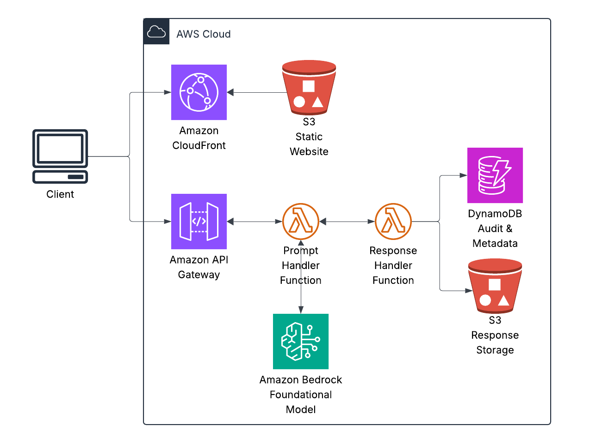

## The Real Problem: Production, Not Prototypes

Everyone can demo generative AI. Almost no one can run it safely in production.

Enterprises in finance, healthcare, and the public sector aren't blocked by technology capabilities—they're blocked by governance requirements that today's AI implementations rarely satisfy.

These organizations face three critical blockers:
- **Data leakage risk**: Sensitive information, from PII to trade secrets, flowing through public model APIs
- **Lack of auditability**: No reliable record of prompts, responses, or who accessed what information
- **Unclear ownership**: Ambiguous rights over prompt engineering IP, training data, and generated outputs

AWS customers don't want AI that behaves like a chatbot toy. They need AI that behaves like enterprise infrastructure: secured, monitored, audited, governed, and compliant with their existing security posture.

## Design Goals for Enterprise-Ready GenAI

When designing generative AI systems for regulated environments, your architecture must satisfy these non-negotiable requirements:

- No public internet exposure for sensitive data
- No training on customer data without explicit permission
- Full audit trail of all prompts and responses
- IAM-first access control integrated with enterprise identity
- Serverless and scalable by default

This checklist maps directly to AWS Well-Architected Framework principles, particularly in security and operational excellence.

## Reference Architecture Overview

Here's a reference architecture that meets these requirements using AWS services:

## Walking the Architecture: Building for Security and Scale

### 1️⃣ Edge & Entry: CloudFront + API Gateway

The edge layer serves as your first line of defense:

- Global edge protection through CloudFront
- Request validation and throttling via API Gateway
- Clear API contract for AI access
- WAF rules to block suspicious patterns

This approach frames AI as just another AWS workload, not an exception to your security rules. Your existing infrastructure and compliance controls extend naturally to your AI services.

### 2️⃣ Prompt Handling: Lambda

The Prompt Handler Lambda is where policy meets AI:

- Sanitizes inputs to prevent prompt injection
- Injects system prompts to enforce guardrails
- Enforces token limits (cost control)
- Attaches request metadata (user ID, application, purpose)

This layer ensures all model interactions are appropriately structured and traced. Every prompt includes context about who sent it, why, and what constraints apply.

### 3️⃣ Private Model Access: Bedrock via VPC Endpoint

The model interaction layer guarantees data privacy:

- No public internet egress
- No customer-managed model hosting
- No fine-tuning on customer prompts
- VPC integration with existing security controls

The model is consumed like a managed AWS service—not an external API. This distinction is critical for security teams evaluating AI adoption.

### 4️⃣ Response Filtering: Post-processing Lambda

The response handler implements safety guardrails:

- Content moderation (PII, offensive content)
- Output validation against schema
- Optional redaction of sensitive information
- Confidence scoring and hallucination detection

This layer acknowledges and mitigates hallucination risk without fear-mongering, providing mechanisms to validate and filter model outputs.

### 5️⃣ Audit & Evidence: DynamoDB / S3

The audit layer addresses compliance requirements:

- Persistent storage of prompt hashes
- Model ID and version tracking
- Timestamped responses
- Immutable audit logs

This creates a defensible evidentiary trail that satisfies governance requirements for regulated industries.

## Why This Works for Regulated Industries

This architecture succeeds where most AI implementations fail because it addresses the key requirements that matter to enterprise stakeholders:

**Security**: IAM-based access control, VPC endpoints, and private networking eliminate public exposure risks. The system operates entirely within your security perimeter, following the principle of "default deny" with explicit allow policies.

**Compliance**: Complete prompt/response traceability enables regulatory reporting and satisfies audit requirements. You can demonstrate who used the system, when, how, and what results they received—critical for SOC2, HIPAA, and FedRAMP.

**Cost control**: Serverless scaling plus token limits provide predictable, manageable costs. Unlike self-hosted options, you're not paying for idle infrastructure, and unlike public APIs, you have fine-grained control over usage patterns.

**Operational clarity**: The system is observable, debuggable, and auditable using the same tools you already use for the rest of your AWS infrastructure. There's no AI-specific monitoring to implement.

This approach works particularly well for financial services (handling sensitive financial data), healthcare (maintaining PHI compliance), and public sector (satisfying FedRAMP requirements)—precisely the industries with the most to gain from AI and the most stringent security requirements.

## Implementation Considerations

When implementing this pattern in production, several practical considerations emerge:

**IAM roles and boundaries**: Create specific IAM roles for each component with least-privilege access. The prompt handler needs Bedrock access but not S3 write access; the response filter needs DynamoDB write access but not Bedrock APIs. Use service control policies (SCPs) to enforce guardrails.

**VPC design**: Depending on your existing network topology, you may need to adjust the VPC design. For large enterprises with transit gateways, consider routing AI traffic through dedicated VPCs with specific security monitoring.

**Cost management**: Monitor token usage carefully. Implement token quotas at the API Gateway layer and consider using smaller context window models for initial responses, reserving larger context models for specific use cases.

**Scaling characteristics**: Lambda's concurrency model handles traffic spikes well, but Bedrock has model-specific quotas and SLAs. Request quota increases proactively if you anticipate high volume. Consider implementing queue-based architectures for asynchronous workloads.

**Cross-account patterns**: For large organizations, implement a hub-and-spoke model where a central AI governance account hosts the Bedrock endpoint, with workload accounts accessing it through cross-account roles. This centralizes auditing while enabling distributed usage.

## Conclusion

The gap between AI demos and AI in production isn't primarily a technical gap—it's a governance gap. 

This reference architecture bridges that gap by treating generative AI as enterprise infrastructure rather than a standalone tool. It integrates with existing security controls, creates auditability, and provides the governance hooks necessary for regulated environments.

The result? AI that can safely navigate the journey from prompt to production, enabling organizations to capture AI's business value without compromising on security and compliance requirements.

In regulated environments, the future of AI isn't about building fancy demos—it's about building trust. By architecting generative AI systems that behave like proper enterprise infrastructure—secured, monitored, audited, and governed—we allow organizations to focus on business value rather than security firefighting.

Remember that this is a reference architecture, not a one-size-fits-all solution. Your specific implementation should be tailored to your compliance requirements, existing infrastructure, and risk profile. But the principles outlined here—isolation, auditability, IAM-first access, and metadata enrichment—remain universal best practices for any enterprise AI deployment.
