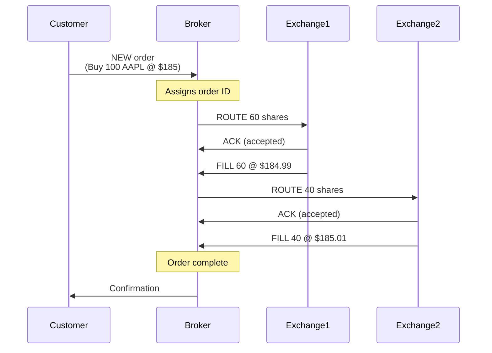
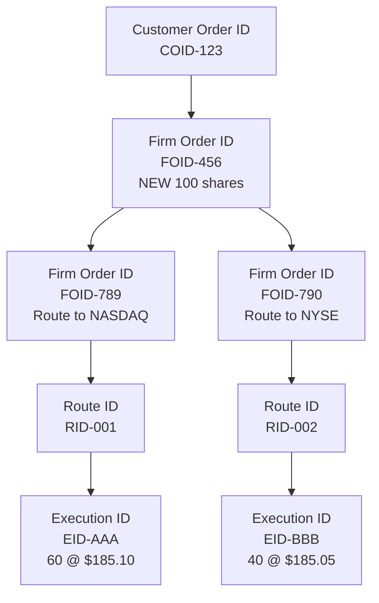
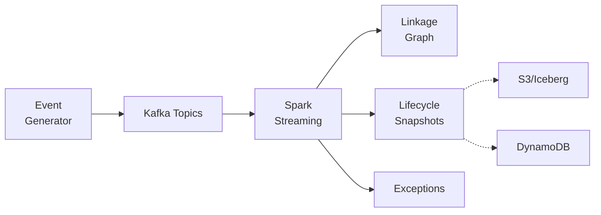

## Introduction

Imagine you're a regulator investigating suspicious trading activity. An order was placed at 9:30 AM, routed to three different exchanges, partially filled, modified twice, and finally canceled at 9:35 AM. How do you reconstruct what actually happened when the data is scattered across dozens of systems?

This is the challenge that the **Consolidated Audit Trail (CAT)** solves for U.S. securities markets. In this post, we'll explore how CAT works, why it matters, and how you can build a simplified version using modern streaming architecture.

## What is the Consolidated Audit Trail?

### The Regulatory Context

In July 2012, the Securities and Exchange Commission (SEC) adopted [Rule 613](https://www.sec.gov/about/divisions-offices/division-trading-markets/rule-613-consolidated-audit-trail) under Regulation NMS (National Market System) in Release No. 34-67457. The rule required the national securities exchanges and FINRA (the self-regulatory organizations, or SROs) to jointly file a national market system plan to create, implement, and maintain a consolidated audit trail that captures the lifecycle of orders across U.S. securities markets.

**Legal citation**: [17 CFR § 242.613](https://www.law.cornell.edu/cfr/text/17/242.613)

### Why Was CAT Needed?

Before CAT, market data was fragmented:
- **Multiple venues**: NYSE, NASDAQ, BATS, IEX, and dozens of other exchanges
- **Hundreds of broker-dealers**: Each with their own systems and formats
- **No unified view**: Regulators couldn't easily track an order across the market

This fragmentation made it difficult to:
- Investigate market events (like the 2010 Flash Crash)
- Detect manipulation or insider trading
- Ensure fair and orderly markets
- Reconstruct what happened during anomalies

### What CAT Captures

CAT requires reporting of:
1. **Customer and order information** for all NMS securities (in today's implementation, customer and account data goes to a separate Customer and Account Information System, CAIS, and Social Security numbers are no longer reported to CAT)
<!-- TODO(Luke): verify the CAIS/SSN wording against the current CAT NMS Plan and the SEC's 2020 exemptive relief before publishing -->
2. **Order lifecycle events** from inception through execution
3. **Routing information** across venues
4. **Modifications, cancellations, and executions**
5. **Timestamps** at least to the millisecond (finer if the firm's systems already capture finer)
6. **Linkage identifiers** to connect related events

## The CAT NMS Plan

The roles here are easy to blur, so let me be precise. CAT exists under a national market system plan, the [CAT NMS Plan](https://www.catnmsplan.com/), which is jointly owned by the SROs (the exchanges and FINRA, called the Participants) through CAT NMS, LLC. The Participants hired **FINRA CAT, LLC** as the Plan Processor, which builds and runs the central repository. The **SEC** approved the Plan and has oversight of it.

In practice, the Plan Processor:
- Receives billions of events daily from market participants
- Publishes [technical specifications](https://www.catnmsplan.com/specifications) for data reporting
- Provides regulators access to the consolidated data
- Runs data quality feedback and error correction

Broker-dealers ("Industry Members") report to CAT under each SRO's CAT compliance rule, and FINRA examines its member firms for it. FINRA has [told firms](https://www.finra.org/rules-guidance/notices/20-31) it expects them to perform comparative reviews and maintain data quality controls.
<!-- TODO(Luke): verify Regulatory Notice 20-31 is the right cite for the "comparative reviews" expectation (finra.org blocked automated fetch) -->

### Recent Developments

The CAT program continues to evolve. <!-- TODO(Luke): verify the 2025 order details, press release number (2025-127) and release number 34-104144 (sec.gov rate-limited automated fetch) -->
In 2025, the SEC issued an [order to reduce operating costs](https://www.sec.gov/newsroom/press-releases/2025-127-sec-issues-order-reduce-operating-costs-consolidated-audit-trail) while maintaining regulatory effectiveness ([fact sheet](https://www.sec.gov/files/34-104144-fact-sheet.pdf)).

## Understanding Order Lifecycles

### What is an Order Lifecycle?

An order lifecycle is the complete journey of an order from inception to final disposition:



Each step generates an **event**. These events must be:
- **Linked**: Connected through identifiers
- **Ordered**: Sequenced by event time
- **Complete**: No missing steps
- **Accurate**: Correct prices, quantities, timestamps

### The Distributed Systems Challenge

In real markets:
- Events come from **multiple independent systems**
- **No global clock** (timestamps are approximate)
- **Network delays** cause reordering
- **Systems fail** and retry (creating duplicates)
- **Late events** arrive after initial processing

This is a classic distributed systems problem: how do you reconstruct a coherent story from fragmented, out-of-order, potentially duplicate data?

## Event Sourcing: The Foundation

### What is Event Sourcing?

Event sourcing is a pattern where:
- **State changes are stored as events** (not just current state)
- **Current state is derived** by replaying events
- **Events are immutable** (never modified, only appended)
- **Complete history is preserved** for audit and debugging

### Traditional vs. Event Sourcing

**Traditional (State-Oriented)**:
```
Order Table:
order_id | symbol | qty | filled_qty | status | last_updated
---------|--------|-----|------------|--------|-------------
FOID-123 | AAPL   | 100 | 100        | FILLED | 10:05:23
```

You know the current state, but not how you got there.

**Event Sourcing**:
```
Event Log:
event_id | event_type | order_id | qty | ts_event
---------|------------|----------|-----|----------
E1       | NEW        | FOID-123 | 100 | 10:00:00
E2       | ROUTE      | FOID-123 | 60  | 10:00:15
E3       | FILL       | FOID-123 | 60  | 10:00:18
E4       | ROUTE      | FOID-123 | 40  | 10:00:20
E5       | FILL       | FOID-123 | 40  | 10:00:25
```

You can reconstruct the complete story and derive current state at any point in time.

### Why Event Sourcing for CAT?

1. **Regulatory audit trail**: Regulators need to see what happened, when, and why
2. **Time travel**: Reconstruct state at any point ("What was the order status at 10:00:20?")
3. **Debugging**: Replay events to reproduce issues
4. **Late data handling**: Insert late events and recompute state

## Lifecycle Linkages: Connecting the Dots

### Linkage Identifiers

Events contain IDs that connect them into a lifecycle graph:



### How Linkages Work

Each event contains identifiers that reference other events:

```json
{
  "event_type": "ROUTE",
  "customer_order_id": "COID-123",
  "firm_order_id": "FOID-789",
  "parent_firm_order_id": "FOID-456",  // Links to parent
  "route_id": "RID-001",
  "venue": "NASDAQ"
}
```

By following these links, we reconstruct the complete lifecycle graph - even when events arrive out of order.

## Streaming Architecture

### System Design

Our simplified CAT implementation uses:



The solid paths are what the Spark job does today: it reads `cat.events.v1` and writes linkages, lifecycle snapshots, and exceptions back to Kafka. The dotted sinks are where the design is headed. Terraform creates the S3 bucket and a DynamoDB table for snapshots, but the job doesn't write to them yet.
<!-- TODO(Luke): repo has S3/Iceberg + DynamoDB in the README diagram and Terraform, but lifecycle_streaming.py never writes to them (and nothing writes audit.v1); wire them up in repo or keep this caveat -->

### Kafka Topics

We use separate topics for different concerns:

- **cat.events.v1**: Raw lifecycle events (NEW, ROUTE, FILL, etc.)
- **cat.linkages.v1**: Parent-child edges
- **cat.lifecycle.v1**: Materialized lifecycle snapshots
- **cat.exceptions.v1**: Data quality violations
- **cat.late_events.v1**: Events that arrived after the watermark, for batch reconciliation
- **audit.v1**: Immutable audit trail of corrections (created by `tools/create_topics.sh`, not written by the Spark job yet)

### Spark Structured Streaming

The core processing logic, trimmed down from `spark/lifecycle_job/lifecycle_streaming.py`:

```python
# Read events from Kafka and parse the JSON payload
events = spark.readStream \
    .format("kafka") \
    .option("kafka.bootstrap.servers", bootstrap_servers) \
    .option("subscribe", "cat.events.v1") \
    .load() \
    .select(from_json(col("value").cast("string"), EVENT_SCHEMA).alias("data")) \
    .select("data.*") \
    .withColumn("event_time", (col("ts_event") / 1000).cast("timestamp"))

# Watermark first, and tag events that arrived later than the watermark delay
watermarked = events \
    .withWatermark("event_time", "2 minutes") \
    .withColumn("is_late",
                col("kafka_timestamp") > col("event_time") + expr("INTERVAL 2 minutes"))

# Deduplicate (idempotency) with bounded state
unique_events = watermarked.dropDuplicates(["event_id", "event_time"])

# Build linkages: a UDF returns an array of edges per event, then explode
linkages = unique_events \
    .withColumn("edges", construct_edges(
        col("event_id"), col("event_type"), col("customer_order_id"),
        col("firm_order_id"), col("parent_firm_order_id"), col("route_id"),
        col("exec_id"), col("ts_event"))) \
    .select(explode(col("edges")).alias("edge")) \
    .select("edge.*")

# Materialize lifecycles: one row per customer order per trading day
lifecycles = unique_events \
    .groupBy(window(col("event_time"), "1 day"), col("customer_order_id")) \
    .agg(
        _max(struct(col("ts_event"), col("event_type"))).alias("last_event"),
        _max(expr("CASE WHEN event_type = 'NEW' THEN qty END")).alias("total_qty"),
        _sum(expr("""CASE WHEN event_type = 'FILL' THEN qty
                          WHEN event_type = 'BUST' THEN -qty
                          ELSE 0 END""")).alias("filled_qty"),
        # ...route/fill counts, status, avg exec price, first/last timestamps
    )

# Each micro-batch of updated lifecycles is written to Kafka, and validated
# for exceptions, inside foreachBatch
```

Why the watermark comes before deduplication: a plain `dropDuplicates(["event_id"])` on a stream has to remember every `event_id` it has ever seen, forever, so its state grows without bound. Adding the watermarked `event_time` column to the keys lets Spark evict each ID once the watermark passes it. A resent event carries the same `ts_event`, so it still matches. Spark 3.5 also has `dropDuplicatesWithinWatermark`, which is the more natural fit, but I hit a runtime crash with it once downstream steps pruned columns, so the repo sticks with the two-key version.

A few other details that are easy to get wrong:

- **Group by trading day, too.** If lifecycles are grouped by `customer_order_id` alone, there's no event-time key, so Spark can never expire that state. Adding a one-day window lets the watermark close out each trading day. (Orders that live across days, like good-till-canceled orders, would need `applyInPandasWithState` with a timeout instead.)
- **Pick the last event by time.** `max(struct(event_type, ts_event))` compares the event type first, so it returns the alphabetically largest type, not the latest event. Put the timestamp first.
- **Take quantity from the NEW event.** Using `max(qty)` across all events hides overfills, because an oversized fill just becomes the new "total."
- **Validate inside `foreachBatch`.** Exceptions are derived from an aggregation, and Spark won't emit that in append mode. Writing lifecycles in update mode and validating each micro-batch inside `foreachBatch` sidesteps the problem.

## Handling Late and Out-of-Order Events

### The Late Data Problem

Events can arrive late due to:
- Network delays
- System failures and retries
- Clock skew between systems
- Batch processing delays

### Watermarks

A **watermark** is a threshold: "I don't expect events older than X seconds anymore."

```
Current time: 10:05:00
Watermark delay: 30 seconds
Watermark: 10:04:30

Events with event_time < 10:04:30 are "late"
```

(Strictly, Spark computes the watermark from the maximum event time it has seen, not the wall clock, but the idea is the same.)

### Reconciliation

Here's the catch: once an event is behind the watermark, Spark's stateful operators (deduplication, windowed aggregations) drop it. The streaming job won't reconcile it for you. Late events past the watermark need their own path.

The approach I'd take:
1. **Detect**: Before the stateful operators, tag events that reached Kafka more than the watermark delay after they happened. That's an approximation of Spark's watermark, and it's what the repo's `is_late` column does.
2. **Route**: Write those events to a separate late-events sink instead of relying on the streaming aggregation. The repo sends them to `cat.late_events.v1`.
3. **Recompute**: A batch reconciliation job replays the full event log for each affected `customer_order_id`, including the late events. The raw topic keeps 30 days of events, so the history is there.
4. **Audit**: Log the correction to `audit.v1`.
5. **Update**: Emit a corrected lifecycle snapshot.

The streaming path gives you fast, provisional lifecycles, and the batch path makes them correct. Real CAT reporting has a similar rhythm: data is due by 8:00 a.m. ET on the trading day after the event, and errors get corrected afterward.
The repo implements steps 1 and 2. Steps 3 through 5 are a good exercise.
<!-- TODO(Luke): verify error-correction deadline (T+3 by 8:00 a.m. ET) in the current CAT NMS Plan / Industry Member specs if you want to add it here -->

## Data Quality Validation

### Validation Rules

The repo checks two quantity rules on each lifecycle today:

- **Overfill**: Filled more than ordered (`OVERFILL`)
- **Negative fill**: Filled quantity below zero (`NEGATIVE_FILL`)

The checks I'd add next (and good exercises if you're working through the repo):

- **Sequence violations**: Execution before order receipt
- **Missing linkages**: Fill references unknown route
- **Temporal anomalies**: Events with impossible timestamps
- **Orphaned events**: Events with no parent

### Exception Handling

When violations are detected:

```json
{
  "exception_id": "b3f1c2de-...",
  "exception_type": "OVERFILL",
  "severity": "ERROR",
  "customer_order_id": "COID-123",
  "firm_order_id": "FOID-456",
  "description": "Filled quantity exceeds total quantity",
  "ts_detected": 1710000030000,
  "metadata": {"total_qty": 100, "filled_qty": 120}
}
```

Exceptions are written to `cat.exceptions.v1` for investigation.

## Try It Yourself

### Local Quickstart

All you need is Docker. Kafka, Spark, and the event generator run in containers.

```bash
# Clone the repository
git clone https://github.com/lukelittle/sec-613-cat-lifecycle-reconstruction-example
cd sec-613-cat-lifecycle-reconstruction-example

# Start Kafka, Kafka UI, and Spark, then create topics
make local-up
make local-topics

# Run the streaming job (leave it running)
make local-spark

# In another terminal, generate events
make local-generate                          # normal
make local-generate MODE=duplicate           # resend some events
make local-generate MODE=late DURATION=300   # hold some events past the watermark

# Watch the results
./tools/tail_topics.sh cat.lifecycle.v1
./tools/tail_topics.sh cat.late_events.v1

# Run the tests
make test
```

In duplicate mode you should see zero overfill exceptions, because dedup catches the resent fills. In late mode, held-back ACKs show up on `cat.late_events.v1` instead of silently disappearing.

### AWS Deployment

```bash
# Deploy infrastructure
cd terraform/envs/dev
terraform init
terraform apply

# Deploy Spark job
./deploy_spark_job.sh

# Start generator via API
curl -X POST https://YOUR_API_URL/generator/start \
  -d '{"mode": "normal", "duration": 300, "rate": 2.0}'
```

See the [full documentation](https://github.com/lukelittle/sec-613-cat-lifecycle-reconstruction-example/tree/main/docs) for detailed instructions.

## Key Takeaways

1. **CAT solves a real problem**: Reconstructing order lifecycles across fragmented markets
2. **Event sourcing is natural**: Store events, derive state
3. **Linkages enable reconstruction**: Identifiers connect distributed events
4. **Late data is normal**: Watermarks bound your state, and events past the watermark need a separate reconciliation path
5. **Data quality matters**: Validation catches errors early
6. **Streaming is powerful**: Real-time processing, as long as you design for duplicates (the Kafka sink is at-least-once, so downstream consumers should be idempotent too)

## About This Project

Created for finance-minded college students to learn AWS with real-world examples. The goal is to teach practical cloud and streaming concepts through regulatory-inspired use cases that bridge technology and financial services.

**Ready to build your own lifecycle reconstruction system?** Check out the [full repository](https://github.com/lukelittle/sec-613-cat-lifecycle-reconstruction-example) and workshop materials!

## Sources and Further Reading

### Primary Regulatory Sources

1. **SEC Rule 613 Final Adopting Release**  
   Securities and Exchange Commission, Release No. 34-67457 (July 18, 2012)  
   [https://www.sec.gov/files/rules/final/2012/34-67457.pdf](https://www.sec.gov/files/rules/final/2012/34-67457.pdf)

2. **Code of Federal Regulations: 17 CFR § 242.613**  
   [https://www.law.cornell.edu/cfr/text/17/242.613](https://www.law.cornell.edu/cfr/text/17/242.613)

3. **SEC Rule 613 Overview**  
   [https://www.sec.gov/about/divisions-offices/division-trading-markets/rule-613-consolidated-audit-trail](https://www.sec.gov/about/divisions-offices/division-trading-markets/rule-613-consolidated-audit-trail)

4. **CAT NMS Plan**  
   [https://www.catnmsplan.com/](https://www.catnmsplan.com/)

5. **CAT Technical Specifications**  
   [https://www.catnmsplan.com/specifications](https://www.catnmsplan.com/specifications)

### Oversight and Recent Developments

6. **FINRA Regulatory Notice 20-31**  
   [https://www.finra.org/rules-guidance/notices/20-31](https://www.finra.org/rules-guidance/notices/20-31)

7. **FINRA 2026 Annual Regulatory Oversight Report: CAT**  
   [https://www.finra.org/rules-guidance/guidance/reports/2026-finra-annual-regulatory-oversight-report/cat](https://www.finra.org/rules-guidance/guidance/reports/2026-finra-annual-regulatory-oversight-report/cat)

8. **SEC Order to Reduce CAT Operating Costs (2025)**  
   [https://www.sec.gov/newsroom/press-releases/2025-127-sec-issues-order-reduce-operating-costs-consolidated-audit-trail](https://www.sec.gov/newsroom/press-releases/2025-127-sec-issues-order-reduce-operating-costs-consolidated-audit-trail)  
   Fact sheet: [https://www.sec.gov/files/34-104144-fact-sheet.pdf](https://www.sec.gov/files/34-104144-fact-sheet.pdf)

### Technical Resources

9. **Apache Kafka Documentation**  
   [https://kafka.apache.org/documentation/](https://kafka.apache.org/documentation/)

10. **Apache Spark Structured Streaming Guide**  
    [https://spark.apache.org/docs/latest/structured-streaming-programming-guide.html](https://spark.apache.org/docs/latest/structured-streaming-programming-guide.html)

11. **Martin Fowler: Event Sourcing**  
    [https://martinfowler.com/eaaDev/EventSourcing.html](https://martinfowler.com/eaaDev/EventSourcing.html)

### Project Repository

12. **GitHub Repository and Workshop Docs**  
    [https://github.com/lukelittle/sec-613-cat-lifecycle-reconstruction-example](https://github.com/lukelittle/sec-613-cat-lifecycle-reconstruction-example)

---

**Disclaimer**: This blog post and associated demo are for educational purposes only. They do not constitute trading advice, legal advice, or compliance guidance. The architecture described does not represent any former employer's actual systems or implementations. The demo uses synthetic data and simplified logic to illustrate concepts rather than real production implementations. It is not CAT reporting: actual CAT reporting requires onboarding with the Plan Processor, adherence to the full CAT technical specifications, and extensive testing, security, and compliance review. Always consult with legal and compliance professionals when implementing regulatory reporting systems.
