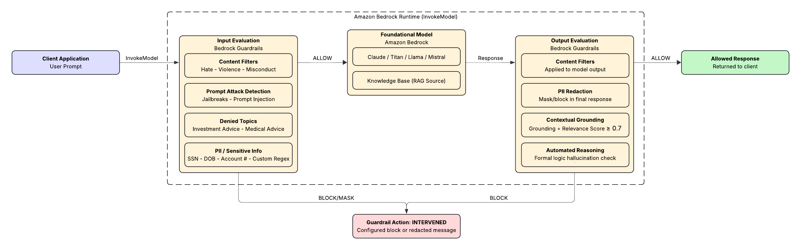
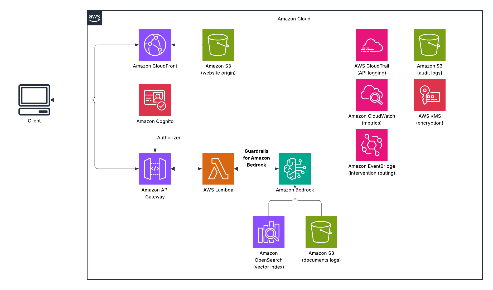

Everyone wants to ship AI into production. Almost no one wants to own what happens when it goes wrong.
I've been in enough rooms with financial services clients to know how this plays out. A team builds something impressive on Bedrock — a RAG-powered knowledge assistant, an internal compliance copilot, a customer-facing chatbot. The demo looks great. Then someone in Legal raises their hand. What happens if it leaks a customer's SSN? What if it makes a recommendation that sounds like investment advice? What if a clever user tricks it into ignoring your system prompt?

The AI project stalls. Not because the technology isn't ready — because the governance layer isn't there.

AWS Bedrock Guardrails is that governance layer. And in regulated environments like banking, insurance, and healthcare, it's not optional — it's the prerequisite for going to production.
This post walks through what Guardrails actually does, how it works under the hood, why it matters specifically in financial services, and how to implement it with code you can actually deploy.
What Guardrails Solves
Let's be direct about the problem. Large language models have four failure modes that matter most in regulated industries:

Harmful content generation: Even well-prompted models can produce hate speech, violent content, or guidance on misconduct if pushed in the right direction — especially in customer-facing contexts where you can't predict every input.

Prompt injection and jailbreaks: Sophisticated users will attempt to override your system prompt, bypass your application logic, or extract information from your context window that they shouldn't have. This isn't theoretical — it's the first thing a red team tests.

PII leakage: In a RAG system where your model has access to customer records, there's a real risk of the model surfacing one customer's information in another customer's session, or including SSNs and account numbers in a response that gets logged, cached, or screenshotted.

Hallucination: For a general-purpose chatbot, hallucination is annoying. For a compliance assistant answering questions about regulatory requirements, it's a liability.

Bedrock Guardrails addresses all four — as a managed layer that sits between your application and the foundation model, evaluating both input and output independently.

How It Works
The core mental model is simple: guardrails wrap the model invocation, not the model itself. You define a set of policies once, attach them to your Bedrock calls, and every prompt and every response gets evaluated against those policies before anything reaches the end user.





There are two evaluation passes:

Input evaluation runs before the prompt reaches the foundation model. If the user's message violates a policy, the model never sees it — you get a blocked message back immediately.
Output evaluation runs after the model generates a response. The model might have produced something that passes input filters but fails on output — hallucinated content that contradicts your source documents, or a response that inadvertently includes PII from the retrieved context.

If either pass blocks, you get back a configurable message. The model response is never surfaced to the user.

The Six Policy Types
1. Content Filters
Detect and filter harmful content across six categories: Hate, Insults, Sexual, Violence, Misconduct, and Prompt Attack. Each category has an adjustable filter strength — Low, Medium, or High — so you can calibrate based on your use case. A customer service chatbot for a brokerage doesn't need the same thresholds as an internal developer tool.


AWS extended content filtering to code-related content in 2025, which matters for any application where users can submit or request code. Harmful content in comments, variable names, and string literals is now caught at the same level as prose.
2. Prompt Attack Detection
This sits inside content filters but deserves its own callout. Jailbreaks and prompt injections are the most common adversarial inputs your application will face once it's live. Guardrails detects both and gives you the option to block or log them — useful for incident response when your security team wants to know who tried what.
3. Denied Topics
Define topics that are off-limits in the context of your application. For a retail banking chatbot, this might be investment advice (FINRA), cryptocurrency recommendations, or competitor product comparisons. You describe the topic in plain language; AWS uses that description to classify user inputs and model responses.


This is one of the more powerful policy types for financial services, because it lets you draw a hard line around regulatory risk without having to enumerate every possible phrasing of a question.
4. Sensitive Information Filters (PII Redaction)
Bedrock Guardrails uses probabilistic ML detection to identify PII in both inputs and outputs. Predefined entity types include: SSN, Date of Birth, phone numbers, email addresses, credit card numbers, driver's license numbers, bank account numbers, and more.


For anything not on the predefined list — like account routing numbers in a proprietary format, or internal employee IDs — you can add custom regex patterns.

When PII is detected, you have two options: block the entire message, or mask the sensitive fields and allow the rest through. Masking is useful for logging and audit scenarios where you want to retain the conversation structure without storing raw PII.
5. Contextual Grounding Checks
This is the hallucination filter, and it's the most technically interesting policy type for RAG applications.


Contextual grounding checks compare the model's response against two things: the source documents retrieved from your knowledge base, and the user's original query. It generates two scores:


Grounding score: How factually consistent is the response with the source material?
Relevance score: Does the response actually answer what was asked?

You set a threshold between 0 and 0.99 for each. A response below either threshold gets blocked. AWS recommends starting around 0.7 for both and adjusting based on testing.
In practice, this means if your compliance knowledge base says "employees must complete annual AML training," and the model responds "employees should complete AML training within 90 days of hire" — that's a grounding failure. The content is plausible; it's just not what your source says. Contextual grounding catches it.
6. Automated Reasoning Checks
This is the newest and most powerful capability for factual accuracy. Where contextual grounding uses ML scoring, Automated Reasoning uses formal logic — encoding your organization's policies as structured logical rules, then verifying model responses against those rules mathematically.


The practical implication: Automated Reasoning doesn't just score a response; it can explain why a response is incorrect and what correction would make it valid. For HR policy bots, compliance Q&A systems, and any use case where you need to be able to show your work to an auditor, this is the capability that changes the conversation.
Implementation
Let's make this concrete. Here's a Terraform module that creates a guardrail configured for a financial services knowledge assistant:

```terraform
resource "aws_bedrock_guardrail" "finserv_assistant" {
  name                      = "finserv-knowledge-assistant"
  description               = "Guardrails for retail banking knowledge assistant"
  blocked_input_messaging   = "I'm not able to help with that request. Please contact your relationship manager for assistance."
  blocked_outputs_messaging = "I wasn't able to generate a response that meets our quality standards. Please rephrase your question."

  # PII: block sensitive data in inputs, mask in outputs
  sensitive_information_policy_config {
    pii_entities_config {
      type   = "SSN"
      action = "BLOCK"
    }
    pii_entities_config {
      type   = "US_BANK_ACCOUNT_NUMBER"
      action = "ANONYMIZE"
    }
    pii_entities_config {
      type   = "CREDIT_DEBIT_CARD_NUMBER"
      action = "ANONYMIZE"
    }
    pii_entities_config {
      type   = "US_PASSPORT_NUMBER"
      action = "BLOCK"
    }
    # Custom regex for internal account IDs
    regexes_config {
      name        = "internal-account-id"
      description = "Internal account reference numbers"
      pattern     = "ACC-[0-9]{8}"
      action      = "ANONYMIZE"
    }
  }

  # Block investment advice topics — FINRA risk mitigation
  topic_policy_config {
    topics_config {
      name       = "investment-advice"
      definition = "Specific recommendations to buy, sell, or hold financial securities, stocks, bonds, mutual funds, ETFs, or other investment products."
      type       = "DENY"
      examples   = [
        "Should I buy more Apple stock?",
        "What funds should I put my 401k into?",
        "Is now a good time to sell my bonds?"
      ]
    }
    topics_config {
      name       = "competitor-products"
      definition = "Comparisons or recommendations involving competing financial institutions or their products."
      type       = "DENY"
    }
  }

  # Content filters — calibrated for customer-facing context
  content_policy_config {
    filters_config {
      type            = "HATE"
      input_strength  = "HIGH"
      output_strength = "HIGH"
    }
    filters_config {
      type            = "INSULTS"
      input_strength  = "MEDIUM"
      output_strength = "MEDIUM"
    }
    filters_config {
      type            = "PROMPT_ATTACK"
      input_strength  = "HIGH"
      output_strength = "NONE"
    }
    filters_config {
      type            = "VIOLENCE"
      input_strength  = "HIGH"
      output_strength = "HIGH"
    }
  }

  # Contextual grounding — prevent hallucination in RAG responses
  contextual_grounding_policy_config {
    filters_config {
      type      = "GROUNDING"
      threshold = 0.75
    }
    filters_config {
      type      = "RELEVANCE"
      threshold = 0.70
    }
  }

  # Encrypt guardrail configuration with customer-managed key
  kms_key_arn = aws_kms_key.bedrock_guardrail_key.arn

  tags = {
    Environment = "production"
    Application = "finserv-knowledge-assistant"
    Compliance  = "FFIEC"
  }
}
```
Now attach it to your Bedrock invocation:

```python
import boto3
import json

bedrock = boto3.client("bedrock-runtime", region_name="us-east-1")

def invoke_with_guardrails(prompt: str, source_documents: list[str]) -> dict:
    """
    Invoke a Bedrock model with Guardrails applied to both input and output.
    source_documents: list of text chunks retrieved from your knowledge base
    """
    guardrail_id = "your-guardrail-id"
    guardrail_version = "DRAFT"  # Use a pinned version in production

    # Format the request with grounding source for contextual checks
    grounding_source = "

".join(source_documents)

    response = bedrock.invoke_model(
        modelId="anthropic.claude-3-5-sonnet-20241022-v2:0",
        guardrailIdentifier=guardrail_id,
        guardrailVersion=guardrail_version,
        body=json.dumps({
            "anthropic_version": "bedrock-2023-05-31",
            "max_tokens": 1024,
            "system": f'''You are a helpful assistant for retail banking customers.
Answer questions based only on the provided documentation.
If the answer is not in the documentation, say so clearly.

Documentation:
{grounding_source}''',
            "messages": [
                {
                    "role": "user",
                    "content": [
                        {
                            "type": "text",
                            "text": prompt,
                            "guardContent": {
                                "text": {
                                    "qualifiers": ["query"]
                                }
                            }
                        }
                    ]
                }
            ]
        }),
        contentType="application/json",
        accept="application/json"
    )

    result = json.loads(response["body"].read())

    # Check if guardrails intervened
    if response.get("amazon-bedrock-guardrailAction") == "INTERVENED":
        guardrail_trace = response.get("amazon-bedrock-trace", {})
        return {
            "blocked": True,
            "reason": guardrail_trace.get("guardrail", {}).get("actionReason", "Policy violation"),
            "response": None
        }

    return {
        "blocked": False,
        "reason": None,
        "response": result["content"][0]["text"]
    }
```
One thing worth calling out: the guardContent qualifier on the user message tells Guardrails which part of the prompt to evaluate for the relevance check. Without it, Guardrails would try to evaluate your entire system prompt (including the retrieved documents) as if it were the user query — which produces noisy results.
The Audit Trail
A guardrail that blocks requests is only half the picture. The other half is knowing what it blocked, when, and why.


Every Guardrail invocation emits metrics to Amazon CloudWatch:

GuardrailInvocations — total count
GuardrailInterventions — how many were blocked
GuardrailIntervention[PolicyType] — breakdowns by policy

Set up a CloudWatch alarm on GuardrailInterventions spiking above your baseline and you have an early warning system for adversarial use or misconfigured prompts.


For a more complete audit trail — the kind that satisfies a FFIEC examiner or a SOC 2 auditor — route blocked events through EventBridge to an S3 bucket and query them with Athena. The pattern looks like this:


```python
# Lambda function triggered by EventBridge rule on Bedrock Guardrail events
import boto3
import json
from datetime import datetime

s3 = boto3.client("s3")
AUDIT_BUCKET = "your-ai-audit-logs-bucket"

def handler(event, context):
    """Log guardrail interventions to immutable S3 audit trail."""
    
    audit_record = {
        "timestamp": datetime.utcnow().isoformat(),
        "guardrail_id": event.get("guardrailId"),
        "policy_triggered": event.get("policyType"),
        "action": event.get("action"),  # BLOCKED or ANONYMIZED
        "session_id": event.get("sessionId"),
        # Do NOT log the raw prompt — PII may not be fully redacted at this point
        "prompt_token_count": event.get("inputTokenCount"),
        "region": event.get("awsRegion"),
        "model_id": event.get("modelId")
    }

    key = f"guardrail-interventions/{datetime.utcnow().strftime('%Y/%m/%d')}/{context.aws_request_id}.json"
    
    s3.put_object(
        Bucket=AUDIT_BUCKET,
        Key=key,
        Body=json.dumps(audit_record),
        ServerSideEncryption="aws:kms",
        BucketKeyEnabled=True
    )

    return {"statusCode": 200}
```
This gives you an immutable, KMS-encrypted log of every guardrail intervention — queryable by date, policy type, model, or session ID without ever storing the raw prompt content.

What This Actually Changes for Banks
I keep coming back to one question in these conversations: what does it take to get an AI project from a successful proof-of-concept to a production system a compliance officer will sign off on?


The answer usually involves four things: data isolation, access controls, auditability, and behavioral controls. The first three are solved problems on AWS — VPC endpoints, IAM, CloudTrail. The fourth one — actually constraining what the model says and does — has historically required custom application logic that's brittle, hard to test, and invisible to your governance team.


Bedrock Guardrails changes that. It gives you behavioral controls that are:

Centralized. One guardrail definition applied consistently across every invocation, every session, every user.
Versioned. You can pin a guardrail version to your production deployment and test changes in a draft version before promoting.
Auditable. Every intervention is observable through CloudWatch metrics and loggable through EventBridge.
Model-agnostic. The ApplyGuardrail API works independently of the foundation model — you can apply your guardrail to Claude, Titan, Llama, and even third-party models outside of Bedrock through the standalone API.

That last point matters more than it sounds. Most banks aren't going to standardize on a single foundation model. As the model landscape evolves, your safety policies shouldn't have to be rewritten every time you swap out the underlying model.


Getting Started

The fastest way to get a guardrail running is through the AWS console — there's a test playground in the Guardrails UI where you can paste prompts and verify your policies before deploying. Start there, calibrate your contextual grounding thresholds against real examples from your knowledge base, then export the configuration to Terraform or CloudFormation for your production deployment.
A few things to validate before go-live:

Test your PII detection against real data samples (anonymized). The predefined entity types work well for standard formats; you'll discover gaps quickly with actual data.
Set your contextual grounding thresholds conservatively at first (0.7/0.7) and monitor your block rate. Too many false positives means end users get frustrated; too few means you're letting hallucinations through.
Verify your denied topics by trying to phrase a restricted question a dozen different ways. The topic detection is robust, but your definition matters — vague definitions lead to both over-blocking and under-blocking.

If you're building in a regulated environment and you're not running Guardrails, you're carrying a liability that grows every day your AI system is in production. The capability exists. The question is whether you implement it before something goes wrong, or after.
