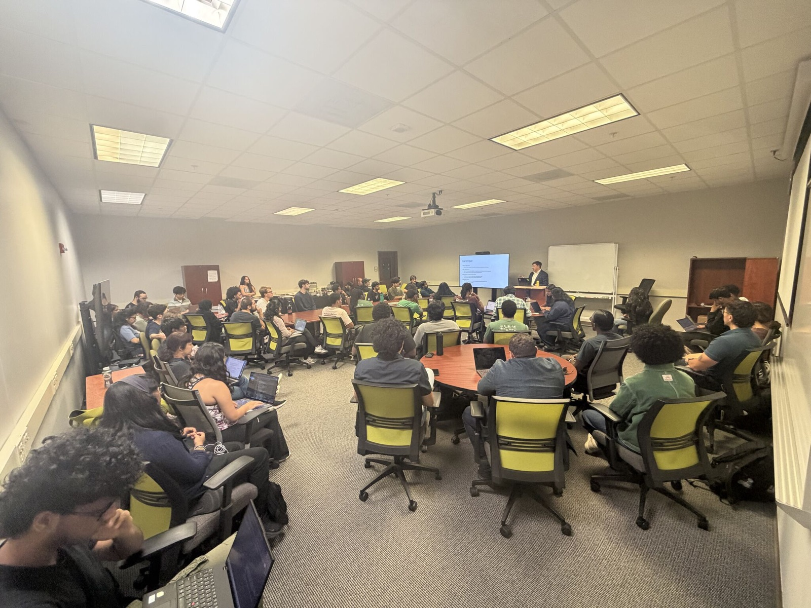

<!--
DRAFT SCAFFOLD. Luke is writing the final version himself.
Each section starts with a note on its job. The prose under it is a rough pass to react to, not final copy.
Working title alternatives: "Cracking the Cloud After the Vibe Shift" / "From 'AI Took My Job' to 'AI Will End Us': Why We Need You Anyway" / "Cracking the Cloud, 2026 Edition"
-->

<!-- JOB: Set the scene. Where, when, and why this visit mattered (alumni board). Keep it short. -->

On September 16th I was back at UNC Charlotte giving [Cracking the Cloud]() to a room full of computing students. This time I came back as a member of the UNC Charlotte Alumni Board of Directors, which made it feel less like a guest lecture and more like checking in on family.

<!-- TODO(Luke): who hosted/organized, anything notable about the room or turnout -->

## The Deck I Built for 2025

<!-- JOB: Show where the talk started. The 2025 framing was "AI is coming for the jobs, so here's how to stand out." -->

When I first put this deck together, it was about the state of AI in 2025. The anxiety in the room was easy to name: *AI is going to take all the entry-level jobs.* So the talk was a practical answer to that fear. Get a certification, build real things, meet real people, and you'll stand out from the pile of résumés that all look the same.

That advice still holds. But the fear changed.

## Then the Conversation Took a Turn

<!-- JOB: The abrupt shift. Name what actually happened ("post-Hugging Face"), in your own words, and how fast the narrative flipped. -->

<!-- TODO(Luke): describe the moment/event you mean by "post-Hugging Face" and what changed. Link a source or two. -->

Somewhere along the way, we went from *"AI is taking all the jobs"* to *"forget the jobs, AI is going to kill us all."* That's a pretty abrupt turn of events. A year ago students were asking me whether they'd get hired. Now some of them are asking whether it's even worth trying.

## How It Feels

<!-- JOB: The emotional core. Validate the whiplash before offering the positive message. Be honest about your own reaction too. -->

I don't want to wave that away, because the feeling is real. It's whiplash. You're told to reskill for an AI-shaped job market, and before you finish the course the headlines move on to existential risk. It's hard to plan a career when the story about the future changes every few months.

<!-- TODO(Luke): how it hit you personally. Did you rewrite slides? Hesitate? Something a student said? -->

If you're feeling some mix of anxious, cynical, and tired, you're not behind. You're paying attention.

## The Truth: We Need Talented People More Than Ever

<!-- JOB: The pivot to the positive message. Make it concrete: specific kinds of work that need people right now. -->

Here's what I told the room: the mess we're in doesn't reduce the need for talented people. It increases it. Somebody has to guide us through this, and it isn't going to be the models.

We need people who can:

- **Work on alignment and safety.** Making AI systems do what we actually intend is an unsolved problem, and it needs researchers, engineers, and evaluators, not just a handful of labs.
- **Build the physical backbone.** All of this runs on data centers, power, cooling, and networks. That's infrastructure work, and cloud skills are a direct on-ramp to it.
- **Put guardrails and governance around AI.** Especially in regulated industries, someone has to decide what a model is allowed to do and prove it. (I wrote about that in [The Missing Layer in Your Enterprise AI Stack]() and [From Prompt to Production]().)
- **Make less AI slop.** The internet is filling up with plausible, generic, low-effort content and code. People with taste and judgment, who can tell *good* from *merely plausible*, are going to be worth a lot.

<!-- TODO(Luke): add or cut from this list; an example from your own work would land well here -->

## Disruption Always Brings Opportunity

<!-- JOB: The thesis. Every disruption opens doors for people willing to stretch and adapt. -->

Every big disruption reshuffles who gets to do what. The people who come out ahead aren't the ones who predicted the future correctly. They're the ones who were willing to stretch, learn the new thing, and adapt when the plan changed.

<!-- TODO(Luke): a disruption you lived through (baking → banking → cloud?) that proves the point -->

## The 30-60-90 Plan, Updated

<!-- JOB: Bring it back to action. Same plan, tuned for this moment. -->

The backbone of the talk still works, with a few updates for right now:

**First 30 days: learn the fundamentals.** An entry-level cloud certification like AWS Cloud Practitioner still gives you the vocabulary and mental models to build. Add a working understanding of how AI systems are deployed and governed.

**By 60 days: build something real.** Not a thin wrapper around a chatbot. Something you understand end to end, that makes real architectural decisions, and that you can explain without a model in the room. (The [student branding starter]() is a good place to put it.)

**By 90 days: connect with people.** Meetups, alumni, faculty. In a noisy market, relationships are the signal. This is still the step students skip most, and still the one that most often turns into offers.

## I'm Stretching Too

<!-- JOB: Model the message. You're adapting in public as well. -->

<!-- TODO(Luke): confirm "started this year" is right for your program -->
I'm taking my own advice. I started my MBA at Duke this year (Class of 2028), because the problems I care about aren't only technical anymore. They're about strategy, governance, and leading people through change.

## Thank You

<!-- TODO(Luke): thank the faculty, staff, and organizers -->

If you were in the room, thank you for the questions and the honesty. And if you'd like me to bring this talk to your school or group, [bug me on LinkedIn](https://www.linkedin.com/in/lucaslittle/).
