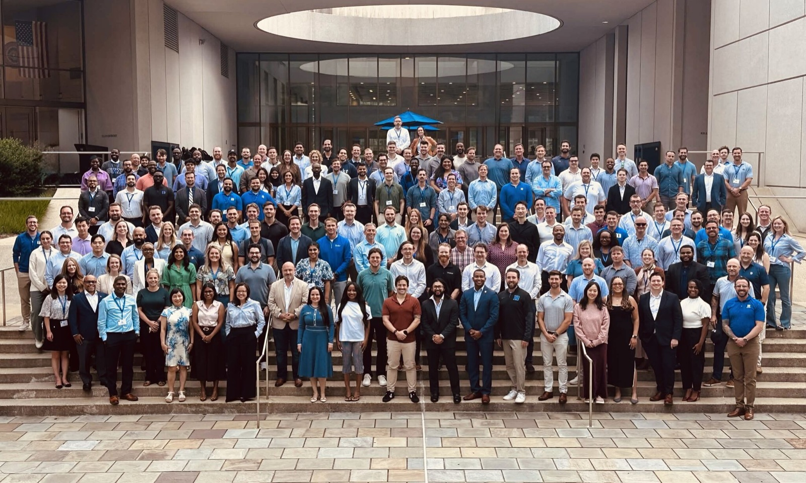
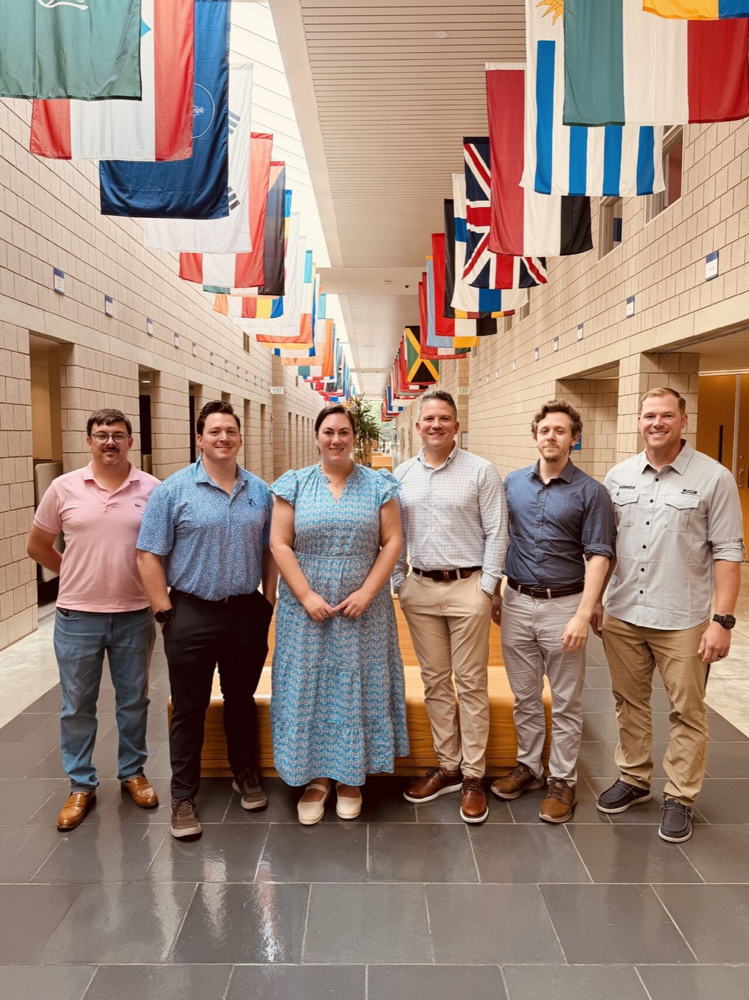

<!--
DRAFT SCAFFOLD. Luke writes the final version.
TODO(Luke): set the real date when the semester wraps. The folder is 2026/12 as a guess, and the URL comes from date + title, so move the folder if the month changes.
TODO(Luke): check your classmates are OK with the small-group photo before publishing.
-->

<!-- JOB: Hook. The "wait, why is a cloud/AI engineer getting an MBA?" question. -->

A lot of people asked me the same question when I told them I was starting an MBA at Duke: *why?* I build cloud and AI systems. I write Terraform for fun. Why would someone like that go back to school for a business degree?

<!-- TODO(Luke): your real answer. The Cracking the Cloud post hints at it: the hardest problems aren't only technical anymore; they're about strategy, governance, and leading people through change. -->

## What the First Semester Was Actually Like

<!-- JOB: Concrete, honest texture. Workload, format, balancing it with work and speaking. -->
<!-- TODO(Luke): program format, the schedule, how you're balancing it with work -->

## The People

<!-- JOB: The cohort. Who's in the room, what you learn from classmates outside tech. -->

<!-- TODO(Luke): what's surprised you about your classmates' backgrounds -->

## What's Clicking for an Engineer

<!-- JOB: Where the MBA content connects to your day job. Finance/accounting ↔ capital markets work; strategy ↔ AI governance; leadership ↔ helping teams level up. -->
<!-- TODO(Luke): 2–3 specific courses or ideas and how they changed how you see your work -->

## What's Hard

<!-- JOB: Vulnerability. The thing you're worst at, the class that humbled you. -->
<!-- TODO(Luke) -->

## Practicing What I Preach

<!-- JOB: Tie back to the Cracking the Cloud message: stretch and adapt during disruption. -->

At UNC Charlotte this fall I told a room full of students that every disruption creates opportunity for people willing to stretch and adapt. Going back to school in the middle of my career is me taking my own advice.

<!-- TODO(Luke): link the Cracking the Cloud post once it's published -->

## What's Next

<!-- TODO(Luke): next semester, what you want to get out of it -->

If you're thinking about an MBA as a technologist, or you just want to compare notes, [bug me on LinkedIn](https://www.linkedin.com/in/lucaslittle/).
