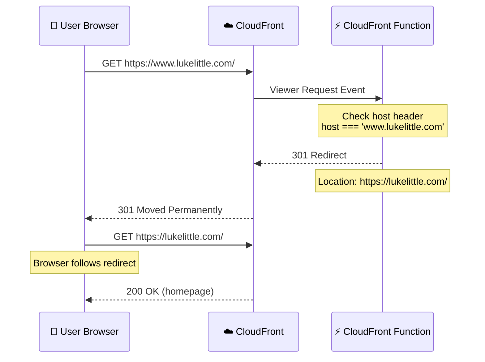
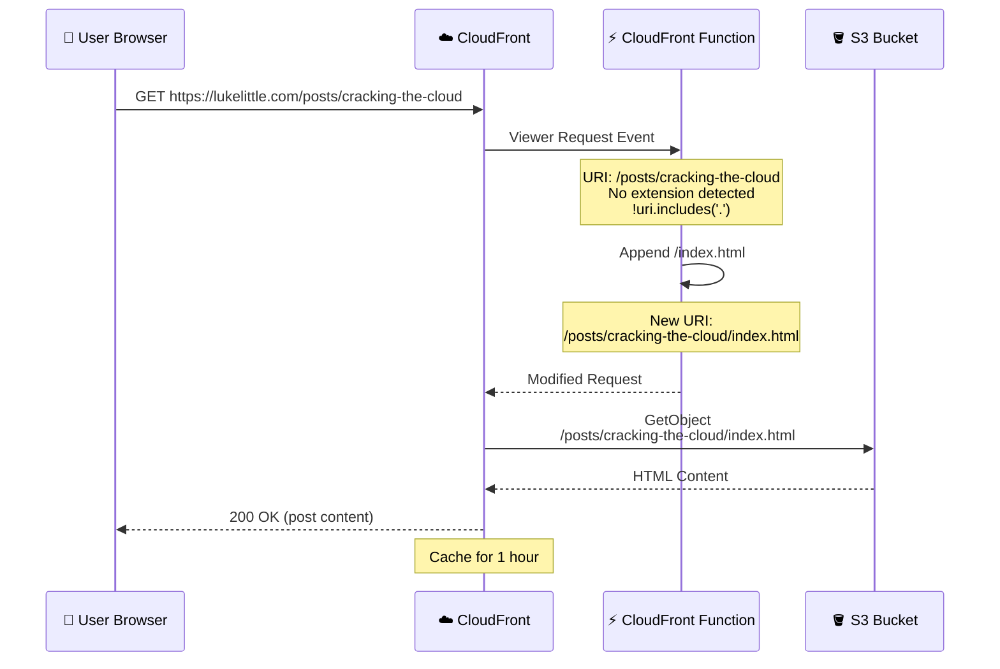
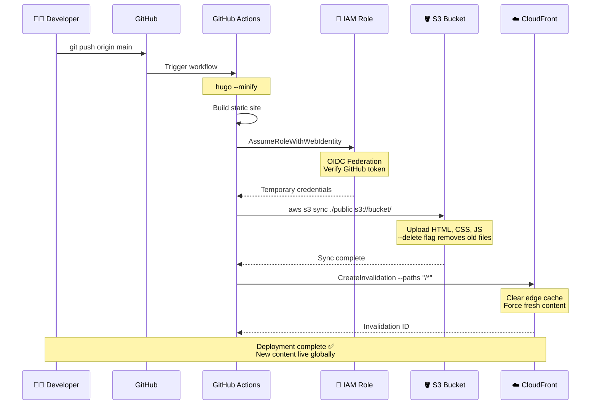

Recently I came across another engineer's personal blog — clean layout, good typography, that "I actually finish my side projects" energy — and it pushed me to finally build one of my own.

I picked Hugo because I like Go, and because using Jekyll in 2025 feels like opting into pain. I briefly considered Ghost, remembered it either requires paying Ghost or hosting Ghost, and closed the tab. And since I'm "the AWS guy," it felt morally necessary to deploy the whole thing on AWS. Maybe I'd even use Kiro if I felt extra fancy.

For context: **Hugo** and **Jekyll** are both static site generators—tools that convert Markdown files into HTML at build time. Jekyll, written in Ruby, was the OG choice for GitHub Pages and still powers thousands of blogs. But it's slow, requires managing Ruby dependencies, and feels dated. Hugo, written in Go, is blazingly fast (builds in milliseconds), has a single binary with zero dependencies, and handles large sites without breaking a sweat. Both produce the same outcome—static HTML you can throw on a CDN—but Hugo does it in a fraction of the time and with far less friction.

So I wrote some Terraform, vibe-coded a theme, deployed it, and immediately remembered that I don't build personal websites very often.

---

## The Architecture

Before diving into the problems I hit, here's what the final architecture looks like.

It's a classic serverless static site setup: **Route 53** handles DNS, pointing the domain to a **CloudFront** distribution. CloudFront sits in front of an **S3 bucket** that stores all the static files—HTML, CSS, JavaScript, images. The bucket is private; CloudFront is the only thing allowed to read from it via an Origin Access Identity.

Here's where it gets slightly more interesting: attached to CloudFront is a **CloudFront Function**—a lightweight JavaScript function that runs at the edge, modifying incoming requests before they hit the origin. This function handles two things: redirecting `www.lukelittle.com` to the apex domain, and rewriting clean URLs (like `/posts/my-article`) to their actual paths (`/posts/my-article/index.html`). 

SSL certificates come from **AWS Certificate Manager** and are automatically attached to CloudFront. The whole thing is defined in **Terraform**, and deployment happens via **GitHub Actions**—push to main, Hugo builds the site, the output gets synced to S3, and CloudFront's cache gets invalidated.

The request flow is straightforward: user hits the domain → Route 53 resolves it to CloudFront → CloudFront invokes the edge function → function rewrites the request if needed → CloudFront fetches from S3 (or serves from cache) → content gets delivered globally from the nearest edge location.

Clean. Simple. Serverless. Costs about $0.50/month for the Route 53 hosted zone. Everything else fits in free tier.

Now, the problems.

---

## First realization: `www` doesn't redirect itself

I wanted `www.lukelittle.com` → `lukelittle.com`.  
Simple enough — except CloudFront doesn't have `.htaccess` or Apache-style rewrite configs.

The fix is a **CloudFront Function** on `viewer-request`:



Here's the actual CloudFront Function code:

```javascript
function handler(event) {
    var request = event.request;
    var host = request.headers.host.value;
    
    // Redirect www to apex domain
    if (host === 'www.lukelittle.com') {
        return {
            statusCode: 301,
            statusDescription: 'Moved Permanently',
            headers: {
                location: { value: 'https://lukelittle.com' + request.uri }
            }
        };
    }
    
    return request;
}
```

CloudFront Functions are perfect for this because they run at the edge, cost almost nothing (you get 2 million free invocations per month), and don't require Lambda, bucket changes, or origin rewrites. They execute in under a millisecond, which means your redirect happens before the user even realizes they typed `www`.

That part was easy. The next part was not.

---

## Second realization: CloudFront does *not* assume `index.html`

Hugo outputs directories like:

```
/posts/
/posts/index.html
```

Apache and Nginx automatically serve `index.html` when you access `/posts/`.  
CloudFront does not. It will happily 404 unless you rewrite the URI yourself.

Here's what's happening under the hood:



So I added this logic to the same CloudFront Function:

```javascript
function handler(event) {
    var request = event.request;
    var uri = request.uri;
    var host = request.headers.host.value;
    
    // Redirect www to apex domain
    if (host === 'www.lukelittle.com') {
        return {
            statusCode: 301,
            statusDescription: 'Moved Permanently',
            headers: {
                location: { value: 'https://lukelittle.com' + uri }
            }
        };
    }
    
    // Append index.html for clean URLs
    if (uri.endsWith('/')) {
        request.uri += 'index.html';
    } else if (!uri.includes('.')) {
        request.uri += '/index.html';
    }
    
    return request;
}
```

Now CloudFront behaves like a normal web server circa 2008. Hugo pages immediately started working.

For a moment.

---

## Where everything went off the rails

I tried to add `www.lukelittle.com` as an alternate domain name on the CloudFront distribution.

CloudFront refused.  
The error claimed it was **already associated with another distribution**.

It wasn't — at least not in any AWS account I currently have access to.

So I did what any rational engineer does:

- Googled  
- Re-Googled  
- Asked ChatGPT  
- Deleted the distribution  
- Recreated the distribution  
- Repeated the cycle  
- Began questioning my past life choices

After four hours, I accepted defeat and temporarily upgraded my support plan.

The answer was unexpected:

`www.lukelittle.com` *was* attached to a CloudFront distribution — in **another AWS account**.

Which account?  
I have no clue.  
Possibilities include:
- some forgotten sandbox from 2017  
- a leftover test account  
- an old attempt at this blog I completely wiped from memory  
- a parallel universe

Support asked me to add a TXT record to prove I owned the domain. I added it in Route 53, they cleared the stale binding, and immediately everything began working exactly as expected.

---

## How deployment actually works

Once I got the infrastructure sorted, I needed a deployment pipeline. GitHub Actions + OIDC federation makes this dead simple:



Here's what makes this beautiful:

**No long-lived credentials.** GitHub Actions uses OIDC to assume an IAM role, gets temporary credentials that expire in an hour, and those credentials only work for this specific repo. If someone compromises the GitHub Actions environment, they get access for 60 minutes max—and only to deploy this blog. Not exactly a treasure trove.

**Hugo builds in ~200ms.** Static site generators are fast when your entire site fits in memory. No database queries, no server-side rendering, just Markdown → HTML and done.

**S3 sync is smart.** It only uploads files that changed. New post? Upload one file. Tweak CSS? Upload one file. CloudFront invalidation clears the edge cache, so every visitor gets fresh content within seconds.

**Global deployment in under a minute.** Push to main → build → sync → invalidate → live. The entire pipeline runs faster than most people can brew coffee.

---

## And now the site actually exists

Despite writing constantly — deep dives, rants, slides, Data Pour episodes — I've never had a single place to put any of it. Everything has been scattered across GitHub repos, Slack threads, LinkedIn posts, and random folders.

This site fixes that.

Hugo prerenders everything.  
CloudFront serves it globally.  
There's no backend.  
No patching.  
No maintenance.  
Just HTML, a CDN, and vibes.

The whole stack:
- **Hugo** for static site generation
- **S3** for object storage
- **CloudFront** for CDN + edge functions
- **Route 53** for DNS
- **ACM** for SSL certificates
- **GitHub Actions** for CI/CD
- **Terraform** for infrastructure as code

Total monthly cost: ~$0.50 for Route 53 hosted zone. Everything else fits in free tier.

---

## The unexpected benefit

Honestly, getting stuck for a few hours was probably good for me. I had to slow down, re-read documentation, and remember exactly how CloudFront, ACM, and Route 53 interact — instead of relying on half-remembered muscle memory.

Building this site reminded me why I got into infrastructure in the first place: you can take a bunch of managed services, wire them together thoughtfully, and end up with something that just works. No servers to patch, no databases to tune, no midnight pages about memory leaks.

Just a website that loads fast, costs nothing, and requires zero maintenance.

Not the night I planned, but not wasted either.

Anyway — the blog is live now. Hopefully the next update doesn't require another round of DNS archaeology or CloudFront forensics.

---

**Want to see the code?** The entire infrastructure setup is open source:  
[github.com/lukelittle/homepage](https://github.com/lukelittle/homepage)
